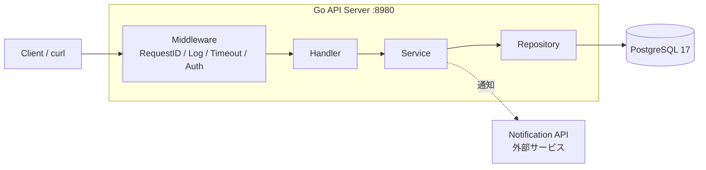

# go_kanban_webapp_hands_on

Go の標準ライブラリ `net/http` と PostgreSQL で、複数ユーザーが使えるカンバン型タスク管理 API を段階的に作るハンズオン。

目標は「動くコードを書く」ことではなく、**本番で問題になるコードを自分で見つけ、再現し、直せる**ようになること。各章では、あえて問題のある実装を先に動かし、壊れる様子を観測してから改善する。

## 概要

| 項目 | 内容 |
| --- | --- |
| 作るもの | Project / Task を管理するカンバン型タスク管理 API（Backend のみ） |
| 扱うテーマ | HTTP / Validation / 認証・認可 / SQL / Transaction / goroutine と Data Race / 同時更新 / Timeout / Retry / 冪等性 / Logging / Test |
| 想定読者 | Go と Web アプリ開発の初心者〜初級者 |
| 必要環境 | Go 1.25 以降、Docker / Docker Compose、curl、Git |
| 所要時間 | 約 10〜14 時間（Chapter 01〜09 の合計） |
| 費用 | ローカル Docker のみで完結するため無料 |

## 完成するもの



Framework や ORM は使わず、`net/http`・`pgx/v5`・`log/slog`・`testing` など標準ライブラリ中心で組み立てる。隠れがちな処理をコードの上で確認するためである。

## 章構成

| 章 | 内容 |
| --- | --- |
| Chapter 00 | 環境準備と前提知識 |
| Chapter 01-02 | HTTP の基礎と、あえて雑な CRUD |
| Chapter 03-05 | Validation、認証・認可・IDOR、層分割・SQL Injection・N+1 |
| Chapter 06-08 | Transaction と同時更新、Timeout・Retry・冪等性、Logging と Audit Log |
| Chapter 09 | Unit / HTTP / Integration / Load Test と Refactoring |

各章の詳細、設計判断、完了条件は [docs/chapter/README.md](./docs/chapter/README.md) にまとめている。**ハンズオンはここから始める。**

## リポジトリ構成

```text
.
├── docs/
│   ├── chapter/      ハンズオン本文（Chapter 00〜09、Appendix）
│   └── images/       本文で使う図
├── answers/          各章を終えた時点の完成コード（chapter01〜chapter09）
├── go-kanban/        ハンズオンで作成するアプリ本体（最終章まで進めた状態）
└── goroutine-lab/    Chapter 06 で goroutine と Data Race を試す実験用コード
```

`answers/` は答え合わせ用。本文に抜粋しか載っていないファイルの確認や、自分のコードが動かないときに使う。動かし方は各フォルダの `README.md` に書いてある。

## はじめ方

1. [Chapter 00: 準備と前提知識](./docs/chapter/chapter00_setup.md) で必要なツールを確認する
2. [Chapter 01](./docs/chapter/chapter01_http.md) から順に進める（各章は前の章の成果物を引き継ぐ）

## ライセンス

[MIT License](./LICENSE)
