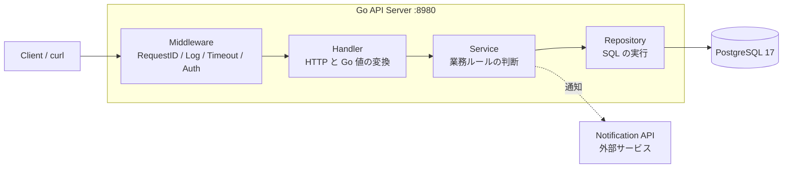
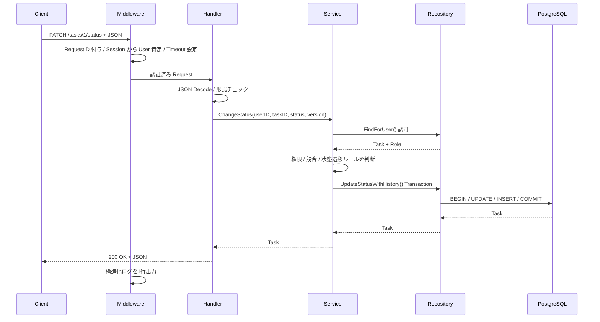
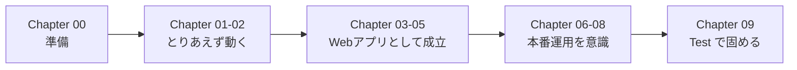

# Goで作るカンバン型タスク管理アプリ ハンズオン

Go の標準ライブラリ `net/http` と PostgreSQL で、複数ユーザーが使えるカンバン型タスク管理 API を段階的に作る。

このハンズオンの狙いは「動くコードを書く」ことではない。**本番で問題になるコードを自分で見つけ、再現し、直せる**ようになることを目標とする。そのため各章では、あえて問題のある実装を先に動かし、壊れる様子を観測してから改善する。

## Overview

| 項目 | 内容 |
| --- | --- |
| 目的 | 「動く CRUD」と「本番で運用できる CRUD」の差分を、実機で再現しながら埋める |
| 学習・検証する内容 | HTTP / Validation / 認証・認可 / SQL / Transaction / goroutine と Data Race / 同時更新 / Timeout / Retry / 冪等性 / Logging / Test |
| 想定読者 | Go と Web アプリ開発の初心者〜初級者 |
| 前提知識 | プログラミング経験があること。Go 固有の文法は [Chapter 00](./chapter00_setup.md) で補う |
| 必要環境 | Go 1.25 以降、Docker / Docker Compose、curl、Git（k6 は Docker イメージで実行するためインストール不要） |
| 所要時間 | 約 10〜14 時間（Chapter 01〜09 の合計） |
| 費用 | ローカル Docker のみで完結するため無料。クラウド費用は発生しない |

## 完成するもの



層を分けること自体が目的ではない。**変更理由が異なるコードを分離する**ことが目的になる。

| 何が変わったとき | どの層を直すか |
| --- | --- |
| HTTP の仕様（URL、Status、JSON 形式） | Handler |
| 業務ルール（誰が何をしてよいか、どの状態遷移を許すか） | Service |
| DB スキーマ、SQL の書き方 | Repository |

## Request が Response になるまで



## Hands-on Flow



各章は前の章の成果物を引き継ぐ。順番に進めることを前提とする。

## Chapters

| 章 | 達成すること | 主に扱う問題 |
| --- | --- | --- |
| [Chapter 00: 準備と前提知識](./chapter00_setup.md) | 環境を用意し、Go の最小知識とドメインモデルを把握する | — |
| [Chapter 01: Go と HTTP の基礎](./chapter01_http.md) | HTTP Request が Handler に届き Response になる流れを説明できる | Request/Response の流れが分からない |
| [Chapter 02: 雑な CRUD を作る](./chapter02_crud.md) | PostgreSQL に繋いだ Task CRUD を動かし、**あえて雑な実装の問題を観測する** | 空の title が保存される、存在しない ID で 500 |
| [Chapter 03: Validation と Error Handling](./chapter03_validation.md) | 不正入力に 400、存在しない資源に 404 を返し、内部情報を漏らさない | Error 漏洩、Status の分類不能 |
| [Chapter 04: 認証・認可・IDOR](./chapter04_auth.md) | ログインしたユーザーを識別し、Project 外の Task 操作を拒否する | 権限外操作、ID 書き換えによる情報漏洩 |
| [Chapter 05: 層分割・SQL Injection・N+1](./chapter05_repository.md) | Handler / Service / Repository へ分離し、SQL の危険と非効率を実測する | HTTP と SQL の密結合、SQL Injection、Query 爆発 |
| [Chapter 06: Transaction と同時更新](./chapter06_transaction.md) | goroutine と Data Race を理解したうえで、複数更新を原子化し、同時更新を 409 で検出する | Data Race、中途半端な更新、Lost Update、不正な状態遷移 |
| [Chapter 07: Timeout・Retry・冪等性](./chapter07_resilience.md) | 外部障害や再送に耐える。Timeout / Retry / Idempotency をセットで扱う | 処理の滞留、Retry storm、二重作成 |
| [Chapter 08: Logging と Audit Log](./chapter08_observability.md) | 障害調査できるログを出し、機密情報を出さない | 調査不能、Secret 漏洩、変更者不明 |
| [Chapter 09: Test と Refactoring](./chapter09_test.md) | Unit / HTTP / Integration / Load Test を使い分け、責務を整理する | 正常系しか確認していない、責務混在 |
| [Appendix: チェックリスト集](./appendix.md) | コードレビュー観点、セルフチェック、原本との対応表 | — |
| [Appendix: Go の基本構文](./appendix_go_syntax.md) | 本編のコードに出てくる Go の構文を、理由と落とし穴まで含めて引ける | ポインタ・interface・error の書き方で手が止まる |

## 技術選定と理由

| 技術 | 役割 | 今回採用した理由 |
| --- | --- | --- |
| Go 1.25+ | Backend | HTTP・Context・Error 処理がコードに明示的に現れる |
| `net/http` | HTTP Server | Framework に隠れる処理を最初に理解する |
| PostgreSQL 17 | RDB | Transaction・Lock・Constraint を実機で確認できる |
| `pgx/v5` | DB Driver | ORM を挟まず、発行される SQL をそのまま観察する |
| Docker Compose | ローカル環境 | PostgreSQL を再現可能に起動する |
| `testing` / `httptest` | Test | Go 標準のテスト手法を理解する |
| `log/slog` | Structured Log | 標準ライブラリで JSON ログを扱う |
| k6（`grafana/k6` イメージ） | Load Test | 負荷増加時の劣化を観察する。Docker で動かすため追加インストールが不要 |

<details>
<summary>後から導入を検討するライブラリ</summary>

最初から便利なライブラリを全部入れない。「何が面倒なのか」を経験した後で導入すると、そのライブラリが何を解決しているのか分かる。

| ライブラリ | 導入を検討する段階 |
| --- | --- |
| `chi` / `echo` | Routing が複雑になり、`net/http` の `ServeMux` では表現しづらくなったとき |
| `go-playground/validator` | Validation の記述量が増え、タグで宣言したほうが見通しが良くなったとき |
| `sqlc` / `sqlx` | SQL と Go 型の対応付けが増え、`Scan` の書き間違いが起きやすくなったとき |
| `golang-migrate` | Migration の適用順・ロールバックを管理する必要が出たとき |

</details>

## 設計判断

| 判断 | 選択肢 | 採用 | 理由 |
| --- | --- | --- | --- |
| HTTP | Framework / `net/http` | `net/http` から開始 | HTTP の基礎を隠さない |
| DB | PostgreSQL / SQLite | PostgreSQL | Transaction・Lock を検証しやすい |
| DB アクセス | ORM / pgx | pgx | 発行 SQL を直接観察する |
| 認証 | JWT / Session | Session | Logout でサーバ側から無効化できる。Cookie と CSRF も学べる |
| 同時実行制御 | 悲観ロック / 楽観ロック | 楽観ロック中心 | Web API で競合検出を体験しやすい |
| アーキテクチャ | 最初から分割 / 段階的に分割 | 段階的 | 分割の必要性を先に体験する |
| Frontend | 同時実装 / 後回し | 後回し | Backend の学習に集中する |

<details>
<summary>それぞれのトレードオフ</summary>

**`net/http` を使う**

- 利点: HTTP 処理が見える。標準ライブラリの理解が深まる。Framework の破壊的変更に影響されない
- 欠点: Routing や Validation を自分で考える量が増える

**SQL を直接書く**

- 利点: 発行 SQL が明確で、N+1 や Index の効果を理解しやすい
- 欠点: CRUD の記述量が増える。`Scan` と型の対応を手で管理する必要がある

**層を分割する**

- 利点: Test しやすい。変更の影響範囲を局所化しやすい
- 欠点: 小規模ではファイルと interface が増えるだけになりやすい

このハンズオンでは「最初から綺麗に分割」せず、コードが複雑になった時点（Chapter 05）で分割する。

</details>

## 最終的なディレクトリ構成

```text
go-kanban/
├── cmd/api/main.go          起動処理のみ
├── internal/
│   ├── app/                 依存関係の組み立てとルーティング
│   ├── handler/             HTTP と Go 値の変換
│   ├── httpx/               handler と middleware の共通処理
│   ├── middleware/          RequestID / Log / Timeout / Auth / Idempotency
│   ├── model/               ドメインの型と業務ルール
│   ├── notify/              外部 API 呼び出しと Retry
│   ├── repository/          SQL の実行
│   └── service/             業務ルールの判断
├── migrations/              スキーマ定義
├── scripts/                 検証用スクリプト
├── test/                    Integration Test
├── docker-compose.yml
└── go.mod
```

各章を終えた時点のコード全体は、リポジトリ直下の [answers/](../../answers/) に章ごとに置いている（`answers/chapter01/` 〜 `answers/chapter09/`）。本文に抜粋しか載っていないファイルの確認や、自分のコードが動かないときの答え合わせに使う。動かし方は各フォルダの `README.md` に書いてある。

`internal/` 配下の package は、その親ツリーの外から import できない。このアプリ専用のコードであることを Go の仕組みとして明示できる。

## 完了条件

すべて満たしたらハンズオン完了とする。

- [ ] API から Project / Task を CRUD できる
- [ ] ログイン後のユーザーを識別できる
- [ ] Project 外のユーザーによる Task 操作を拒否できる
- [ ] 不正入力に 4xx を返せる
- [ ] DB エラーの内部情報を利用者へ返さない
- [ ] `go test -race` で Data Race を検出できる
- [ ] Task 更新と履歴作成を Transaction 化できる
- [ ] Optimistic Lock で更新競合を検出できる
- [ ] SQL Injection / IDOR の危険な実装を再現して修正できる
- [ ] Context Timeout を再現できる
- [ ] Unit / HTTP / Integration Test を実行できる
- [ ] k6 で負荷をかけ、結果を読める
- [ ] [Appendix](./appendix.md) のチェックリストで自分のコードをレビューできる

## 検証環境

本ドキュメントの手順と出力例は、次の環境で実際に実行して確認した。

| 項目 | バージョン |
| --- | --- |
| OS | Windows 11 Pro（Git Bash 上で実行） |
| Go | 1.27.1 |
| PostgreSQL | 17（`postgres:17` イメージ） |
| Docker | 29.7.2 |
| Docker Compose | v5.5.0 |
| pgx | v5.11.0 |
| curl | 8.18.0 |
| k6 | 2.3.0（`grafana/k6:2.3.0` イメージ） |

すべての章の手順を実行済み。k6 はローカルにインストールせず、Docker コンテナから実行した。

## 片付け

ハンズオン終了後、ローカル環境を停止する。

```bash
docker compose down
```

PostgreSQL のデータも含めて完全に初期化する場合。

> **WARNING**
> `-v` を付けると Volume ごと削除され、作成した Project / Task はすべて消える。

```bash
docker compose down -v
```

## 次にやること

このハンズオンの後に自然につながる検証。

1. **React + TypeScript の UI を追加する** — 実際のカンバン UI から API を使い、XSS・CORS・認証 Cookie の扱いを検証する
2. **非同期ジョブを追加する** — CSV Export や通知を Queue + Worker へ移し、同期処理との違いを確認する
3. **クラウドへデプロイする** — コンテナ化した API をデプロイし、TLS・Secret 管理・Logging・Monitoring を追加する
