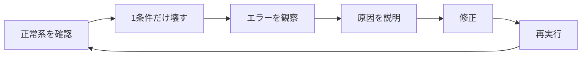

# Appendix: チェックリスト集

ハンズオン本編で使う参照資料をまとめる。各章を進めながら、必要なときに戻って使う。

Go の構文そのものの解説は [Appendix: Go の基本構文](./appendix_go_syntax.md) にまとめている。

- [A. コードレビュー用チェックリスト](#a-コードレビュー用チェックリスト)
- [B. 章ごとのセルフチェック](#b-章ごとのセルフチェック)
- [C. Failure Test 一覧](#c-failure-test-一覧)
- [D. 機能検証マトリクス](#d-機能検証マトリクス)
- [E. セキュリティ検証項目](#e-セキュリティ検証項目)
- [F. 原本との対応表](#f-原本との対応表)

---

## A. コードレビュー用チェックリスト

自分やチームのコードをレビューするときの観点。本ハンズオンのどの章で扱ったかを併記する。

### 入力と信頼境界

| # | 問い | 章 |
| --- | --- | --- |
| 01 | この値はどこから来たか。外部入力か、自分が作った値か | 03 |
| 02 | 外部入力を検証せずに使っていないか | 03 |
| 03 | NULL / 空文字 / 空白のみ / 極端に長い値が来たらどうなるか | 03 |
| 04 | 想定外の JSON フィールドや型が来たらどうなるか | 03 |
| 05 | Path / Query パラメータは検証しているか | 03 |

### 認証と認可

| # | 問い | 章 |
| --- | --- | --- |
| 06 | この操作に認証は必要か。ルーティングを見て判断できるか | 04 |
| 07 | この User にこの操作の権限はあるか | 04 |
| 08 | ID を書き換えて他人のデータへ到達できないか | 04 |
| 09 | 「資源が存在するか」ではなく「この User から見えるか」を問うているか | 04 |
| 10 | エラーレスポンスから、資源の存在やアカウントの存在が推測できないか | 04 |

### データ操作

| # | 問い | 章 |
| --- | --- | --- |
| 11 | SQL に外部入力を文字列連結していないか | 05 |
| 12 | この Query は何回発行されるか。件数に比例しないか | 05 |
| 13 | Transaction は必要か。複数更新が中途半端に終わらないか | 06 |
| 14 | 同時に2人が実行したらどうなるか | 06 |
| 15 | 複数の goroutine から共有する変数や map を、同期なしに書き換えていないか | 06 |
| 16 | DB Constraint でも守るべきルールはないか | 03, 06 |
| 17 | `rows.Err()` を確認しているか | 03 |

### 障害と再送

| # | 問い | 章 |
| --- | --- | --- |
| 18 | 同じ Request が2回来たらどうなるか | 07 |
| 19 | 外部サービスが落ちたらどうなるか | 07 |
| 20 | 外部サービスが遅かったらどうなるか | 07 |
| 21 | Timeout はあるか。Client の Timeout より短いか | 07 |
| 22 | Retry して安全な操作か。Retry すべきエラーか | 07 |
| 23 | Context は下位処理へ伝播しているか | 07 |
| 24 | 副作用の失敗が、主処理の成否を上書きしていないか | 07 |

### 情報の露出

| # | 問い | 章 |
| --- | --- | --- |
| 25 | エラー情報を利用者へ出しすぎていないか | 03 |
| 26 | ログへ出してよい情報か。Cookie / パスワード / トークンが混ざっていないか | 08 |
| 27 | XSS は起きないか（Frontend が値を HTML として解釈しないか） | — |
| 28 | File Upload は安全か（サイズ / MIME / 拡張子 / Path Traversal） | — |
| 29 | 攻撃者ならこの機能をどう悪用するか | 04, 05 |

### 設計と保守

| # | 問い | 章 |
| --- | --- | --- |
| 30 | このコードは何が変わったときに変更されるか | 05, 09 |
| 31 | error を `_` で捨てていないか | 00 |
| 32 | Cleanup 漏れ・Connection Close 漏れはないか | 00, 06 |
| 33 | Test で正常系しか確認していないか | 09 |
| 34 | この抽象化には具体的な理由があるか | 05, 09 |
| 35 | 「なぜこの実装にしたか」を説明できるか | 全章 |

---

## B. 章ごとのセルフチェック

各章を終えたら、次の8問に答える。

```text
1. 今回、何が問題だったか？
2. どうやって問題を再現したか？
3. どの層で修正したか？
4. なぜその層なのか？
5. 修正前後で何が変わったか？
6. Test は何を保証しているか？
7. 別の実装方法はあるか？
8. 本番なら追加で何を考えるか？
```

コードが動いていても、この8問に答えられなければ章を完了としない。

### 記入例（Chapter 06）

| 問い | 回答例 |
| --- | --- |
| 1. 何が問題か | 2人が同時に Task を更新すると、片方の変更がエラーも出さずに消える |
| 2. どう再現したか | 2つの psql セッションで、`pg_sleep` を挟んで read-modify-write を交差させた |
| 3. どの層で修正したか | Repository（`WHERE version = $3`）と Service（version の事前チェック） |
| 4. なぜその層か | DB は最後の砦、Service は利用者に返す Status を決める責任がある |
| 5. 何が変わったか | 消失していた更新が 409 になり、利用者が再読み込みを判断できる |
| 6. Test は何を保証するか | 古い version の更新が 409 になり、DB の状態が変わらないこと |
| 7. 別の実装は | 悲観ロック（`SELECT FOR UPDATE`）。ただし Web API では保持時間が問題になる |
| 8. 本番なら | 409 時の Client 側リトライ方針、競合頻度の計測、ユーザーへの提示方法 |

---

## C. Failure Test 一覧

「正常系を確認 → 1条件だけ壊す → エラーを観察 → 原因を説明 → 修正 → 再実行」の流れで使う。



| # | 壊す条件 | 期待する観測結果 | 章 |
| --- | --- | --- | --- |
| 1 | title を空にする | 400 + `title is required` | 03 |
| 2 | JSON のフィールド名を typo する | 400 + `unknown field` | 03 |
| 3 | 存在しない Task ID を指定する | 404（500 ではない） | 03 |
| 4 | 存在しない Project に Task を作る | 404（外部キー違反を翻訳） | 03 |
| 5 | Cookie なしでアクセスする | 401 | 04 |
| 6 | 別 User の Task ID を指定する | 404（403 ではない） | 04 |
| 7 | Viewer が Task を作ろうとする | 403 | 04 |
| 8 | ログアウト後の Cookie を使う | 401 | 04 |
| 9 | 検索キーワードに SQL 構文を入れる | プレースホルダ版では 0 件。連結版では他人のデータが漏れる | 05 |
| 10 | Task を 200 件にして担当者付きで一覧取得 | N+1 版は 201 Query / 65ms、JOIN 版は 1 Query / 1ms | 05 |
| 11 | 1000 個の goroutine から同期なしで `counter++` する | 値が 1000 にならない。`-race` で `DATA RACE` を検出 | 06 |
| 12 | 2セッションで version を見ずに同時更新 | 片方の更新が消失する | 06 |
| 13 | 古い version で更新する | 409 | 06 |
| 14 | 同じ version で 8 並列更新する | 成功 1 件、409 が 7 件 | 06 |
| 15 | `todo` から `done` へ直接遷移する | 400 | 06 |
| 16 | 履歴の INSERT を制約で失敗させる | 500。Task の更新も Rollback | 06 |
| 17 | DB を 3 秒待たせる（上限 2 秒） | 2.00 秒で 503 | 07 |
| 18 | 外部 API に 400 を返させる | 試行 1 回で終了 | 07 |
| 19 | 外部 API に 503 を返させる | 試行 3 回 | 07 |
| 20 | 外部 API を無応答にする | Client Timeout で打ち切り、3 回試行 | 07 |
| 21 | 通知を失敗させる | Task 更新は 200 のまま成功 | 07 |
| 22 | 同じ POST を2回送る（キーなし） | Task が 2 件できる | 07 |
| 23 | 同じ POST を2回送る（キーあり） | Task は 1 件。`Idempotent-Replay: true` | 07 |

> **CHECK**
> 「エラーになった」で終わらせない。**HTTP Status・レスポンス本文・サーバログ・DB の状態**の4つを毎回確認する。

---

## D. 機能検証マトリクス

最終的に、次をすべて確認する。

| # | 検証 | 操作 | 期待 | 検証状況 |
| --- | --- | --- | --- | --- |
| 1 | Health | `GET /health` | 200 | 検証済み |
| 2 | ユーザー登録 | 正常な email / password | 201 | 検証済み |
| 3 | 重複登録 | 同じ email | 409 + `email is already registered` | 検証済み |
| 4 | 弱いパスワード | 12 文字未満 | 400 | 検証済み |
| 5 | ログイン成功 | 正しい資格情報 | Session Cookie 発行 | 検証済み |
| 6 | ログイン失敗（パスワード誤り） | 誤ったパスワード | 401 | 検証済み |
| 7 | ログイン失敗（未登録） | 存在しない email | **6 と同じ** 401 | 検証済み |
| 8 | 未認証アクセス | Cookie なし | 401 | 検証済み |
| 9 | ログアウト | `POST /logout` | 204。以降 401 | 検証済み |
| 10 | Task 作成 | 正常な JSON | 201 | 検証済み |
| 11 | Validation | title 空 / priority 不正 / 未知フィールド | 400 | 検証済み |
| 12 | Task 取得（メンバー） | 自分の Task | 200 | 検証済み |
| 13 | 認可（Project 外） | 他人の Project の一覧 | 403 | 検証済み |
| 14 | IDOR | 他人の Task ID | 404 | 検証済み |
| 15 | Role | Viewer が Task 作成 | 403 | 検証済み |
| 16 | 存在しない Task | 存在しない ID | 404 | 検証済み |
| 17 | 状態遷移 | `todo` → `done` | 400 | 検証済み |
| 18 | 更新競合 | 古い version | 409 | 検証済み |
| 19 | 並列更新 | 8 並列・同一 version | 成功 1 件のみ | 検証済み |
| 20 | SQL Injection | 攻撃文字列（プレースホルダ版） | SQL として実行されない | 検証済み |
| 21 | Transaction | 履歴 INSERT を失敗させる | Task も Rollback | 検証済み |
| 22 | Timeout | 3 秒の遅延処理 | 2.00 秒で 503 | 検証済み |
| 23 | Retry | 外部 API の各 Status | 400 は 1 回、5xx は 3 回 | 検証済み |
| 24 | 冪等性 | 同じ Idempotency-Key | Task は 1 件のみ | 検証済み |
| 25 | ログ | 全リクエスト | 1 行の JSON。機密情報なし | 検証済み |
| 26 | 監査ログ | Status 変更 | `task_history` に記録 | 検証済み |
| 27 | Unit / Integration Test | `go test` / `-tags=integration` | 全パス | 検証済み |
| 28 | Load Test | k6 で段階的に負荷 | p95 / p99 を読む | 検証済み（p95 1.34s でしきい値超過。原因はページングのない一覧） |

---

## E. セキュリティ検証項目

### 対応済み

| 項目 | 対策 | 章 |
| --- | --- | --- |
| SQL Injection | プレースホルダ（`$1`）を必ず使う | 05 |
| IDOR / BOLA | 取得と認可を1クエリに統合 | 04 |
| 資源の列挙 | 他人の資源に 404 | 04 |
| アカウントの列挙 | ログイン失敗の文言を統一 | 04 |
| パスワードの平文保存 | bcrypt | 04 |
| Session ID の推測 | `crypto/rand` で 32 バイト | 04 |
| Cookie の窃取（XSS 経由） | `HttpOnly` | 04 |
| CSRF（一部） | `SameSite=Lax` | 04 |
| 平文通信での Cookie 送信 | 本番で `Secure: true` | 04 |
| セッションの固定化 | ログイン時に新規発行 | 04 |
| ログアウト後の再利用 | サーバ側 Session を削除 | 04 |
| 内部情報の漏洩 | error を分類し、詳細はログのみ | 03 |
| ログへの機密情報混入 | 出力項目を明示的に列挙 | 08 |
| 冪等キーの盗み見 | `(key, user_id, endpoint)` の複合主キー | 07 |

### 未対応（本番では要検討）

| 項目 | 説明 |
| --- | --- |
| CSRF トークン | `SameSite=Lax` だけでは不十分な場合がある。Cookie 認証を本番で使うなら検討する |
| XSS | Backend が HTML を生成しないため直接の対象外。**Frontend を追加する場合は、Task の description や Comment を表示する箇所で発生しうる** |
| レートリミット | ログイン試行の回数制限は本番では必須 |
| File Upload | 未実装。サイズ / MIME / 拡張子 / ファイル名 / Path Traversal / 実行可否 / マルウェア対策の検討が必要 |
| 多要素認証 | 未実装 |
| セキュリティヘッダ | `Content-Security-Policy`、`X-Frame-Options` など |
| 依存ライブラリの脆弱性 | `govulncheck` による定期チェック |

<details>
<summary>File Upload を追加する場合の検討事項</summary>

本ハンズオンでは実装していないが、カンバンに添付ファイルを追加するなら次を検討する。

| 項目 | 内容 |
| --- | --- |
| ファイルサイズ | 上限を設ける。`http.MaxBytesReader` を使う |
| MIME Type | Content-Type ヘッダを信用しない。実際の中身から判定する |
| 拡張子 | 許可リストで照合する。拒否リストは漏れる |
| ファイル名 | **利用者指定の名前をそのまま保存パスに使わない** |
| Path Traversal | `../../important-file` のような入力を弾く |
| 保存先 | Web サーバの公開ディレクトリに直接置かない |
| 実行可否 | アップロードされたファイルが実行されない構成にする |

```text
利用者が指定した名前
     ↓
Validation（拡張子・サイズ・MIME）
     ↓
Server 側で Storage ID を生成    ← 保存パスは自分で決める
     ↓
Storage

元のファイル名は「表示用のメタデータ」として DB に持つ
```

</details>

---

## F. 原本との対応表

本ドキュメントは、原本（`docs/原本/go_kanban_webapp_hands_on.md`）の 26 テーマを、作業単位でまとまる 9 章へ再編している。

### 原本の Chapter → 本ドキュメント

| 原本 | テーマ | 本ドキュメント |
| --- | --- | --- |
| 01 | Go / HTTP | [Chapter 01](./chapter01_http.md) |
| 02 | CRUD | [Chapter 02](./chapter02_crud.md) |
| 03 | Validation | [Chapter 03](./chapter03_validation.md) |
| 04 | Error Handling | [Chapter 03](./chapter03_validation.md) |
| 05 | Authentication | [Chapter 04](./chapter04_auth.md) |
| 06 | Authorization | [Chapter 04](./chapter04_auth.md) |
| 07 | IDOR / BOLA | [Chapter 04](./chapter04_auth.md) |
| 08 | Repository | [Chapter 05](./chapter05_repository.md) |
| 09 | SQL Injection | [Chapter 05](./chapter05_repository.md) |
| 10 | N+1 | [Chapter 05](./chapter05_repository.md) |
| 11 | Transaction | [Chapter 06](./chapter06_transaction.md) Part 3, 4 |
| 12 | goroutine / Race Condition | [Chapter 06](./chapter06_transaction.md) Part 1 |
| 13-14 | Lost Update / Optimistic Lock | [Chapter 06](./chapter06_transaction.md) Part 2〜4 |
| 14 | State Transition | [Chapter 06](./chapter06_transaction.md) Part 3 |
| 15 | File Upload | **未実装**（本 Appendix E に検討事項のみ記載） |
| 16 | Context / Timeout | [Chapter 07](./chapter07_resilience.md) |
| 17 | External API | [Chapter 07](./chapter07_resilience.md) |
| 18 | Retry / Backoff | [Chapter 07](./chapter07_resilience.md) |
| 19 | Idempotency | [Chapter 07](./chapter07_resilience.md) |
| 20 | Logging | [Chapter 08](./chapter08_observability.md) |
| 21 | Audit Log | [Chapter 08](./chapter08_observability.md) |
| 22 | Unit Test | [Chapter 09](./chapter09_test.md) |
| 23 | Integration Test | [Chapter 09](./chapter09_test.md) |
| 24 | Load Test | [Chapter 09](./chapter09_test.md) |
| 25 | Refactoring | [Chapter 09](./chapter09_test.md) |

### 原本の前提・参考情報 → 本ドキュメント

| 原本の章 | 内容 | 本ドキュメント |
| --- | --- | --- |
| 0, 12 | 読み方、章フォーマット | 各章の構成として反映 |
| 1 | Overview / Goal / 完了条件 | [README](./README.md) |
| 2 | Background | [README](./README.md)、各章の Failure Test |
| 3 | Architecture | [README](./README.md) |
| 4 | Technology / Service Roles | [README](./README.md) |
| 5 | Go 初心者向け最小知識 | [Chapter 00](./chapter00_setup.md) |
| 6 | Prerequisites | [Chapter 00](./chapter00_setup.md) |
| 7 | Repository Structure | [README](./README.md)、[Chapter 05](./chapter05_repository.md) |
| 8 | Domain / Data Model | [Chapter 00](./chapter00_setup.md) |
| 9 | API Contract | [Chapter 00](./chapter00_setup.md) |
| 10 | HTTP Status の基準 | [Chapter 00](./chapter00_setup.md) |
| 11 | 開発 Phase | [README](./README.md) の Hands-on Flow |
| 36 | Security Verification | 本 Appendix E |
| 37 | Functional Verification | 本 Appendix D |
| 38 | Failure Test | 本 Appendix C |
| 39 | What Happened? | [README](./README.md) のシーケンス図 |
| 40, 41 | Design Decisions / Trade-offs | [README](./README.md) |
| 42 | コードレビュー用チェックリスト | 本 Appendix A |
| 43, 44 | What We Learned / Conclusion | [Chapter 09](./chapter09_test.md) の振り返り |
| 45 | Next Experiments | [README](./README.md) |
| 46 | Cleanup | [README](./README.md) |
| 47 | Cost | [README](./README.md) |
| Appendix A | Chapter 一覧 | 本 Appendix F |
| Appendix B | 学習時のセルフチェック | 本 Appendix B |

### 原本から変更した点

| 変更 | 理由 |
| --- | --- |
| 26 テーマ → 9 章へ集約 | 原本には数行しかない章と大きな章が混在し、粒度が不揃いだった。1 章 = 1 作業セッションになるよう再編した |
| 全章に実行可能なコードを追加 | 原本の Chapter 03 以降は抜粋コードのみで、手順どおりに動かせなかった |
| 実行結果を実測値に差し替え | 推測ではなく、実際に Go 1.27.1 / PostgreSQL 17 で実行した出力を掲載している |
| goroutine / Race Condition を Chapter 06 の冒頭へ配置 | 原本では Transaction と Lost Update の間に独立した章として置かれている。本ドキュメントでは Lost Update の直前に置き、「Go のメモリ上の競合」と「DB 上の競合」を同じ章で対比できるようにした。アプリのコードは変更しないため、プロジェクト外の実験用ディレクトリで行う |
| 原本の章番号の重複を解消 | 原本では goroutine 章の追加後、「Chapter 13-14: Lost Update / Optimistic Lock」と「Chapter 14: Task State Transition」で番号が重なり、Appendix A の Chapter 一覧も追加前の番号のままになっている。本表ではテーマ名で対応付けた |
| Chapter 00 を新設 | 原本の前提知識（Go の最小知識、ドメイン、API 仕様、Status 基準）を1か所へまとめ、後から参照しやすくした |
| File Upload を未実装として明示 | 実装すると章が1つ増え、かつ本ハンズオンの主題（データ整合性と障害耐性）から外れるため。検討事項のみ Appendix に記載 |
| 検証中に見つかった設計上の問題を追記 | version チェックの順序（Chapter 06）、Context の不変性（Chapter 08）、import cycle（Chapter 05）は、実装・検証の過程で実際に遭遇したもの |
