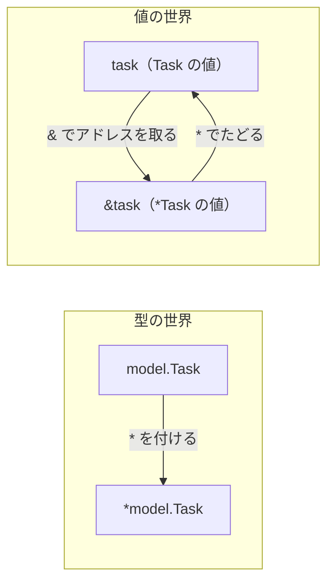
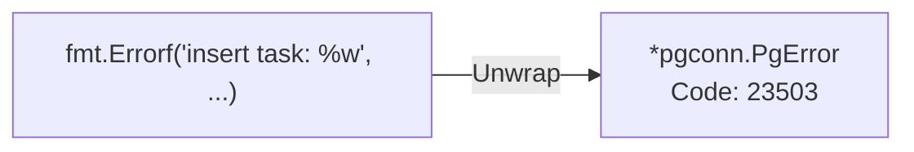
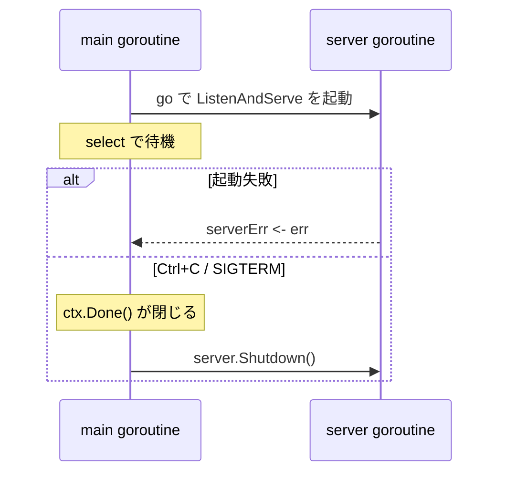

# Appendix: Go の基本構文

本編のコードを読んでいて「この書き方は何か」で手が止まったときに引くリファレンス。[Chapter 00 Step 3](./chapter00_setup.md#step-3-go-の最小知識を押さえる) は「後続の章を読み始めるための最小知識」として概要だけを載せている。この付録では、同じ構文を**なぜそう書くのか**と**書き間違えると何が起きるか**まで掘り下げる。

| 使い分け | Chapter 00 Step 3 | 本付録 |
| --- | --- | --- |
| 読むタイミング | ハンズオン開始前に一度 | コードで詰まったときに該当節だけ |
| 粒度 | 構文の存在を知る | 構文の理由・落とし穴・本リポジトリでの使用箇所 |
| 例 | 一般的なコード片 | `go-kanban/` の実コードと、挙動を確かめる小さなプログラム |

各節の「実行結果」は、Go 1.27.1（Windows / amd64）で実際に実行した出力である。

- [1. package と公開範囲](#1-package-と公開範囲)
- [2. 変数・定数・ゼロ値](#2-変数定数ゼロ値)
- [3. slice / map / struct](#3-slice--map--struct)
- [4. 制御構文](#4-制御構文)
- [5. 関数・クロージャ・defer](#5-関数クロージャdefer)
- [6. ポインタ（`*` と `&`）](#6-ポインタ-と-)
- [7. method と レシーバ](#7-method-と-レシーバ)
- [8. interface と型アサーション](#8-interface-と型アサーション)
- [9. error の扱い](#9-error-の扱い)
- [10. goroutine / channel / select](#10-goroutine--channel--select)
- [11. よくあるつまずき早見表](#11-よくあるつまずき早見表)

---

## 1. package と公開範囲

### 大文字・小文字で公開範囲が決まる

Go には `public` / `private` キーワードがない。**識別子の先頭が大文字なら package の外から見え、小文字なら見えない。**

| 識別子 | 先頭 | 他 package から | 例（本リポジトリ） |
| --- | --- | --- | --- |
| `RespondError` | 大文字 | 使える | `httpx.RespondError(w, r, err)` |
| `writeErrorBody` | 小文字 | 使えない | `httpx` の中だけで使う補助関数 |
| `Task.Title` | 大文字 | 使える | JSON エンコードの対象にもなる |
| `PublicError.err` | 小文字 | 使えない | 外から直接読ませたくない内部値 |

struct のフィールドも同じ規則に従う。`encoding/json` は別 package なので、**小文字のフィールドは JSON に出力されない**。

### import と internal

```go
import (
	"errors"                                   // 標準ライブラリ
	"github.com/jackc/pgx/v5/pgconn"           // 外部モジュール

	"github.com/KenzoKasahara/go_kanban_webapp_hands_on/go-kanban/internal/model"  // 自モジュール
)
```

- 使うときは package 名で修飾する（`pgconn.PgError`、`model.Task`）
- 使っていない import はコンパイルエラーになる
- `internal/` 配下の package は、その親ディレクトリの外から import できない（[README](./README.md) 参照）
- package 同士が互いに import し合うと **import cycle** でコンパイルできない。本リポジトリでは共有処理を [httpx](../../go-kanban/internal/httpx/httpx.go) へ切り出して回避している（[Chapter 05](./chapter05_repository.md)）

---

## 2. 変数・定数・ゼロ値

### 宣言の3つの書き方

```go
var name string = "Task A"   // 型と初期値を明示
var count int                // 初期値を省略 → ゼロ値になる
id := int64(10)              // 型推論。関数内でのみ使える
```

`:=` は**左辺に新しい変数が1つ以上あれば**使える。既存の `err` を再利用しつつ新しい変数を宣言するパターンが頻出する。

```go
task, err := scanTask(row)    // task も err も新規
role, err := s.projects.RoleOf(ctx, projectID, userID)  // role が新規なので OK。err は再代入
```

### ゼロ値

Go の変数は、初期値を書かなくても**型ごとのゼロ値**で初期化される。未初期化のゴミ値は存在しない。

| 型 | ゼロ値 |
| --- | --- |
| 数値（`int`, `int64`, `float64` …） | `0` |
| `string` | `""` |
| `bool` | `false` |
| ポインタ・slice・map・channel・関数・interface | `nil` |
| struct | 全フィールドがそれぞれのゼロ値 |

```go
type Task struct {
	ID         int64
	Title      string
	Done       bool
	AssigneeID *int64
}

var t Task
fmt.Printf("%+v\n", t)
```

実行結果：

```text
{ID:0 Title: Done:false AssigneeID:<nil>}
```

本リポジトリでは、失敗時に `return model.Task{}, err` のようにゼロ値の struct を返している。「値は意味を持たない。error を見よ」という合図になる。

### 「未設定」と「ゼロ値」を区別したいとき

`int64` のゼロ値は `0` なので、「担当者 ID が 0」と「担当者なし」を区別できない。そのため [model.Task](../../go-kanban/internal/model/task.go#L21) の `AssigneeID` は `*int64` にしている。`nil` なら担当者なし、DB の `NULL` と JSON の `null` にそのまま対応する。

### const

```go
const MaxTitleLength = 100

const (
	pgCodeUniqueViolation     = "23505"
	pgCodeForeignKeyViolation = "23503"
)
```

コンパイル時に値が決まるものだけを定数にできる。`errors.New(...)` の結果は実行時に作られる値なので、sentinel error は `const` ではなく `var` で宣言する（[9 章](#9-error-の扱い)）。

### 型変換

Go は暗黙の型変換をしない。`T(v)` の形で明示する。

```go
id := int64(10)
if len([]rune(in.Title)) > MaxTitleLength { ... }
```

`len(string)` は**バイト数**を返す。日本語は1文字が3バイト（UTF-8）なので、文字数を数えるときは `[]rune` へ変換してから `len` を取る（[model/task.go:53](../../go-kanban/internal/model/task.go#L53)）。

---

## 3. slice / map / struct

### slice

可変長の配列。`[]T` と書く。

```go
tasks := []model.Task{}         // 空の slice
tasks = append(tasks, task)     // 追加。戻り値を必ず受け取り直す
```

`append` は容量が足りないと新しい領域を確保して返すので、`tasks = append(tasks, ...)` と代入し直す。

#### nil slice と空 slice

どちらも `len` は 0 だが、JSON にしたときの結果が違う。

```go
var a []string    // nil slice
b := []string{}   // 空 slice

ja, _ := json.Marshal(a)
jb, _ := json.Marshal(b)
fmt.Println(len(a), a == nil, string(ja))
fmt.Println(len(b), b == nil, string(jb))
```

実行結果：

```text
0 true null
0 false []
```

API が「0件のときに `null` を返す」と Client 側で配列として扱えずに壊れることがある。[collectTasks](../../go-kanban/internal/repository/task.go#L54) が `tasks := []model.Task{}` で始めているのはこのためである。

### map

キーと値の対応表。`map[K]V` と書く。

```go
var validPriorities = map[string]bool{
	"low":    true,
	"medium": true,
	"high":   true,
}

if !validPriorities[in.Priority] { ... }   // 存在しないキーはゼロ値（false）が返る
```

キーが存在するかを区別したいときは、2つ目の戻り値 `ok` を使う（comma ok イディオム）。

```go
v, ok := m["x"]   // ok == false ならキーが存在しない
```

> **WARNING**
> `var m map[string]bool` で宣言しただけの map は `nil`。**読み取りはできるが、書き込むと panic する。** 書き込む map は `map[string]bool{}` か `make(map[string]bool)` で作る。

```go
var m map[string]bool
fmt.Println(m["x"], len(m))   // 読み取りは OK
m["x"] = true                 // panic
```

実行結果：

```text
false 0
panic: assignment to entry in nil map
```

※ 実行時は `recover` で捕捉して文言を表示した。

### struct

#### タグ

```go
type Task struct {
	ID    int64  `json:"id"`
	Title string `json:"title"`
}
```

バッククォート内はタグと呼ばれるメタデータで、`encoding/json` が読んでキー名に使う。Go のフィールド名（`ProjectID`）と JSON のキー名（`project_id`）を別々に決められる。

#### 複合リテラル

```go
model.CreateTaskInput{
	ProjectID: projectID,
	Title:     req.Title,
}
```

フィールド名を書いた場合、書かなかったフィールドはゼロ値になる。複数行で書くときは**最後の行にもカンマが必要**。

#### 埋め込み

フィールド名を書かずに型だけを書くと、その型のフィールドと method を取り込める。

```go
type TaskWithAssignee struct {
	Task                        // 埋め込み
	AssigneeEmail string `json:"assignee_email"`
}

x.Title        // x.Task.Title と同じ
```

`encoding/json` も埋め込みを展開するので、JSON では Task のフィールドと `assignee_email` が同じ階層に並ぶ（[model/task.go:27](../../go-kanban/internal/model/task.go#L27)）。継承ではなく、**中に持っている値へのショートカット**である。

---

## 4. 制御構文

### if（初期化文つき）

```go
if err := decoder.Decode(dst); err != nil {
	return model.Invalid(...)
}
// ここでは err はスコープ外
```

`;` の前で宣言した変数は、その `if` / `else` の中でだけ有効。「この error はこの判定にしか使わない」ことが読み手に伝わり、外側の `err` を誤って上書きすることも防げる。

### for

Go のループは `for` だけである。

```go
for i := 0; i < 3; i++ { ... }      // C 風
for rows.Next() { ... }             // while 相当（条件だけ）
for { ... }                         // 無限ループ
for i, task := range tasks { ... }  // slice / map / string / channel を走査
for _, task := range tasks { ... }  // 使わない値は _ で捨てる
```

### switch

`break` を書かなくても、該当した `case` だけを実行して抜ける。

条件式を書かない `switch { ... }` は `if-else if` の連鎖と同じで、上から順に最初に真になった `case` を実行する。[RespondError](../../go-kanban/internal/httpx/httpx.go#L107) はこの形で error を HTTP Status へ振り分けている。

```go
switch {
case errors.As(err, &validationErr):
	// 400
case errors.Is(err, model.ErrNotFound):
	// 404
default:
	// 500
}
```

**case の順序に意味がある**点に注意する。より具体的な分類を先に書く。

### select

channel 専用の `switch`。[10 章](#10-goroutine--channel--select)で扱う。

---

## 5. 関数・クロージャ・defer

### 複数の戻り値

```go
func PathID(r *http.Request, name string) (int64, error)
```

「値, error」の組で返すのが Go の基本形。error は**最後**に置く慣習がある。

同じ型の引数は型をまとめて書ける。

```go
func (s *TaskService) Get(ctx context.Context, userID, taskID int64) (model.Task, error)
```

### 関数は値

関数は変数に入れたり、引数として渡したりできる。

```go
mux.HandleFunc("GET /health", handler.Health)          // 関数を渡す
mux.HandleFunc("POST /login", authHandler.Login)       // method も値として渡せる（method value）
```

`authHandler.Login` は、レシーバ `authHandler` を束縛済みの関数値になる。呼び出し時にレシーバを渡す必要はない。

### クロージャ

関数の中で定義した無名関数は、外側の変数を参照できる。

```go
requireAuth := func(h http.HandlerFunc) http.Handler {
	return middleware.RequireAuth(authService, h)   // 外側の authService を使う
}

mux.Handle("GET /tasks/{id}", requireAuth(taskHandler.Get))
```

[app.go:62](../../go-kanban/internal/app/app.go#L62) では、`authService` を毎回書かずに済むよう、クロージャで包んでいる。

### defer

関数を抜けるときに実行する処理を予約する。**予約した順と逆順（LIFO）に実行される。**

```go
for i := 1; i <= 3; i++ {
	defer fmt.Println("defer", i)
}
fmt.Println("body end")
```

実行結果：

```text
body end
defer 3
defer 2
defer 1
```

後から開いたものを先に閉じる順序になるので、「接続を開く → Transaction を開始する」の後片付けが自然な順序で走る。

> **WARNING**
> `defer` の引数は**予約した時点で評価される**。上の例で `3, 3, 3` にならないのはこのため。また、ループの中で `defer rows.Close()` を書くと、ループが終わるまで1つも閉じられない。

---

## 6. ポインタ（`*` と `&`）

### `*` と `&` は書く場所で意味が変わる

| 記号 | 書く場所 | 意味 | 例 |
| --- | --- | --- | --- |
| `*T` | **型**を書く場所 | 「T へのポインタ」という**型**（T のアドレスを入れる変数の型） | `var p *model.Task` |
| `&x` | **式**を書く場所 | 変数 x のアドレスを取る | `errors.As(err, &pgErr)` |
| `&T{...}` | 式を書く場所 | T の値を作り、そのアドレスを得る | `return &TaskService{...}` |
| `*p` | 式を書く場所 | ポインタ p の指す先の値（デリファレンス） | `*task.AssigneeID` |

`&` は変数やフィールドなど、メモリ上に置き場所がある式にしか付けられない。型名には付けられないので、`var p &model.Task` はコンパイルエラーになる。



### 自動デリファレンス

struct へのポインタからフィールドや method を使うときは、`(*p).Title` と書かずに `p.Title` と書ける。コンパイラが補う。

```go
var pgErr *pgconn.PgError
// ...
return pgErr.Code   // (*pgErr).Code の省略形
```

### ポインタを使う3つの理由

| 理由 | 例（本リポジトリ） |
| --- | --- |
| 関数に、**自分の変数へ結果を書き込んでもらいたい** | `row.Scan(&task.ID, &task.Title, ...)`、`DecodeJSON(r, &req)`、`errors.As(err, &pgErr)` |
| **「値がない（nil）」を表したい** | `AssigneeID *int64` |
| **1つの実体を共有したい**・大きな struct のコピーを避けたい | `*pgxpool.Pool`、`*service.TaskService` |

`Scan` や `Decode` は、渡された**アドレスの先へ**結果を書き込む。値をそのまま渡すと、関数の中のコピーが書き換わるだけで呼び出し元には何も届かない。

### nil ポインタ

ポインタのゼロ値は `nil`。`nil` のままフィールドを読むと panic する。`*int64` のような「任意項目」を読むときは、先に `nil` かどうかを確認する。

```go
if task.AssigneeID != nil {
	fmt.Println(*task.AssigneeID)
}
```

---

## 7. method と レシーバ

### 値レシーバとポインタレシーバ

```go
func (in *CreateTaskInput) Normalize() { in.Title = strings.TrimSpace(in.Title) }  // ポインタレシーバ
func (in CreateTaskInput) Validate() error { ... }                                 // 値レシーバ
```

レシーバは「隠れた第1引数」と考えるとよい。値レシーバはコピーを受け取るので、中で書き換えても呼び出し元へ届かない。

```go
type Input struct{ Title string }

func (in *Input) Normalize() { in.Title = "normalized" }
func (in Input) Rename()     { in.Title = "renamed" }

in := Input{Title: "raw"}
in.Rename()
fmt.Println(in.Title)
in.Normalize()
fmt.Println(in.Title)
```

実行結果：

```text
raw
normalized
```

`Rename` はコピーを書き換えただけなので、元の値は `raw` のまま。

| 選ぶ基準 | レシーバ |
| --- | --- |
| 中身を書き換える | ポインタ |
| `sync.Mutex` などコピーしてはいけないフィールドを持つ | ポインタ |
| Service / Repository / Handler のように、1つの実体を共有する | ポインタ |
| 小さな値で、読むだけ | 値でもよい |

「コピーしてはいけない」のは、内部の状態が1か所にしかないことを前提に動く型である。`sync.Mutex` / `sync.RWMutex` / `sync.WaitGroup` / `sync.Once`、`sync/atomic` の `atomic.Int64` など、`strings.Builder` が該当し、これらをフィールドに持つ構造体も同じ扱いになる。値レシーバにすると呼び出しのたびに Mutex ごとコピーされ、ゴルーチンごとに別々のロックを掛けることになるので、排他制御が効かない。

```go
type Counter struct {
    mu    sync.Mutex
    count int
}

func (c Counter) Inc() {  // NG: コピーの mu をロックし、コピーの count を増やすだけ
    c.mu.Lock()
    c.count++
    c.mu.Unlock()
}
```

`func (c *Counter) Inc()` とすれば全員が同じ `mu` と `count` を使う。この種の誤りは `go vet ./...` の `copylocks` チェックが検出する。

迷ったらポインタにしておき、1つの型の中では揃えるのが無難である。

### メソッドセット：ポインタレシーバの method は `*T` にしか付かない

変数 `in` が addressable なら `in.Normalize()` と書けるが（コンパイラが `(&in).Normalize()` に補う）、**interface を満たすかどうか**の判定ではこの補完は効かない。

| 型 | 値レシーバの method | ポインタレシーバの method |
| --- | --- | --- |
| `T` | 持つ | **持たない** |
| `*T` | 持つ | 持つ |

```go
type Validator interface{ Validate() error }

type Input struct{}

func (in *Input) Validate() error { return nil }

var _ Validator = Input{}   // 値型を interface に入れようとする
```

コンパイル結果：

```text
cannot use Input{} (value of struct type Input) as Validator value in variable declaration: Input does not implement Validator (method Validate has pointer receiver)
```

この規則は、次節の interface と、[9 章](#9-error-の扱い)の `errors.As` の両方に効いてくる。

---

## 8. interface と型アサーション

### 暗黙の実装

Go では「この interface を実装する」と宣言しない。**必要な method をすべて持っていれば、自動的にその interface を満たす。**

```go
type TaskRepository interface {
	Create(ctx context.Context, in model.CreateTaskInput) (model.Task, error)
	FindForUser(ctx context.Context, taskID, userID int64) (model.Task, string, error)
	// ...
}
```

`PgTaskRepository` はこれらの method を持つので `TaskRepository` として扱える。Test では同じ method を持つ Fake を代わりに渡せる（[Chapter 09](./chapter09_test.md)）。

### コンパイル時チェック

```go
var _ TaskRepository = (*PgTaskRepository)(nil)
```

[repository/task.go:25](../../go-kanban/internal/repository/task.go#L25) のこの1行は、実行時には何もしない。`(*PgTaskRepository)(nil)` は「`*PgTaskRepository` 型の nil」で、それを `TaskRepository` 型の変数 `_` に代入できるかをコンパイラに確かめさせている。method を1つ消したり引数を変えたりすると、利用箇所ではなくこの行でエラーになる。

### any

`any` は `interface{}` の別名で、method を1つも要求しない interface である。**どんな値でも入る**代わりに、取り出すときに型を確認する必要がある。

```go
func WriteJSON(w http.ResponseWriter, status int, body any)
```

### 型アサーション

interface に入っている値を、具体的な型として取り出す。

```go
user, ok := ctx.Value(userContextKey).(model.User)
```

`ok` を受け取る形なら、型が違っても panic せず `ok == false` になる。`ok` を省略すると、型が違ったときに panic する。

```go
var x any = "hello"
s, ok := x.(string)
fmt.Println(s, ok)
n, ok := x.(int)
fmt.Println(n, ok)
_ = x.(int)          // ok なし
```

実行結果：

```text
hello true
0 false
panic: interface conversion: interface {} is string, not int
```

※ 最後の行は `recover` で捕捉して文言を表示した。

外部から来る値や Context から取り出す値には、**必ず ok 付きで書く**。

---

## 9. error の扱い

### error は interface

```go
type error interface {
	Error() string
}
```

`Error() string` を持つ型なら何でも error になる。本リポジトリでは3種類の作り方を使い分けている。

| 作り方 | 用途 | 例 |
| --- | --- | --- |
| `errors.New` で作った値を `var` で公開（sentinel error） | 「種類」だけを表す | `model.ErrNotFound`、`model.ErrConflict` |
| 独自の struct 型 | 種類に加えて**情報を持たせる** | `*model.ValidationError`（Message を持つ） |
| `fmt.Errorf("...: %w", err)` | 元の error に**文脈を足す** | `fmt.Errorf("insert task: %w", err)` |

### ラップと error チェーン

`%w` で包むと、元の error を内側に保持したまま文言を足せる。包まれた error は1本の鎖（チェーン）になる。



`%v` で文字列に埋め込むと、見た目は同じでもチェーンが切れる。

```go
var ErrNotFound = errors.New("not found")

w1 := fmt.Errorf("find task: %w", ErrNotFound)
w2 := fmt.Errorf("find task: %v", ErrNotFound)
fmt.Println(w1)
fmt.Println(errors.Is(w1, ErrNotFound), errors.Is(w2, ErrNotFound), w1 == ErrNotFound)
```

実行結果：

```text
find task: not found
true false false
```

包んだ後は `==` で比較できない。チェーンをたどる `errors.Is` / `errors.As` を使う。

### errors.Is と errors.As

| | `errors.Is(err, target)` | `errors.As(err, &target)` |
| --- | --- | --- |
| 問い | チェーンの中に**この値**があるか | チェーンの中に**この型**があるか |
| 対象 | sentinel error | 独自の error 型 |
| 見つかったとき | `true` を返すだけ | `true` を返し、**target に取り出して代入する** |
| 例 | `errors.Is(err, model.ErrNotFound)` | `errors.As(err, &validationErr)` |

### errors.As の target の型

[pgerror.go](../../go-kanban/internal/repository/pgerror.go#L17) の関数を例にする。

```go
func pgErrorCode(err error) string {
	var pgErr *pgconn.PgError       // (1) nil のポインタを用意する

	if errors.As(err, &pgErr) {     // (2) 見つかったら pgErr に代入してもらう
		return pgErr.Code           // (3) ポインタ経由でフィールドを読む
	}

	return ""
}
```

| 式 | 型 | 役割 |
| --- | --- | --- |
| `pgErr` | `*pgconn.PgError` | 見つかった error を指すポインタ |
| `&pgErr` | `**pgconn.PgError` | `errors.As` が書き込む先 |

`pgErr` をポインタ型で宣言するのは、書き込みのためではない。**チェーンに入っている error の動的型が `*pgconn.PgError` だから**である。`PgError` の `Error()` はポインタレシーバで定義されており（[7 章](#メソッドセットポインタレシーバの-method-は-t-にしか付かない)）、error を満たすのは `*PgError` だけになる。

target の型を間違えると、実行時に panic する。

```go
type MyErr struct{ Code string }

func (e *MyErr) Error() string { return e.Code }   // ポインタレシーバ

err := fmt.Errorf("insert: %w", &MyErr{Code: "23505"})

var p *MyErr
fmt.Println(errors.As(err, &p), p.Code)   // 正しい

var v MyErr
errors.As(err, &v)                         // 誤り：MyErr（値型）は error を満たさない
```

実行結果：

```text
true 23505
panic: errors: *target must be interface or implement error
```

※ 2つ目は `recover` で捕捉して文言を表示した。`go vet` でも次のように検出できる。

```text
second argument to errors.As must be a non-nil pointer to either a type that implements error, or to any interface type
```

**target の型は、error を返す側がどの型で返しているかで決まる。** `&T{}` で返している型なら `var x *T`、値で返していて値レシーバの `Error()` を持つ型なら `var x T` と宣言する。

### error を捨てない

```go
task, _ := repo.FindByID(ctx, id)   // NG
```

`_` で捨てると、失敗しても `task` はゼロ値のまま処理が進み、原因の手がかりも残らない。本リポジトリでは error を必ず `if err != nil` で確認している（[Appendix A #31](./appendix.md#設計と保守)）。

---

## 10. goroutine / channel / select

並行処理の詳細は [Chapter 06 Part 1](./chapter06_transaction.md) で Data Race と合わせて扱う。ここでは [main.go](../../go-kanban/cmd/api/main.go#L58) の起動・停止処理を読むのに必要な範囲だけを押さえる。

| 構文 | 意味 |
| --- | --- |
| `go f()` | `f` を別の goroutine（軽量スレッド）で実行し、完了を待たずに次へ進む |
| `ch := make(chan error, 1)` | error を1つまで溜められる channel を作る |
| `ch <- err` | channel へ送る |
| `err := <-ch` | channel から受け取る。来るまで待つ |
| `select { case ...: }` | 複数の channel のうち、**先に準備できたもの**を1つ処理する |

```go
serverErr := make(chan error, 1)

go func() {
	if err := server.ListenAndServe(); err != nil && !errors.Is(err, http.ErrServerClosed) {
		serverErr <- err                   // 起動失敗を main 側へ伝える
	}
}()

select {
case err := <-serverErr:                   // サーバが異常終了した
	return err
case <-ctx.Done():                         // Ctrl+C / SIGTERM を受けた
	return server.Shutdown(shutdownCtx)    // 処理中の Request を終えてから止める
}
```



`ListenAndServe` は止まるまで戻ってこないため、別 goroutine で動かしている。main 側は `select` で「異常終了」と「停止シグナル」のどちらか早い方を待つ。

---

## 11. よくあるつまずき早見表

| 症状 | 原因 | 対処 | 節 |
| --- | --- | --- | --- |
| JSON にフィールドが出力されない | フィールド名が小文字 | 先頭を大文字にし、キー名はタグで指定 | [1](#1-package-と公開範囲), [3](#3-slice--map--struct) |
| 日本語の title が上限より短いのに弾かれる | `len(string)` がバイト数 | `len([]rune(s))` | [2](#2-変数定数ゼロ値) |
| 0件の一覧が `null` になる | nil slice を返している | `[]T{}` で初期化 | [3](#3-slice--map--struct) |
| `assignment to entry in nil map` | 宣言しただけの map に書き込んだ | `map[K]V{}` か `make` で作る | [3](#3-slice--map--struct) |
| method の中で書き換えたのに反映されない | 値レシーバでコピーを書き換えた | ポインタレシーバにする | [7](#7-method-と-レシーバ) |
| `does not implement ... (method X has pointer receiver)` | `T` を渡したが method は `*T` にしかない | `&T{}` を渡す | [7](#7-method-と-レシーバ) |
| `interface conversion: ... is X, not Y` | ok なしの型アサーション | `v, ok := x.(T)` | [8](#8-interface-と型アサーション) |
| `errors.Is` が `false` になる | `%v` で包んでチェーンが切れた | `%w` で包む | [9](#9-error-の扱い) |
| `errors: *target must be interface or implement error` | `errors.As` の target の型が違う | 返す側の型（多くは `*T`）で宣言する | [9](#9-error-の扱い) |
| `invalid memory address or nil pointer dereference` | nil ポインタのフィールドを読んだ | 先に `!= nil` を確認する | [6](#6-ポインタ-と-) |
| `declared and not used` / `imported and not used` | 使っていない変数・import | 削除するか `_` で受ける | [1](#1-package-と公開範囲), [2](#2-変数定数ゼロ値) |
