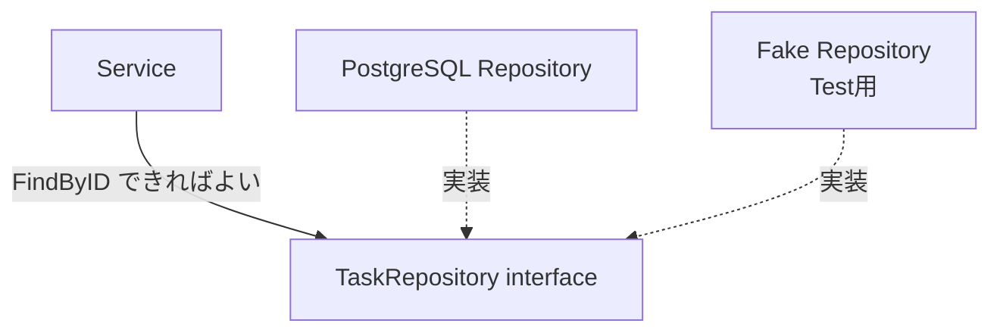
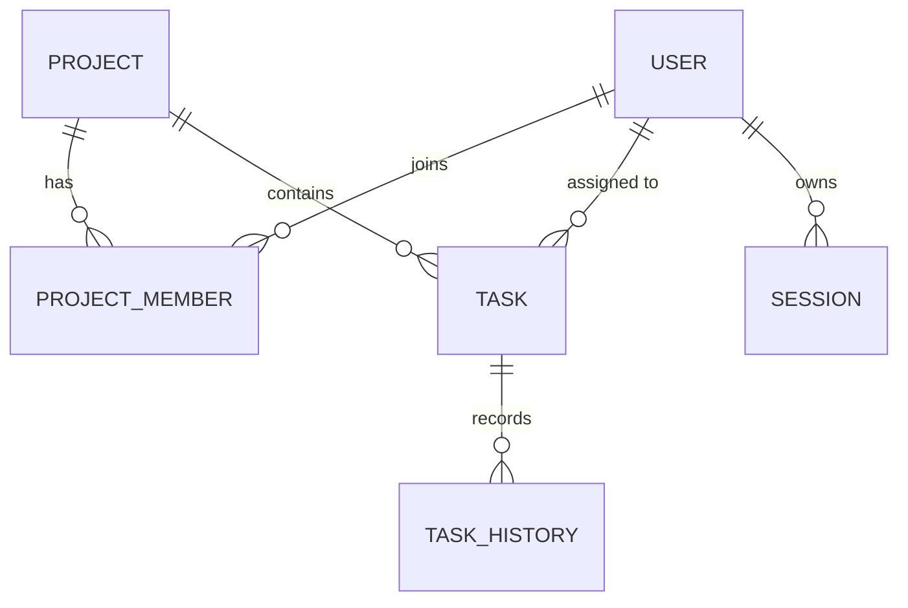

# Chapter 00: 準備と前提知識

## この章の目的

ハンズオンを始める前に、必要なツールを揃え、後続の章を読むために最低限必要な Go の知識とドメインモデルを押さえる。

この章にコードを書く作業はない。**環境確認だけ済ませて Chapter 01 へ進み、分からない用語が出たらこの章へ戻る**使い方を想定している。

## 現在地

**準備** → 基礎(01-02) → Webアプリ化(03-05) → 本番対応(06-08) → Test(09)

## 完了条件

- [ ] `go version` が 1.25 以降を返す
- [ ] `docker compose version` が動く
- [ ] `curl` が動く
- [ ] 「Handler / Service / Repository が何を担当するか」を1行で言える
- [ ] Project と Task の関係を説明できる

---

## Step 1. 必要なツールを確認する

### やること

ハンズオンで使うツールが揃っているか確認する。

### 実行

```bash
go version
docker --version
docker compose version
git --version
curl --version
```

### 期待結果

各コマンドがバージョンを返す。検証環境での実際の出力。

```text
go version go1.27.1 windows/amd64
Docker version 29.7.2, build a7dcaa6
Docker Compose version v5.5.0
curl 8.18.0 (x86_64-w64-mingw32) libcurl/8.18.0 ...
```

必要なバージョンの目安。

| ツール | 必要バージョン | 使う章 |
|---|---|---|
| Go | 1.25 以降 | 全章（`ServeMux` のメソッドルーティングに 1.22 以降が必須） |
| Docker / Compose | 現行安定版 | Chapter 02 以降 |
| curl | 任意 | Chapter 01 以降 |
| Git | 任意 | 任意 |
| k6 | 不要（Docker イメージ `grafana/k6:2.3.0` を使う） | Chapter 09 のみ |

k6 は Chapter 09 の負荷テストでしか使わない。ローカルへのインストールは不要で、Docker で実行する。Chapter 09 の前にイメージを取得しておくと、当日の待ち時間を減らせる。

```bash
docker pull grafana/k6:2.3.0
docker run --rm grafana/k6:2.3.0 version
```

検証環境での実際の出力。

```text
k6 v2.3.0 (commit/e088784614, go1.27.1, linux/amd64)
```

### なぜ行うのか

Go 1.22 より前の `net/http` には `mux.HandleFunc("GET /health", ...)` のようなメソッド付きルーティングがない。バージョンが古いと Chapter 01 の最初のコードが動かない。

---

## Step 2. Windows で日本語を送るときの注意

### やること

Windows 環境の場合のみ、curl で日本語を送るときの文字化け対策を確認する。

### 実行

```bash
# NG: シェルの引数として日本語を直接渡す
curl -X POST localhost:8080/projects/1/tasks \
  -H 'Content-Type: application/json' \
  -d '{"title":"認証APIを実装する"}'
```

### 期待結果

Windows の Git Bash やコマンドプロンプトでは、この書き方でタイトルが `���` に化けることがある。検証環境で実際に化けた。

```text
{"title":"\357\277\275F\357\277\275\357\277\275API..."}   ← EF BF BD = 置換文字
```

これは**アプリの不具合ではなく、シェルが引数を UTF-8 以外へ変換している**ために起きる。UTF-8 のファイルから読ませれば正しく通る。

```bash
# OK: UTF-8 で保存したファイルから送る
cat > req.json <<'EOF'
{"title":"認証APIを実装する","priority":"high"}
EOF

curl -X POST localhost:8080/projects/1/tasks \
  -H 'Content-Type: application/json' \
  --data-binary @req.json
```

### なぜ行うのか

この違いを知らないと、Chapter 03 の Validation を検証するときに「アプリが日本語を壊している」と誤診する。本ドキュメントの実行例は、この問題を避けるため原則 ASCII のタイトルを使う。

---

## Step 3. Go の最小知識を押さえる

後続の章に出てくる Go の文法を、必要な分だけ確認する。すでに Go を知っている場合は読み飛ばしてよい。

<details>
<summary>package と main</summary>

Go のファイル先頭には、所属する package を書く。

```go
package main
```

`main` package に `main()` があると、実行可能なプログラムになる。

```text
go run ./cmd/api
   ↓
main package を探す
   ↓
main() を実行
```

</details>

<details>
<summary>変数と struct</summary>

```go
var name string = "Task A"
count := 10                    // := は右辺から型を推論する（関数内でのみ使える）
```

関連する値をまとめた型が struct。DB の1行や JSON の1オブジェクトを表すときに使う。

```go
type Task struct {
    ID     int64
    Title  string
    Status string
}
```

```text
Task
 ├─ ID: 1
 ├─ Title: "APIを作る"
 └─ Status: "todo"
```

</details>

<details>
<summary>method と pointer</summary>

特定の型に紐づく関数が method。

```go
func (t Task) IsDone() bool {
    return t.Status == "done"
}
```

`*Task` は Task そのものを参照する。元の値を書き換えたいとき、または大きな struct のコピーを避けたいときに使う。

```go
func rename(t *Task) {
    t.Title = "changed"   // 呼び出し元の Task が変わる
}
```

```text
値渡し     Task ──copy──> 関数       関数内の変更は呼び出し元に届かない
Pointer    Task <────────  関数       同じ値を参照するので変更が届く
```

</details>

<details>
<summary>interface</summary>

「この method を持っているものなら何でも使える」という契約。

```go
type TaskRepository interface {
    FindByID(ctx context.Context, id int64) (Task, error)
}
```

Service は PostgreSQL の詳細を知らず、この契約だけを使う。



これにより、Test で DB を Fake へ置き換えられる。Chapter 09 で実際に使う。

</details>

<details>
<summary>error</summary>

Go では例外を投げず、戻り値として error を返す。

```go
task, err := repo.FindByID(ctx, id)
if err != nil {
    return Task{}, err
}
```

```text
処理
 ├─ 成功 → value, nil
 └─ 失敗 → zero value, error
```

> **WARNING**
> `task, _ := repo.FindByID(ctx, id)` のように error を捨てると、障害の原因も一緒に捨てることになる。

</details>

<details>
<summary>defer</summary>

関数終了時に実行する処理を予約する。DB の接続やファイルなど「最後に必ず閉じたいもの」で使う。

```go
rows, err := db.Query(ctx, query)
if err != nil {
    return err
}
defer rows.Close()   // この関数を抜けるとき、どの経路でも必ず呼ばれる
```

</details>

<details>
<summary>context.Context</summary>

Request の期限やキャンセルを、下位の処理へ伝えるための値。

```text
Client
  │ Request cancel
  ↓
Handler  ──ctx──> Service ──ctx──> Repository ──ctx──> Database
```

基本は Request から受け取った Context をそのまま引き回す。

```go
ctx := r.Context()
```

> **WARNING**
> Request 処理の途中で安易に `context.Background()` を作ると、Client が切断しても DB 処理だけが残り続けることがある。

Chapter 07 で、実際に Timeout を発生させて挙動を確認する。

</details>

<details>
<summary>JSON と struct の変換</summary>

```go
type CreateTaskRequest struct {
    Title string `json:"title"`   // バッククォート内はタグ。JSON のキー名を指定する
}
```

受信。

```go
var input CreateTaskRequest
err := json.NewDecoder(r.Body).Decode(&input)
```

送信。

```go
w.Header().Set("Content-Type", "application/json")
json.NewEncoder(w).Encode(task)
```

</details>

---

## Step 4. 作るもののドメインを把握する

### カンバンの構造

```text
Project
  │
  ├── Members（Owner / Member / Viewer）
  │
  └── Board
       ├── Todo    ├── Task A
       │           └── Task B
       ├── Doing   └── Task C
       └── Done    └── Task D
```

### Entity の関係



### 段階的に増やす

最初から全 Entity を扱うと、「HTTP」「SQL」「認証」「関連テーブル」を同時に理解する必要があり、問題の原因を切り分けられない。次の順番で増やす。

| 章 | 追加する Entity |
|---|---|
| Chapter 02 | `projects`、`tasks` |
| Chapter 04 | `users`、`sessions`、`project_members`、`tasks.assignee_id` |
| Chapter 06 | `task_history` |
| Chapter 07 | `idempotency_keys` |

---

## Step 5. API 仕様と Status の基準を確認する

### 最終的な API

```http
POST   /users                      ユーザー登録
POST   /login                      ログイン（Session Cookie を発行）
POST   /logout                     ログアウト（サーバ側 Session を削除）

POST   /projects                   Project 作成（作成者が Owner になる）
POST   /projects/{id}/members      Member 追加（Owner のみ）
POST   /projects/{id}/tasks        Task 作成
GET    /projects/{id}/tasks        Task 一覧（?q= で検索）

GET    /tasks/{id}                 Task 取得
PATCH  /tasks/{id}/status          Status 変更（楽観ロック）
```

### Error Response の形式

すべてのエラーを同じ形で返す。Client 側がエラー処理を1か所に書ける。

```json
{
  "error": {
    "code": "invalid_request",
    "message": "title is required"
  }
}
```

> **WARNING**
> DB の生エラーやスタックトレースをそのまま Response へ返さない。テーブル名や内部構造が攻撃者の手がかりになる。Chapter 03 で実際に何が漏れるか確認する。

### HTTP Status の使い分け

| 状況 | Status | このハンズオンでの例 |
|---|---|---|
| 取得・更新成功 | 200 | `GET /tasks/1`、`PATCH /tasks/1/status` |
| 作成成功 | 201 | `POST /projects/1/tasks` |
| Body なしの成功 | 204 | `POST /logout`、`POST /login`（Chapter 05 以降） |
| 入力形式・Validation 不正 | 400 | title が空、priority が範囲外、許可されない状態遷移 |
| 未認証 | 401 | Cookie なし、Session 失効、ログイン失敗 |
| 認証済みだが権限なし | 403 | Viewer が Task を作ろうとした |
| 資源なし | 404 | 存在しない Task、**他人の Task** |
| 更新競合 | 409 | 古い version で更新しようとした |
| Request 過多 | 429 | （今回は未実装。外部 API からの受信側として扱う） |
| 想定外の Server Error | 500 | 分類できなかった error |
| 依存先が利用不能 | 503 | Request Timeout |

「他人の Task が 403 ではなく 404」になる理由は Chapter 04 で扱う。

---

## この章のまとめ

- ツールのバージョン確認ができた
- Go の文法は「必要になったらこの章へ戻る」使い方をする
- Entity は段階的に増やす。最初は `projects` と `tasks` だけ
- Error Response は1つの形式に統一する

次は [Chapter 01: Go と HTTP の基礎](./chapter01_http.md) で、最初の HTTP サーバを起動する。
