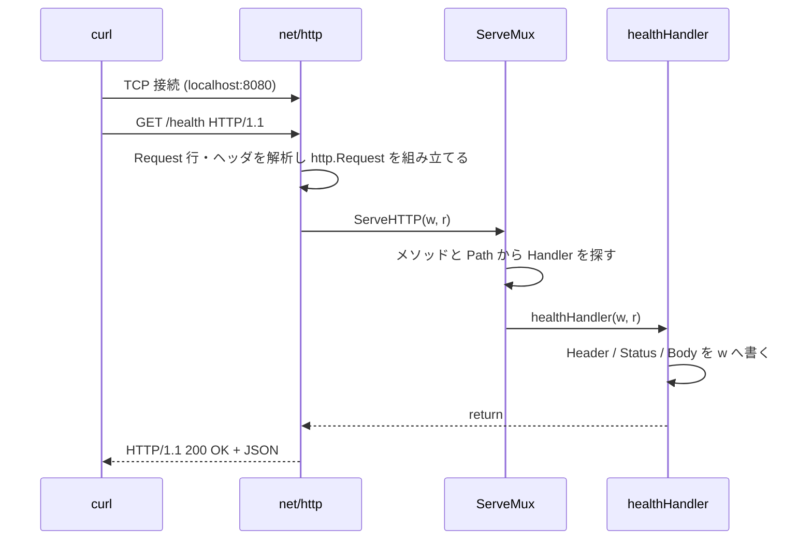

# Chapter 01: Go と HTTP の基礎

## この章の目的

Go のプログラムを起動し、HTTP Request が Handler に届いて Response になるまでの流れを、実際に動かして確認する。

DB もフレームワークもまだ使わない。`net/http` だけで JSON を返すサーバを立てる。

## 現在地

準備(00) → **基礎(01-02)** → Webアプリ化(03-05) → 本番対応(06-08) → Test(09)

## 完了条件

- [ ] `go run ./cmd/api` でサーバが起動する
- [ ] `curl http://localhost:8080/health` が `{"status":"ok"}` を返す
- [ ] 存在しない Path が 404 を返すことを確認した
- [ ] `w` と `r` がそれぞれ何を表すか説明できる

## この章の構造

```text
curl
 │ HTTP GET /health
 ▼
net/http Server (:8080)
 │
 ▼
ServeMux           URL と Handler の対応表
 │
 ▼
healthHandler      JSON を書き込む
 │
 ▼
HTTP Response
```

---

## Step 1. プロジェクトを作る

### やること

Go モジュールを初期化し、最小のディレクトリを作る。

### 実行

```bash
mkdir go-kanban
cd go-kanban

go mod init example.com/go-kanban

mkdir -p cmd/api
```

### 期待結果

`go.mod` が作られる。

```text
go-kanban/
├── cmd/
│   └── api/
└── go.mod
```

### なぜ行うのか

最初から `internal/handler/` や `internal/service/` を作らない。この段階では分けるほどの複雑さがなく、ファイルを往復する手間が増えるだけになる。**責務の分離は、分離しないと辛くなってから行う**（Chapter 05 で実施する）。

---

## Step 2. 最小の HTTP サーバを書く

### やること

`/health` にアクセスすると JSON を返すサーバを書く。

### 実行

`cmd/api/main.go` を作る。

```go
package main

import (
	"encoding/json"
	"log"
	"net/http"
)

type HealthResponse struct {
	Status string `json:"status"`
}

func healthHandler(w http.ResponseWriter, r *http.Request) {
	w.Header().Set("Content-Type", "application/json")
	w.WriteHeader(http.StatusOK)

	response := HealthResponse{Status: "ok"}

	if err := json.NewEncoder(w).Encode(response); err != nil {
		log.Printf("encode response: %v", err)
	}
}

func main() {
	mux := http.NewServeMux()
	mux.HandleFunc("GET /health", healthHandler)

	server := &http.Server{
		Addr:    ":8080",
		Handler: mux,
	}

	log.Println("server started on :8080")

	if err := server.ListenAndServe(); err != nil && err != http.ErrServerClosed {
		log.Fatal(err)
	}
}
```

### 期待結果

コードの整形と静的チェックが通る。

```bash
go fmt ./...
go vet ./...
```

`go vet` は何も出力しなければ問題なし。

---

## Step 3. コードを読む

### `main()` の流れ

```text
main()
 ├─ http.NewServeMux()   URL と Handler の対応表を作る
 ├─ mux.HandleFunc()     "GET /health" を healthHandler に割り当てる
 ├─ &http.Server{}       Server の設定を作る
 └─ ListenAndServe()     8080 番ポートで待ち受ける（ここで処理が止まる）
```

`main()` の中で作っているのは次の3つの係。それぞれを作り、つないでから待ち受けを始めている。

```text
http.Server     8080 番ポートで接続を受け付ける係      ← &http.Server{} で作る
   │ Request を渡す
   ▼
ServeMux        メソッドと Path を見て振り分ける係    ← http.NewServeMux() で作る
   │ 対応表で見つけた関数を呼ぶ
   ▼
healthHandler   Response を作る係                      ← mux.HandleFunc() で登録する
```

> **POINT**
> `main()` は**起動時に1回だけ**実行され、係の準備と登録をするだけ。`healthHandler` は `main()` の中では呼ばれていない。Request が届くたびに `net/http` が呼び出す。

### `mux := http.NewServeMux()`

```go
mux := http.NewServeMux()
│   │  └ 空の対応表（ServeMux）を作り、そのポインタ（*http.ServeMux）を返す
│   └ 短い変数宣言：宣言と代入を同時に行う
└ 変数名
```

`:=` は、右辺の値から型を推論して変数を宣言する。次の2行は同じ意味になる。

```go
mux := http.NewServeMux()
var mux *http.ServeMux = http.NewServeMux()
```

| 項目 | 内容 |
|---|---|
| 型が決まるタイミング | コンパイル時。一度決まった型は変わらない |
| 使える場所 | 関数の中だけ。関数の外では `var` を使う |
| 既存の変数に代入するとき | `:=` ではなく `=` を使う |

### `mux.HandleFunc("GET /health", healthHandler)`

「`GET /health` が届いたら `healthHandler` を呼ぶ」という1行を対応表に追加する。この行を実行しても `healthHandler` は呼ばれない。

| パターン | 呼ぶ関数 |
|---|---|
| `GET /health` | `healthHandler` |

#### `healthHandler` にカッコを付けない理由

```go
healthHandler()   // 今ここで関数を実行する
healthHandler     // 関数そのものを値として渡す（実行しない）
```

Go では関数を値として引数に渡せる。ここでは関数を mux に預けておき、Request が届いたときに mux に呼んでもらう。

#### `HandleFunc` の定義を読む

`net/http` パッケージでは、`HandleFunc` は次のように定義されている。

```go
func (mux *ServeMux) HandleFunc(pattern string, handler func(ResponseWriter, *Request))
│    │               │          │               │
│    │               │          │               └ ④ 引数2：handler（型は「関数」）
│    │               │          └ ③ 引数1：pattern（型は string）
│    │               └ ② メソッド名
│    └ ① レシーバ：*ServeMux 型に属するメソッドであることを表す
└ 関数定義のキーワード
```

| 部分 | 意味 | 呼び出し側で対応するもの |
|---|---|---|
| ① `(mux *ServeMux)` | レシーバ。`mux.HandleFunc(...)` とドットで呼べるのはこれがあるため。Java の `this`、Python の `self` にあたる | `mux` |
| ③ `pattern string` | 反応するメソッドと Path | `"GET /health"` |
| ④ `handler func(ResponseWriter, *Request)` | 「`ResponseWriter` と `*Request` を受け取り、何も返さない関数」なら何でも渡せる | `healthHandler` |

引数は「名前 型」の順に書く。④ は名前が `handler`、型が `func(ResponseWriter, *Request)` になる。

④ の型と `healthHandler` の定義を並べると、引数の型の並びと「戻り値なし」が一致している。形が合わない関数を渡すとコンパイルエラーになる。

```go
func(ResponseWriter, *Request)                              // HandleFunc が要求する形
func healthHandler(w http.ResponseWriter, r *http.Request)  // 自分で書いた関数
```

### `server := &http.Server{...}`

Server の設定を構造体にまとめ、そのポインタを `server` に入れる。この時点ではまだ起動しない。

```go
server := &http.Server{   // & ：作った構造体のポインタ（*http.Server）を取る
    Addr:    ":8080",      // 待ち受けるアドレスとポート
    Handler: mux,          // 届いた Request を渡す相手
}
```

| フィールド | 値 | 意味 |
|---|---|---|
| `Addr` | `":8080"` | ホストを省略すると、このマシンのすべてのネットワークインターフェースの 8080 番ポートで待ち受ける |
| `Handler` | `mux` | 届いた Request をすべて mux に渡す |
| 書いていないフィールド | ゼロ値 | 数値は `0`、文字列は `""`、ポインタは `nil` になる |

`Handler` フィールドの型は `http.Handler` インターフェースで、`ServeHTTP(w, r)` メソッドを持つ型なら何でも入れられる。`*http.ServeMux` はこのメソッドを持っているので、そのまま入れられる。[What Happened?](#what-happened) の図の `ServeHTTP(w, r)` は、Server がこのメソッドを呼んでいる部分にあたる。

#### `http.ListenAndServe(":8080", mux)` との違い

次の1行でも同じサーバが起動する。内部で `http.Server{Addr: ":8080", Handler: mux}` を作っているだけである。

```go
http.ListenAndServe(":8080", mux)
```

`http.Server` を自分で作るのは、あとから設定を足せるようにするためである。

- タイムアウト（`ReadHeaderTimeout` など）を設定できる
- `server.Shutdown(ctx)` で、処理中の Request を待ってから止められる（グレースフルシャットダウン）

`ListenAndServe()` の戻り値から `http.ErrServerClosed` を除外しているのは、`Shutdown()` で止めたときにこのエラーが返るためで、異常終了ではない。

### ポインタを使う場面と使わない場面

`main.go` には、`*` や `&` が付くもの（`mux`、`server`、`r`）と付かないもの（`w`、`response`）がある。この違いを整理する。

#### 前提：Go は値をコピーして渡す

Go では、代入や関数呼び出しのたびに値がまるごとコピーされる。ポインタを使うと、コピーされるのは値が置いてある場所（アドレス）だけになる。

```go
type Counter struct {
	N int
}

func addValue(c Counter)    { c.N++ } // コピーを書き換える
func addPointer(c *Counter) { c.N++ } // 場所の先にある本体を書き換える

func main() {
	c := Counter{N: 0}
	addValue(c)
	fmt.Println("value:", c.N)
	addPointer(&c)
	fmt.Println("pointer:", c.N)
}
```

実際の出力。

```text
value: 0
pointer: 1
```

| 記号 | 読み方 | 意味 |
|---|---|---|
| `&x` | x のアドレス | x が置いてある場所を取り出す |
| `*T`（型の位置） | T へのポインタ型 | 「T の場所」を入れる型 |

#### ポインタを使う3つの動機

1. **本体を書き換えたい**：コピーを書き換えても元に反映されない
2. **1つの実体を共有したい**：状態を持つもの（Server、ServeMux、DB 接続など）が複製されると困る
3. **大きな値のコピーを避けたい**：大きな構造体を毎回コピーすると無駄になる

どれにも当てはまらなければ、値のまま扱う。

#### `main.go` での使い分け

| 箇所 | 型 | ポインタか | 理由 |
|---|---|---|---|
| `mux := http.NewServeMux()` | `*http.ServeMux` | ポインタ | 動機1・2 |
| `server := &http.Server{...}` | `*http.Server` | ポインタ | 動機2 |
| `r *http.Request` | `*http.Request` | ポインタ | 動機3 |
| `w http.ResponseWriter` | `http.ResponseWriter` | 付けない | インターフェースのため |
| `response := HealthResponse{...}` | `HealthResponse` | 値 | どの動機にも当てはまらない |

**`mux`**：`HandleFunc()` で対応表に書き込み（動機1）、同じ対応表を `server` に渡している（動機2）。3か所とも同じ1つの本体を指している。

```text
mux ───────────┐
               ▼
          [ServeMux 本体]   GET /health → healthHandler
               ▲
server.Handler ┘
```

仮に mux が値でコピーされるとすると、`HandleFunc()` はコピーに登録し、Server は空の対応表を受け取る。その結果 `/health` は 404 になる。

**`server`**：`http.Server` は内部にロック（`sync.Mutex`）や接続の一覧などの状態を持つ。複製されると、起動したサーバと `Shutdown()` を呼んだサーバが別物になりうる。そのため最初から `&` で作り、同じ実体を指し続ける。

`ListenAndServe()` はポインタレシーバ（`func (s *Server) ListenAndServe() error`）なので、`&` を付けずに作った変数からでも呼べる。Go が自動で `(&server).ListenAndServe()` と解釈するためである。それでも、別の関数に渡したときのコピーを防ぐために `&` で作るのが慣習になっている。

**`r`**：`http.Request` はメソッド・URL・ヘッダ・Body・Context などを持つ大きな構造体である。Handler の中で書き換えることは基本的にないので、ここでのポインタの目的は書き換えではなくコピーを避けることにある。

**`w`**：`http.ResponseWriter` はインターフェースである。インターフェースの値は、中に具体的な型の値（ここでは `net/http` 内部の構造体へのポインタ）を持っていて、すでに本体を指している。`*` を付ける必要はない。

**`response`**：作ったあと書き換えず、共有もせず（JSON にして捨てる）、フィールドが1つだけで小さい。値のまま扱う。

#### 判断の目安

```text
その値を…
 ├─ 関数の中で書き換えて、呼び出し元に反映させたい？ → ポインタ
 ├─ 状態を持っていて、複製されると困る？            → ポインタ
 │    （Server、ServeMux、DB 接続、Mutex を含む構造体など）
 ├─ 大きな構造体で、何度も受け渡す？                → ポインタ
 ├─ インターフェース・スライス・マップ？            → 付けない
 │    （中身はもともと本体を指している）
 └─ どれでもない                                    → 値のまま
```

> **POINT**
> 迷ったら次の2つに従う。
>
> - 標準ライブラリが `New〜()` でポインタを返すものや、公式ドキュメントの例で `&` を付けているものは、ポインタのまま使う
> - 自分で作る小さなデータ（JSON のレスポンスなど）は値で作る

### Handler の引数

```go
func healthHandler(
    w http.ResponseWriter,   // Client へ Response を書き込むための出力先
    r *http.Request,         // Client から届いた Request
)
```

```text
Client
   │
   │ 届いた Request = r
   ▼
healthHandler
   │
   │ 書き込む先 = w
   ▼
Client
```

`w` は「書き込むと Client に届く」出力ストリームだと考えればよい。`r` は読み取り専用の入力だと考えればよい。

### 書き込む順番

```go
w.Header().Set("Content-Type", "application/json")   // 1. ヘッダを設定
w.WriteHeader(http.StatusOK)                         // 2. Status を確定
json.NewEncoder(w).Encode(response)                  // 3. Body を書く
```

> **POINT**
> この順番は入れ替えられない。`WriteHeader()` を呼んだ時点で Status とヘッダが Client へ送信され、その後の `Header().Set()` は無視される。

### `"GET /health"` という書き方

Go 1.22 以降の `ServeMux` は、パターンに HTTP メソッドを含められる。

```go
mux.HandleFunc("GET /health", healthHandler)   // GET のみ受け付ける
```

これ以前のバージョンでは Handler の中で `if r.Method != "GET"` と自分で判定する必要があった。

---

## Step 4. 動かして確認する

### やること

サーバを起動し、curl で叩く。

### 実行

```bash
go run ./cmd/api
```

**別のターミナル**で実行する。

```bash
curl -i http://localhost:8080/health
```

### 期待結果

実際の出力。

```http
HTTP/1.1 200 OK
Content-Type: application/json
Date: Thu, 24 Sep 2026 15:01:16 GMT
Content-Length: 16

{"status":"ok"}
```

`-i` はレスポンスヘッダも表示するオプション。Status と Content-Type を確認するために付ける。

---

## Step 5. 壊して観察する

正常系だけ確認して終わらない。**条件を1つずつ崩し、何が起きるかを観測する**。

### Failure Test 1: 存在しない Path

```bash
curl -i http://localhost:8080/not-found
```

実際の出力。

```http
HTTP/1.1 404 Not Found
Content-Type: text/plain; charset=utf-8
X-Content-Type-Options: nosniff

404 page not found
```

`ServeMux` に登録されていない Path は、自動的に 404 になる。自分で書いていない挙動が `net/http` 側で用意されている。

### Failure Test 2: 登録していないメソッド

```bash
curl -i -X POST http://localhost:8080/health
```

実際の出力。

```http
HTTP/1.1 405 Method Not Allowed
Allow: GET, HEAD
Content-Type: text/plain; charset=utf-8
X-Content-Type-Options: nosniff

Method Not Allowed
```

`"GET /health"` と登録したため、POST は 405 になる。`Allow: GET, HEAD` が自動で付く点にも注目する。HEAD は GET から自動的に導出される。

> **CHECK**
> 「エラーになった」で終わらせず、**Status・ヘッダ・Body の3つ**を確認する癖をつける。この癖が Chapter 03 以降で効いてくる。

---

## What Happened?

`curl http://localhost:8080/health` を実行したとき、実際に起きていること。



自分が書いたのは `healthHandler` と、mux への登録だけ。TCP の待ち受け、HTTP の解析、Response の組み立ては `net/http` が担当している。

---

## この章のまとめ

| 学んだこと | 要点 |
|---|---|
| `ServeMux` | URL とメソッドの対応表。一致しなければ 404 / 405 を自動で返す |
| `w` と `r` | `w` は Client への出力先、`r` は届いた Request |
| 書き込み順 | Header → WriteHeader → Body。逆順にすると無視される |
| 確認の仕方 | Status・ヘッダ・Body の3つを毎回見る |

ここまでで「HTTP Request が Go の関数に届く」流れが確認できた。次は [Chapter 02](./chapter02_crud.md) で PostgreSQL を繋ぎ、実際に読み書きする CRUD を作る。ただし**あえて雑に作る**。
