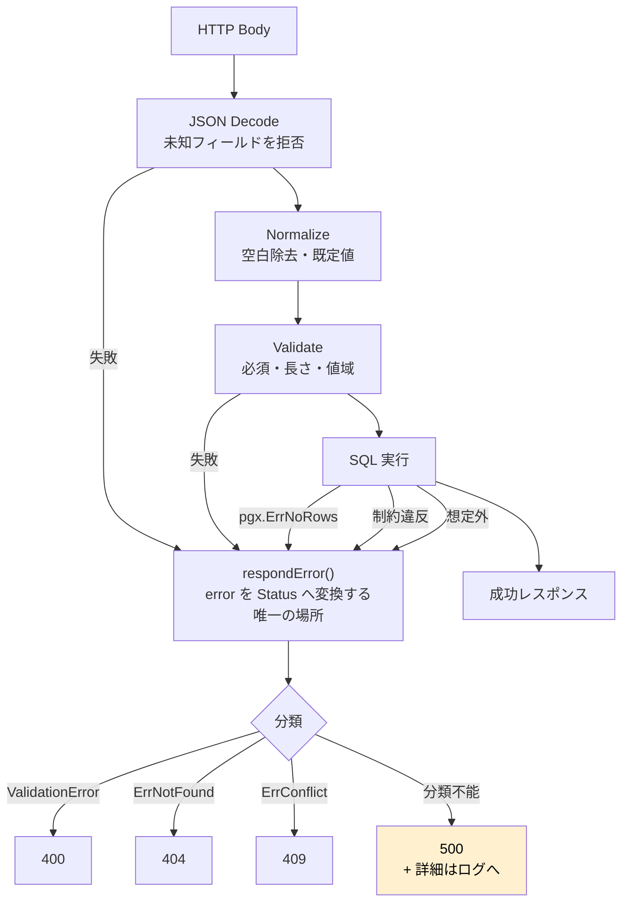
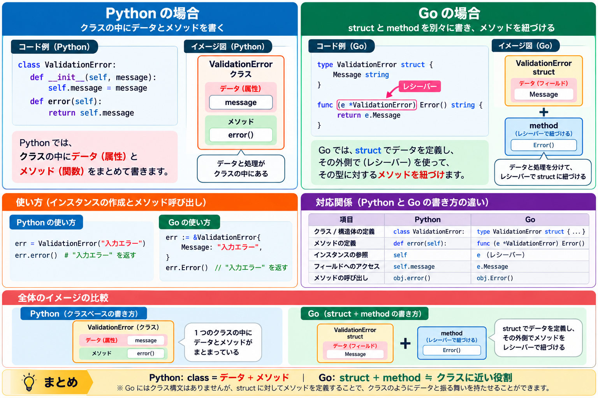

# Chapter 03: Validation と Error Handling

## この章の目的

Chapter 02 で観測した4つの問題を潰す。

1. 空の title が 201 で保存される
2. typo したフィールドが黙って無視される
3. 存在しない Task が 500 になる
4. DB の内部エラーが利用者へ漏れる

Validation と Error Handling は別の話に見えるが、どちらも「外部から来た入力や、下位層から来た失敗を、利用者に返してよい形へ変換する」という同じ仕事をしている。この章でまとめて扱う。

## 現在地

基礎(01-02) → **Webアプリ化(03-05)** → 本番対応(06-08) → Test(09)

## 完了条件

- [ ] 空 title / 範囲外 priority が 400 になる
- [ ] 未知の JSON フィールドが 400 になる
- [ ] 存在しない Task が 404 になる
- [ ] 存在しない Project への Task 作成が 404 になる
- [ ] 500 のとき、利用者には一般的な文言だけが返る
- [ ] エラーの詳細がサーバログにだけ残る

## この章の構造



---

## Step 1. エラーを分類する仕組みを作る

### やること

内部エラーと HTTP Response を分離する。

### 実行

`cmd/api/errors.go` を新規作成する。

```go
package main

import (
	"errors"
	"log"
	"net/http"

	"github.com/jackc/pgx/v5/pgconn"
)

// 業務上の失敗の分類。sentinel error（比較の目印として使う、あらかじめ用意した error 値）と呼ばれる。
var (
	ErrNotFound     = errors.New("not found")
	ErrForbidden    = errors.New("forbidden")
	ErrConflict     = errors.New("conflict")
	ErrUnauthorized = errors.New("unauthorized")
)

// ValidationError は「入力が不正である」という分類を表す。
// 利用者へ返してよいメッセージだけを Message に入れる。
type ValidationError struct {
	Message string
}

func (e *ValidationError) Error() string {
	return e.Message
}

type errorBody struct {
	Code    string `json:"code"`
	Message string `json:"message"`
}

type errorEnvelope struct {
	Error errorBody `json:"error"`
}

func writeError(w http.ResponseWriter, status int, code, message string) {
	writeJSON(w, status, errorEnvelope{
		Error: errorBody{Code: code, Message: message},
	})
}

// PublicError は「分類(err)」と「利用者へ見せてよい文言(message)」を束ねる。
// 分類だけでは "email is already registered" のような具体的な案内を返せない。
type PublicError struct {
	err     error
	message string
}

func (e *PublicError) Error() string {
	return e.message + ": " + e.err.Error()
}

// Unwrap があるため errors.Is(err, ErrConflict) は引き続き成立する。
func (e *PublicError) Unwrap() error {
	return e.err
}

func publicError(err error, message string) error {
	return &PublicError{err: err, message: message}
}

// publicMessage は err に利用者向け文言が付いていればそれを、
// 無ければ fallback を返す。
func publicMessage(err error, fallback string) string {
	var publicErr *PublicError

	if errors.As(err, &publicErr) {
		return publicErr.message
	}

	return fallback
}

// respondError は内部 error を HTTP Status へ変換する唯一の場所。
// 分類できない error は詳細をログへ残し、利用者へは一般的な文言だけ返す。
func respondError(w http.ResponseWriter, err error) {
	var validationErr *ValidationError

	switch {
	case errors.As(err, &validationErr):
		writeError(w, http.StatusBadRequest, "invalid_request", validationErr.Message)
	case errors.Is(err, ErrUnauthorized):
		writeError(w, http.StatusUnauthorized, "unauthorized", "authentication required")
	case errors.Is(err, ErrForbidden):
		writeError(w, http.StatusForbidden, "forbidden", "operation not allowed")
	case errors.Is(err, ErrNotFound):
		writeError(w, http.StatusNotFound, "not_found",
			publicMessage(err, "resource not found"))
	case errors.Is(err, ErrConflict):
		writeError(w, http.StatusConflict, "conflict",
			publicMessage(err, "resource was updated by another request"))
	default:
		log.Printf("unexpected error: %v", err)
		writeError(w, http.StatusInternalServerError, "internal_error", "internal server error")
	}
}

// PostgreSQL の制約違反は、Go側では単なる error として届く。
// SQLSTATE（PostgreSQL がエラーの種類ごとに返す5桁のコード）を見て
// 業務上の意味へ翻訳しないと、すべて 500 になる。
const (
	pgCodeUniqueViolation     = "23505"
	pgCodeForeignKeyViolation = "23503"
	pgCodeCheckViolation      = "23514"
)

func pgErrorCode(err error) string {
	var pgErr *pgconn.PgError

	if errors.As(err, &pgErr) {
		return pgErr.Code
	}

	return ""
}

func isUniqueViolation(err error) bool {
	return pgErrorCode(err) == pgCodeUniqueViolation
}

func isForeignKeyViolation(err error) bool {
	return pgErrorCode(err) == pgCodeForeignKeyViolation
}

func isCheckViolation(err error) bool {
	return pgErrorCode(err) == pgCodeCheckViolation
}
```

### なぜこの設計にするのか

`respondError` を「error を Status へ変換する唯一の場所」にする。各 Handler が `http.Error(w, ..., 500)` を個別に書くと、Status の付け方がバラバラになり、どこか1か所で内部情報を漏らす。変換を1か所に集めると、そこだけレビューすれば「漏れていないか」を判断できる。

<details>
<summary>GO NOTE: <code>errors.Is</code> と <code>errors.As</code> の使い分け</summary>

| 関数 | 用途 | 例 |
|---|---|---|
| `errors.Is(err, ErrNotFound)` | 同一の値かを判定する。sentinel error 向け | 「これは NotFound か？」 |
| `errors.As(err, &target)` | その型かを判定し、値を取り出す。情報を持つ error 向け | 「ValidationError なら、その Message を読みたい」 |

どちらも `%w` でラップされた error を辿る。

```go
err := fmt.Errorf("insert task: %w", ErrNotFound)

errors.Is(err, ErrNotFound)   // true（ラップされていても辿れる）
err == ErrNotFound            // false（== では辿れない）
```

`%w` は「この error を包む」という意味。`%v` で包むと文字列になるだけで、`errors.Is` が辿れなくなる。

</details>

<details>
<summary>GO NOTE: <code>func (e *ValidationError) Error() string</code> の読み方</summary>

Go にはクラスがない。`struct` でデータを定義し、`func` の直後の `(e *ValidationError)`（レシーバー）でその型にメソッドを紐づける。レシーバーは戻り値ではなく、「どの型のメソッドか」を示す。戻り値はメソッド名の後ろの `string`。



`Error() string` を持つ型は、Go 標準の `error` インターフェースを満たす。そのため `&ValidationError{...}` を `error` として返せる。

</details>

<details>
<summary>WHY: なぜ <code>PublicError</code> が必要か</summary>

sentinel error だけだと、409 のメッセージが常に同じになる。

```json
// メール重複なのに
{"error":{"code":"conflict","message":"resource was updated by another request"}}
```

利用者には意味が伝わらない。かといって内部エラーをそのまま返すわけにもいかない。

`PublicError` は「分類（何番を返すか）」と「公開文言（何と説明するか）」を分けて持つ。`Unwrap()` があるので `errors.Is(err, ErrConflict)` は従来どおり成立する。

```go
return publicError(ErrConflict, "email is already registered")
```

```json
{"error":{"code":"conflict","message":"email is already registered"}}
```

</details>

---

## Step 2. 入力検証を書く

### やること

必須・長さ・値域の検証を書く。

### 実行

`cmd/api/validate.go` を新規作成する。

```go
package main

import "strings"

const maxTitleLength = 100

var allowedPriorities = map[string]bool{
	"low":    true,
	"medium": true,
	"high":   true,
}

type CreateTaskRequest struct {
	Title       string `json:"title"`
	Description string `json:"description"`
	Priority    string `json:"priority"`
}

// Normalize は Validation の前に入力を正規化する。
// 「前後の空白だけの title」を空として扱うために必要。
func (input *CreateTaskRequest) Normalize() {
	input.Title = strings.TrimSpace(input.Title)
	input.Description = strings.TrimSpace(input.Description)

	if input.Priority == "" {
		input.Priority = "medium"
	}
}

func (input CreateTaskRequest) Validate() error {
	if input.Title == "" {
		return &ValidationError{Message: "title is required"}
	}

	if len([]rune(input.Title)) > maxTitleLength {
		return &ValidationError{Message: "title must be 100 characters or fewer"}
	}

	if !allowedPriorities[input.Priority] {
		return &ValidationError{Message: "priority must be one of: low, medium, high"}
	}

	return nil
}
```

### なぜ Normalize と Validate を分けるのか

```text
"   "  → Normalize →  ""  → Validate →  400 "title is required"
```

正規化せずに検証すると、`"   "`（空白3文字）が「title あり」として通ってしまう。DB には見た目が空のタイトルが入る。

正規化 → 検証 → 保存の順を守ると、「保存された値は常に正規化済み」という前提が成立する。

<details>
<summary>GO NOTE: <code>len([]rune(s))</code> と <code>len(s)</code> の違い</summary>

Go の `len(string)` はバイト数を返す。

```go
len("あいう")           // 9（UTF-8 で1文字3バイト）
len([]rune("あいう"))   // 3（文字数）
```

`len(input.Title) > 100` と書くと、日本語では 34 文字で弾かれる。利用者から見れば理不尽な制限になる。

Chapter 09 でこの挙動をテストで固定する。

</details>

<details>
<summary>DECISION: Validation ライブラリを使わない理由</summary>

`go-playground/validator` を使えば、タグで宣言的に書ける。

```go
Title string `json:"title" validate:"required,max=100"`
```

ただし、今の検証項目は3つしかない。ライブラリを入れると「タグの書き方を調べる」コストのほうが大きい。

検証項目が増えて if 文が並び始めたら導入を検討する。そのとき初めて、ライブラリが何を解決しているのかが分かる。

</details>

---

## Step 3. Handler を書き換える

### やること

JSON Decode を厳格にし、エラーを `respondError` に集約する。

### 実行

`cmd/api/main.go` に共通処理を追加する。

```go
// decodeJSON は未知のフィールドを拒否する。
// typo したフィールド名が黙って無視されると、利用者は「送ったのに反映されない」状態になる。
func decodeJSON(r *http.Request, dst any) error {
	decoder := json.NewDecoder(r.Body)
	decoder.DisallowUnknownFields()

	if err := decoder.Decode(dst); err != nil {
		return &ValidationError{Message: "request body is not valid JSON: " + err.Error()}
	}

	return nil
}

func pathID(r *http.Request, name string) (int64, error) {
	raw := r.PathValue(name)

	id, err := strconv.ParseInt(raw, 10, 64)
	if err != nil || id <= 0 {
		return 0, &ValidationError{Message: fmt.Sprintf("%s must be a positive integer", name)}
	}

	return id, nil
}
```

Task 作成の Handler を書き換える。

```go
func createTaskHandler(w http.ResponseWriter, r *http.Request) {
	projectID, err := pathID(r, "id")
	if err != nil {
		respondError(w, err)
		return
	}

	var input CreateTaskRequest

	if err := decodeJSON(r, &input); err != nil {
		respondError(w, err)
		return
	}

	input.Normalize()

	if err := input.Validate(); err != nil {
		respondError(w, err)
		return
	}

	var task Task

	err = pool.QueryRow(
		r.Context(),
		`INSERT INTO tasks (project_id, title, description, priority)
		 VALUES ($1, $2, $3, $4)
		 RETURNING id, project_id, title, description, priority, status, version`,
		projectID, input.Title, input.Description, input.Priority,
	).Scan(
		&task.ID, &task.ProjectID, &task.Title,
		&task.Description, &task.Priority, &task.Status, &task.Version,
	)

	// project が存在しない場合、DBは外部キー違反を返す。
	// これは Server の不具合ではなく「指定された project が無い」という利用者向けの情報。
	if isForeignKeyViolation(err) {
		respondError(w, ErrNotFound)
		return
	}

	if err != nil {
		respondError(w, fmt.Errorf("insert task: %w", err))
		return
	}

	writeJSON(w, http.StatusCreated, task)
}
```

Task 取得の Handler を書き換える。

```go
func getTaskHandler(w http.ResponseWriter, r *http.Request) {
	taskID, err := pathID(r, "id")
	if err != nil {
		respondError(w, err)
		return
	}

	var task Task

	err = pool.QueryRow(
		r.Context(),
		`SELECT id, project_id, title, description, priority, status, version
		 FROM tasks WHERE id = $1`,
		taskID,
	).Scan(
		&task.ID, &task.ProjectID, &task.Title,
		&task.Description, &task.Priority, &task.Status, &task.Version,
	)

	// pgx.ErrNoRows を「存在しない」という業務上の意味へ翻訳する。
	if errors.Is(err, pgx.ErrNoRows) {
		respondError(w, ErrNotFound)
		return
	}

	if err != nil {
		respondError(w, fmt.Errorf("query task: %w", err))
		return
	}

	writeJSON(w, http.StatusOK, task)
}
```

Task 一覧取得の Handler を書き換える。`respondError` への集約に加えて、`for rows.Next()` ループの直後に `rows.Err()` の確認を追加する。

```go
func listTasksHandler(w http.ResponseWriter, r *http.Request) {
	projectID, err := pathID(r, "id")
	if err != nil {
		respondError(w, err)
		return
	}

	rows, err := pool.Query(
		r.Context(),
		`SELECT id, project_id, title, description, priority, status, version
		 FROM tasks WHERE project_id = $1 ORDER BY id`,
		projectID,
	)
	if err != nil {
		respondError(w, fmt.Errorf("query tasks: %w", err))
		return
	}
	defer rows.Close()

	tasks := []Task{}

	for rows.Next() {
		var task Task

		if err := rows.Scan(
			&task.ID, &task.ProjectID, &task.Title,
			&task.Description, &task.Priority, &task.Status, &task.Version,
		); err != nil {
			respondError(w, fmt.Errorf("scan task: %w", err))
			return
		}

		tasks = append(tasks, task)
	}

	// ループを抜けた理由がエラーでないかを確認する。
	if err := rows.Err(); err != nil {
		respondError(w, fmt.Errorf("iterate tasks: %w", err))
		return
	}

	writeJSON(w, http.StatusOK, tasks)
}
```

> **WARNING**
> `rows.Next()` のループを抜けた理由は「全件読み終えた」とは限らない。途中で通信エラーが起きても `Next()` は `false` を返す。`rows.Err()` を見ないと、**一部しか取れていない結果を正常として返してしまう**。

```bash
go vet ./...
go run ./cmd/api
```

---

## Step 4. 動かして確認する

### やること

Chapter 02 で観測した問題が、Status と Response Body の両方で解消したか確認する。

### 実行

先に、Task の追加先になる Project があるか確認する。DB を作り直した場合など、Project が無ければ作っておく。

```bash
curl -X POST localhost:8080/projects \
  -H 'Content-Type: application/json' \
  -d '{"name":"Kanban Hands-on"}'
```

以降のコマンドは `projects/1` を前提にしている。返ってきた `id` が 1 でなければ、URL の `1` をその値に置き換える。

> **NOTE**
> Project が無いまま Task を作ると、外部キー違反を `ErrNotFound` に翻訳した結果として 404 が返る。Validation が先に動くため、不正な入力であれば Project が無くても 400 になる。400 を期待したケースで 404 が返ってきたら、`createTaskHandler` が Step 3 のコードに置き換わっているか確認する。

Project が用意できたら、各ケースを順に叩く。`-w '\n%{http_code}\n'` で、Response Body の次の行に Status を表示する。

```bash
# title が空
curl -s -w '\n%{http_code}\n' -X POST localhost:8080/projects/1/tasks \
  -H 'Content-Type: application/json' -d '{"title":"","priority":"high"}'

# title が空白だけ
curl -s -w '\n%{http_code}\n' -X POST localhost:8080/projects/1/tasks \
  -H 'Content-Type: application/json' -d '{"title":"   ","priority":"high"}'

# priority が不正
curl -s -w '\n%{http_code}\n' -X POST localhost:8080/projects/1/tasks \
  -H 'Content-Type: application/json' -d '{"title":"ok","priority":"SUPER_HIGH"}'

# フィールド名の typo
curl -s -w '\n%{http_code}\n' -X POST localhost:8080/projects/1/tasks \
  -H 'Content-Type: application/json' -d '{"title":"ok","titel":"typo"}'

# 壊れた JSON
curl -s -w '\n%{http_code}\n' -X POST localhost:8080/projects/1/tasks \
  -H 'Content-Type: application/json' -d '{"title":'

# id が数値でない
curl -s -w '\n%{http_code}\n' localhost:8080/tasks/abc

# 存在しない Task
curl -s -w '\n%{http_code}\n' localhost:8080/tasks/9999

# 存在しない Project
curl -s -w '\n%{http_code}\n' -X POST localhost:8080/projects/9999/tasks \
  -H 'Content-Type: application/json' -d '{"title":"ok","priority":"high"}'

# 正常系
curl -s -w '\n%{http_code}\n' -X POST localhost:8080/projects/1/tasks \
  -H 'Content-Type: application/json' -d '{"title":"write docs","priority":"high"}'
```

1ケース目の出力は次のようになる。

```text
{"error":{"code":"invalid_request","message":"title is required"}}
400
```

### 期待結果

検証環境での実際の出力。

| 入力 | Status | Response Body |
|---|---|---|
| `{"title":"","priority":"high"}` | 400 | `{"error":{"code":"invalid_request","message":"title is required"}}` |
| `{"title":"   ","priority":"high"}` | 400 | `{"error":{"code":"invalid_request","message":"title is required"}}` |
| `{"title":"ok","priority":"SUPER_HIGH"}` | 400 | `{"error":{"code":"invalid_request","message":"priority must be one of: low, medium, high"}}` |
| `{"title":"ok","titel":"typo"}` | 400 | `{"error":{"code":"invalid_request","message":"request body is not valid JSON: json: unknown field \"titel\""}}` |
| `{"title":` （壊れた JSON） | 400 | `{"error":{"code":"invalid_request","message":"request body is not valid JSON: unexpected EOF"}}` |
| `GET /tasks/abc` | 400 | `{"error":{"code":"invalid_request","message":"id must be a positive integer"}}` |
| `GET /tasks/9999` | 404 | `{"error":{"code":"not_found","message":"resource not found"}}` |
| `POST /projects/9999/tasks` | 404 | `{"error":{"code":"not_found","message":"resource not found"}}` |
| `{"title":"write docs","priority":"high"}` | 201 | `{"id":5,"project_id":1,"title":"write docs",...}` |

201 の `id` は、それまでに作った Task の数によって変わる。

Chapter 02 で観測した4つの問題がすべて解消した。

---

## Step 5. 500 のときに何が返るか確認する

### やること

分類できないエラーが起きたとき、利用者とログでそれぞれ何が見えるか確認する。

### 実行

この Step は読むだけでよい。DB 側で必ず失敗する状況は Chapter 06 で作るので、実際に動かすのはそこになる。ここでは、分類できないエラーが起きたときに何がどこへ出るかだけ押さえる。

### 期待結果

利用者には、一般的な文言だけが返る。

```json
{"error":{"code":"internal_error","message":"internal server error"}}
```

サーバログには詳細が残る。この章の `respondError` は `log.Printf` で出力するので、次のような1行になる。

```text
2026/09/25 09:16:48 unexpected error: insert task history: ERROR: new row for relation "task_history" violates check constraint "reject_done" (SQLSTATE 23514)
```

Chapter 05 で `log/slog` に切り替えると、同じ内容が JSON 形式で出るようになる。

> **POINT**
> ログ側にはテーブル名・制約名・SQLSTATE がすべて残る。調査に必要な情報は捨てず、利用者には渡さない。
> Chapter 02 の実装では、この文字列がそのまま HTTP Response の Body になっていた。

---

## 検証対象の一覧

この章で扱った検証項目と、今後扱うもの。

| 項目 | この章 | 備考 |
|---|---|---|
| 必須 | ○ | title |
| 長さ | ○ | rune 数で判定 |
| 値域 / enum | ○ | priority |
| 空文字 / 空白のみ | ○ | Normalize で TrimSpace |
| 想定外の JSON フィールド | ○ | `DisallowUnknownFields()` |
| 不正な Path Parameter | ○ | `pathID()` |
| 型 | ○ | JSON Decode が自動で弾く |
| 状態遷移の妥当性 | Chapter 06 | todo → done を拒否する |
| 権限 | Chapter 04 | Validation ではなく Authorization |

---

## Design Decision: Validation と DB Constraint の両方を持つ理由

両方必要になる。役割が違う。

| | Application Validation | DB Constraint |
|---|---|---|
| 目的 | 利用者へ理由を伝える | データの整合性を守る |
| 返せるもの | 「title is required」 | SQLSTATE や制約名など、機械向けの情報 |
| 守れる範囲 | この API を通った入力だけ | 直接 SQL を叩いた場合も含む |
| 抜け道 | 別の API、バッチ、手動 SQL | なし |

Application 側だけだと、管理用スクリプトや別経路からの書き込みで壊れる。DB 側だけだと、利用者に理由を説明できない。

---

## この章のまとめ

| 導入したもの | 解決した問題 |
|---|---|
| `ValidationError` + `Validate()` | 空 title / 範囲外 priority が保存される |
| `DisallowUnknownFields()` | typo が黙って無視される |
| sentinel error + `errors.Is` | 存在しない Task / Project が 500 になる |
| `respondError` への集約 | Status の付け方がバラバラになる |
| `PublicError` | 409 のメッセージが常に同じで意味が伝わらない |
| SQLSTATE の翻訳 | 外部キー違反が 500 になる |
| 既定の 500 文言 | DB の内部情報が利用者へ漏れる |

次は [Chapter 04: 認証・認可・IDOR](./chapter04_auth.md)。現時点では誰でも全ての Task を読み書きできる状態なので、これを塞ぐ。
