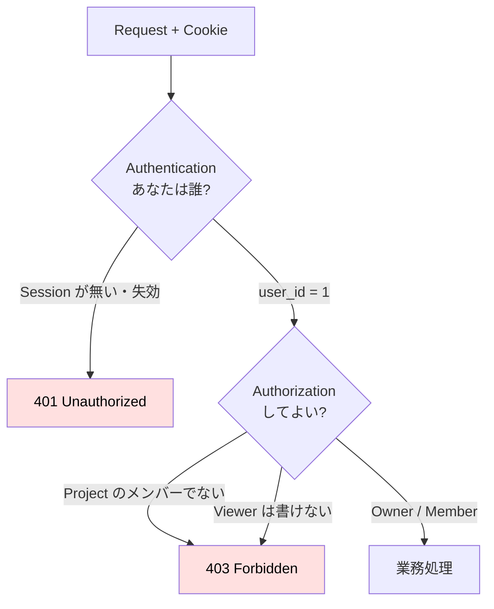
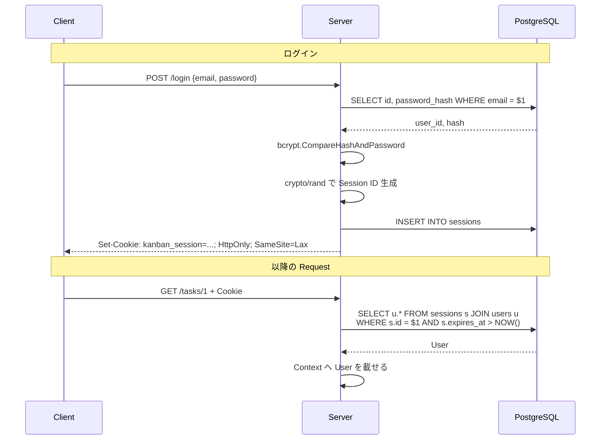
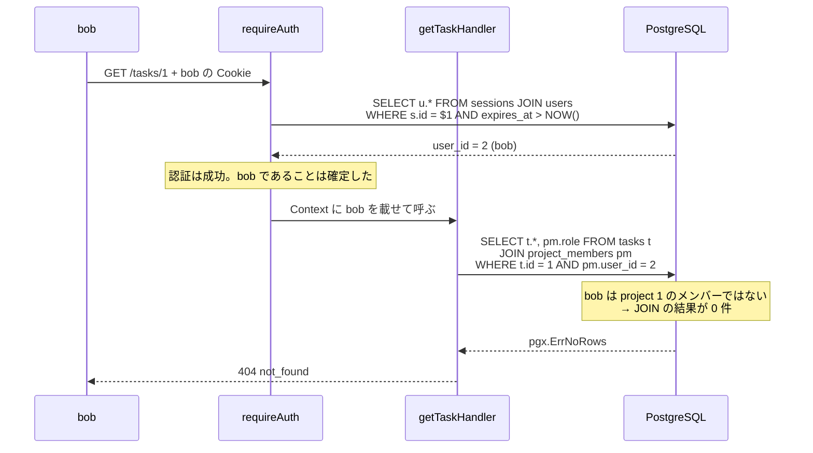

# Chapter 04: 認証・認可・IDOR

## この章の目的

現時点の API は、**誰でも全ての Task を読み書きできる**。これを3段階で塞ぐ。

1. **Authentication（認証）** — 「あなたは誰か」を識別する
2. **Authorization（認可）** — 「その人はこの操作をしてよいか」を判断する
3. **IDOR / BOLA 対策** — ID を書き換えても他人の資源へ到達できないようにする

この3つは混同されやすいが別物で、対策する場所も違う。

## 現在地

基礎(01-02) → **Webアプリ化(03-05)** → 本番対応(06-08) → Test(09)

## 完了条件

- [ ] ユーザー登録とログインができ、Session Cookie が発行される
- [ ] 未認証の Request が 401 になる
- [ ] Project 外のユーザーによる Task 作成が 403 になる
- [ ] **他人の Task の取得が 404 になる**（403 ではない）
- [ ] ログアウト後に同じ Cookie を使うと 401 になる

## 認証と認可の関係



| | Authentication | Authorization |
|---|---|---|
| 問い | あなたは誰？ | その人はこの操作をしてよい？ |
| 失敗時 | 401 | 403 |
| 実装場所 | Middleware（全 Request 共通） | 各操作の直前（操作ごとに条件が違う） |
| 再試行の意味 | ログインし直せば通る | 何度やっても通らない |

---

## Step 1. 認証用のテーブルを作る

### やること

ユーザー、セッション、プロジェクトメンバーのテーブルを追加する。

### 実行

`migrations/002_auth.sql` を作る。

```sql
CREATE TABLE users (
    id BIGSERIAL PRIMARY KEY,
    email TEXT NOT NULL UNIQUE,
    password_hash TEXT NOT NULL,
    created_at TIMESTAMPTZ NOT NULL DEFAULT NOW()
);

CREATE TABLE sessions (
    id TEXT PRIMARY KEY,
    user_id BIGINT NOT NULL REFERENCES users(id) ON DELETE CASCADE,
    expires_at TIMESTAMPTZ NOT NULL,
    created_at TIMESTAMPTZ NOT NULL DEFAULT NOW()
);

CREATE INDEX idx_sessions_user_id ON sessions(user_id);

CREATE TABLE project_members (
    project_id BIGINT NOT NULL REFERENCES projects(id) ON DELETE CASCADE,
    user_id BIGINT NOT NULL REFERENCES users(id) ON DELETE CASCADE,
    role TEXT NOT NULL CHECK (role IN ('owner', 'member', 'viewer')),
    created_at TIMESTAMPTZ NOT NULL DEFAULT NOW(),
    PRIMARY KEY (project_id, user_id)
);

CREATE INDEX idx_project_members_user_id ON project_members(user_id);

ALTER TABLE tasks
    ADD COLUMN assignee_id BIGINT REFERENCES users(id) ON DELETE SET NULL;

CREATE INDEX idx_tasks_assignee_id ON tasks(assignee_id);
```

```bash
docker compose exec -T db \
  psql -U kanban -d kanban -v ON_ERROR_STOP=1 < migrations/002_auth.sql
```

### 期待結果

```text
CREATE TABLE
CREATE TABLE
CREATE INDEX
CREATE TABLE
CREATE INDEX
ALTER TABLE
CREATE INDEX
```

<details>
<summary>スキーマの設計判断</summary>

| 決定 | 理由 |
|---|---|
| `users.email` に `UNIQUE` | 重複登録を DB レベルで防ぐ。アプリ側のチェックだけでは同時登録で抜ける |
| `sessions.id` が `TEXT PRIMARY KEY` | ランダム文字列をそのまま主キーにする。連番だと次の値を推測できてしまう |
| `sessions.expires_at` | 期限切れ Session を SQL の `WHERE` で弾ける |
| `project_members` の複合主キー | 「同じ Project に同じ User が2回入る」を DB で防ぐ |
| `role` に `CHECK` 制約 | 想定外の Role 文字列が入らない。アプリのバグが即データ破損にならない |
| `assignee_id` は `ON DELETE SET NULL` | ユーザー退会で Task ごと消えると困る。担当者だけ外す |

</details>

---

## Step 2. ユーザー登録とログインを実装する

### やること

パスワードをハッシュ化して保存し、ログイン時に Session Cookie を発行する。

### 実行

```bash
go get golang.org/x/crypto/bcrypt
```

`cmd/api/auth.go` を新規作成する。

```go
package main

import (
	"context"
	"crypto/rand"
	"encoding/base64"
	"errors"
	"fmt"
	"net/http"
	"strings"
	"time"

	"github.com/jackc/pgx/v5"
	"golang.org/x/crypto/bcrypt"
)

const (
	sessionCookieName = "kanban_session"
	sessionTTL        = 24 * time.Hour
)

type User struct {
	ID    int64  `json:"id"`
	Email string `json:"email"`
}

// contextKey は他packageのkeyと衝突しないよう独自型にする。
type contextKey string

const userContextKey contextKey = "user"

// newSessionID は推測不能なSession IDを生成する。
// math/rand ではなく crypto/rand を使う。
func newSessionID() (string, error) {
	buf := make([]byte, 32)

	if _, err := rand.Read(buf); err != nil {
		return "", fmt.Errorf("generate session id: %w", err)
	}

	return base64.RawURLEncoding.EncodeToString(buf), nil
}

type credentials struct {
	Email    string `json:"email"`
	Password string `json:"password"`
}

func (c credentials) validate() error {
	if !strings.Contains(c.Email, "@") {
		return &ValidationError{Message: "email must be a valid address"}
	}

	if len(c.Password) < 12 {
		return &ValidationError{Message: "password must be 12 characters or more"}
	}

	return nil
}

func createUserHandler(w http.ResponseWriter, r *http.Request) {
	var input credentials

	if err := decodeJSON(r, &input); err != nil {
		respondError(w, err)
		return
	}

	if err := input.validate(); err != nil {
		respondError(w, err)
		return
	}

	hash, err := bcrypt.GenerateFromPassword([]byte(input.Password), bcrypt.DefaultCost)
	if err != nil {
		respondError(w, fmt.Errorf("hash password: %w", err))
		return
	}

	var user User

	err = pool.QueryRow(
		r.Context(),
		"INSERT INTO users (email, password_hash) VALUES ($1, $2) RETURNING id, email",
		input.Email, string(hash),
	).Scan(&user.ID, &user.Email)

	if isUniqueViolation(err) {
		respondError(w, publicError(ErrConflict, "email is already registered"))
		return
	}

	if err != nil {
		respondError(w, fmt.Errorf("insert user: %w", err))
		return
	}

	writeJSON(w, http.StatusCreated, user)
}

func loginHandler(w http.ResponseWriter, r *http.Request) {
	var input credentials

	if err := decodeJSON(r, &input); err != nil {
		respondError(w, err)
		return
	}

	var (
		userID int64
		hash   string
	)

	err := pool.QueryRow(
		r.Context(),
		"SELECT id, password_hash FROM users WHERE email = $1",
		input.Email,
	).Scan(&userID, &hash)

	// 「User未登録」と「Password不一致」を区別して返さない。
	// 区別するとEmailの登録有無を外部から列挙できてしまう。
	if errors.Is(err, pgx.ErrNoRows) {
		respondError(w, ErrUnauthorized)
		return
	}

	if err != nil {
		respondError(w, fmt.Errorf("query user: %w", err))
		return
	}

	if err := bcrypt.CompareHashAndPassword([]byte(hash), []byte(input.Password)); err != nil {
		respondError(w, ErrUnauthorized)
		return
	}

	sessionID, err := newSessionID()
	if err != nil {
		respondError(w, err)
		return
	}

	expiresAt := time.Now().Add(sessionTTL)

	_, err = pool.Exec(
		r.Context(),
		"INSERT INTO sessions (id, user_id, expires_at) VALUES ($1, $2, $3)",
		sessionID, userID, expiresAt,
	)
	if err != nil {
		respondError(w, fmt.Errorf("insert session: %w", err))
		return
	}

	http.SetCookie(w, &http.Cookie{
		Name:     sessionCookieName,
		Value:    sessionID,
		Path:     "/",
		Expires:  expiresAt,
		HttpOnly: true,                 // JavaScriptから読めなくする
		Secure:   false,                // 本番(HTTPS)では true にする
		SameSite: http.SameSiteLaxMode, // 他サイトからの自動送信を抑制する
	})

	writeJSON(w, http.StatusOK, map[string]int64{"user_id": userID})
}

func logoutHandler(w http.ResponseWriter, r *http.Request) {
	cookie, err := r.Cookie(sessionCookieName)
	if err == nil {
		// Server側のSessionを消す。Cookieを消すだけでは無効化にならない。
		if _, err := pool.Exec(r.Context(), "DELETE FROM sessions WHERE id = $1", cookie.Value); err != nil {
			respondError(w, fmt.Errorf("delete session: %w", err))
			return
		}
	}

	http.SetCookie(w, &http.Cookie{
		Name:     sessionCookieName,
		Value:    "",
		Path:     "/",
		MaxAge:   -1,
		HttpOnly: true,
		SameSite: http.SameSiteLaxMode,
	})

	w.WriteHeader(http.StatusNoContent)
}

// requireAuth はCookieのSessionからUserを特定し、Contextへ載せる。
func requireAuth(next http.HandlerFunc) http.HandlerFunc {
	return func(w http.ResponseWriter, r *http.Request) {
		cookie, err := r.Cookie(sessionCookieName)
		if err != nil {
			respondError(w, ErrUnauthorized)
			return
		}

		var user User

		err = pool.QueryRow(
			r.Context(),
			`SELECT u.id, u.email
			 FROM sessions s
			 JOIN users u ON u.id = s.user_id
			 WHERE s.id = $1 AND s.expires_at > NOW()`,
			cookie.Value,
		).Scan(&user.ID, &user.Email)

		if errors.Is(err, pgx.ErrNoRows) {
			respondError(w, ErrUnauthorized)
			return
		}

		if err != nil {
			respondError(w, fmt.Errorf("query session: %w", err))
			return
		}

		ctx := context.WithValue(r.Context(), userContextKey, user)
		next(w, r.WithContext(ctx))
	}
}

func currentUser(ctx context.Context) (User, bool) {
	user, ok := ctx.Value(userContextKey).(User)
	return user, ok
}
```

### 認証の流れ



### なぜこの実装にするのか

> **WARNING**
> 認証処理・パスワードハッシュ・乱数生成を独自方式で作らない。既存の検証された実装を使う。

| 実装上の判断 | 理由 |
|---|---|
| `bcrypt` を使う | **意図的に遅い**ハッシュ関数。総当たり攻撃のコストを上げる。SHA-256 などの高速ハッシュは不適 |
| `crypto/rand` を使う | `math/rand` は擬似乱数で、種から次の値を予測できる。Session ID には使えない |
| 未登録とパスワード不一致を**両方 401** にする | 区別すると、レスポンスの違いから登録済みメールアドレスを列挙できる |
| `HttpOnly` | JavaScript から Cookie を読めなくする。XSS があっても Session を盗まれにくくする |
| `SameSite=Lax` | 他サイトからの遷移で Cookie が自動送信されるのを抑える。CSRF 対策の一部 |
| `Secure` は本番で `true` | HTTPS でのみ Cookie を送る。ローカルは HTTP なので `false` |
| Session を**サーバ側**に持つ | Logout でサーバ側から即座に無効化できる |

<details>
<summary>DECISION: なぜ JWT ではなく Session なのか</summary>

| | Session（採用） | JWT |
|---|---|---|
| 状態の保持 | サーバ側（DB） | クライアント側（トークン内） |
| ログアウト | DB から削除すれば即無効 | 有効期限まで無効化できない（別途ブロックリストが必要） |
| 権限変更の反映 | 次の Request から反映 | トークン再発行まで古い権限のまま |
| スケール | Session ストアが必要 | サーバ側に状態が不要 |
| 学べること | Cookie 属性、CSRF、サーバ側失効 | 署名検証、クレーム設計 |

学習目的では Session を選ぶ。「Logout したのに無効化されない」というトークン方式の難しさを、まずは回避した状態で Cookie の扱いを理解する。

</details>

---

## Step 3. 認可を実装する

### やること

Project のメンバーシップと Role を確認する仕組みを作る。

### Role の設計

| Role | Task 閲覧 | Task 作成・更新 | Member 追加 |
|---|:---:|:---:|:---:|
| Viewer | ○ | × | × |
| Member | ○ | ○ | × |
| Owner | ○ | ○ | ○ |

### 実行

`cmd/api/authz.go` を新規作成する。

```go
package main

import (
	"context"
	"errors"
	"fmt"

	"github.com/jackc/pgx/v5"
)

// Role は Project 内での権限を表す。
const (
	RoleOwner  = "owner"
	RoleMember = "member"
	RoleViewer = "viewer"
)

// canWriteTask は Task を作成・更新できる Role かどうかを判断する。
func canWriteTask(role string) bool {
	return role == RoleOwner || role == RoleMember
}

// projectRole は user が project のメンバーかどうかと、その Role を返す。
// メンバーでなければ ErrForbidden。
func projectRole(ctx context.Context, projectID, userID int64) (string, error) {
	var role string

	err := pool.QueryRow(
		ctx,
		"SELECT role FROM project_members WHERE project_id = $1 AND user_id = $2",
		projectID, userID,
	).Scan(&role)

	if errors.Is(err, pgx.ErrNoRows) {
		return "", ErrForbidden
	}

	if err != nil {
		return "", fmt.Errorf("query project role: %w", err)
	}

	return role, nil
}

// findTaskForUser は「Taskが存在するか」ではなく
// 「このUserから見てアクセス可能なTaskか」をひとつのQueryで判断する。
//
// WHERE t.id = $1 だけで取得してから権限を確認する実装にすると、
// 確認を忘れた経路がそのまま IDOR / BOLA になる。
func findTaskForUser(ctx context.Context, taskID, userID int64) (Task, string, error) {
	var (
		task Task
		role string
	)

	err := pool.QueryRow(
		ctx,
		`SELECT t.id, t.project_id, t.title, t.description,
		        t.priority, t.status, t.version, pm.role
		 FROM tasks t
		 JOIN project_members pm ON pm.project_id = t.project_id
		 WHERE t.id = $1 AND pm.user_id = $2`,
		taskID, userID,
	).Scan(
		&task.ID, &task.ProjectID, &task.Title, &task.Description,
		&task.Priority, &task.Status, &task.Version, &role,
	)

	// 存在しないTaskと、他人のTaskを同じ 404 で返す。
	// 403 で返すと「そのIDのTaskは存在する」ことを攻撃者へ教えることになる。
	if errors.Is(err, pgx.ErrNoRows) {
		return Task{}, "", ErrNotFound
	}

	if err != nil {
		return Task{}, "", fmt.Errorf("query task for user: %w", err)
	}

	return task, role, nil
}
```

---

## Step 4. IDOR / BOLA を理解する

### 問題の構造

IDOR（Insecure Direct Object Reference）、API では BOLA（Broken Object Level Authorization）とも呼ばれる。

```text
User A がログイン済み

GET /tasks/100     ← 自分の Task。正常に見える
      ↓ URL の数字を変えるだけ
GET /tasks/101     ← User B の Task が見える？
```

**認証は通っている**ことに注意する。ログインしているので 401 にはならない。足りないのは「この Task はこの User のものか」という**オブジェクト単位の認可**。

### 危険な実装

```go
// 悪い例: 存在確認しかしていない
err := pool.QueryRow(ctx,
    "SELECT * FROM tasks WHERE id = $1", taskID).Scan(...)
```

「Task が存在するか」しか判断していない。ログインさえしていれば誰の Task でも読める。

### よくある不十分な修正

```go
// まだ危ない例: 取得してから確認する
task, _ := findTask(ctx, taskID)
role, err := projectRole(ctx, task.ProjectID, userID)   // ← この行を書き忘れると穴が開く
if err != nil {
    return ErrForbidden
}
```

動きはするが、**Handler が増えるたびに同じ確認を書く必要がある**。1か所でも書き忘れれば、そこが穴になる。

### 採用した実装

```sql
SELECT t.*, pm.role
FROM tasks t
JOIN project_members pm ON pm.project_id = t.project_id
WHERE t.id = $1 AND pm.user_id = $2;
```

**取得と認可を1つのクエリにまとめる。** メンバーでなければ「0 件」になり、そもそも Task を手に入れられない。書き忘れようがない。

> **POINT**
> 「資源が存在するか」ではなく、「**現在の User から見て、その資源へアクセス可能か**」を問う。
> この違いが IDOR 対策の核心になる。

### 403 ではなく 404 を返す理由

```text
他人の Task に 403 を返す
   → 「403 が返った = その ID の Task は実在する」
   → ID を総当たりすれば、存在する Task の一覧が作れる

他人の Task に 404 を返す
   → 存在しない Task と区別がつかない
   → 存在自体を漏らさない
```

これを **Resource Enumeration（資源の列挙）** の防止という。ただし、社内ツールなど「誰が見ても存在は分かってよい」要件なら 403 のほうが親切な場合もある。**要件次第で決める判断項目**として扱う。

---

## Step 5. Handler へ組み込む

### やること

各 Handler の先頭で認証済みユーザーを取り出し、認可を確認する。

### 実行

Task 作成の Handler。

```go
func createTaskHandler(w http.ResponseWriter, r *http.Request) {
	user, ok := currentUser(r.Context())
	if !ok {
		respondError(w, ErrUnauthorized)
		return
	}

	projectID, err := pathID(r, "id")
	if err != nil {
		respondError(w, err)
		return
	}

	// 「誰か」は requireAuth が確定させた。ここで確認するのは「してよいか」。
	role, err := projectRole(r.Context(), projectID, user.ID)
	if err != nil {
		respondError(w, err)
		return
	}

	if !canWriteTask(role) {
		respondError(w, ErrForbidden)
		return
	}

	// ... 以降は Chapter 03 と同じ（Validation → INSERT）
}
```

Task 取得の Handler。IDOR 対策済みのクエリに置き換える。

```go
func getTaskHandler(w http.ResponseWriter, r *http.Request) {
	user, ok := currentUser(r.Context())
	if !ok {
		respondError(w, ErrUnauthorized)
		return
	}

	taskID, err := pathID(r, "id")
	if err != nil {
		respondError(w, err)
		return
	}

	task, _, err := findTaskForUser(r.Context(), taskID, user.ID)
	if err != nil {
		respondError(w, err)
		return
	}

	writeJSON(w, http.StatusOK, task)
}
```

Project 作成では、作成者を Owner として登録する。

```go
	// Project作成とOwner登録は「両方成功」か「両方失敗」でなければならない。
	// Projectだけ作られてMemberが居ないと、作成者本人すら操作できないProjectが残る。
	// Transactionの詳細は Chapter 06 で扱う。
	tx, err := pool.Begin(r.Context())
	if err != nil {
		respondError(w, fmt.Errorf("begin tx: %w", err))
		return
	}
	defer tx.Rollback(r.Context())

	var project Project

	err = tx.QueryRow(
		r.Context(),
		"INSERT INTO projects (name) VALUES ($1) RETURNING id, name",
		input.Name,
	).Scan(&project.ID, &project.Name)
	if err != nil {
		respondError(w, fmt.Errorf("insert project: %w", err))
		return
	}

	_, err = tx.Exec(
		r.Context(),
		"INSERT INTO project_members (project_id, user_id, role) VALUES ($1, $2, $3)",
		project.ID, user.ID, RoleOwner,
	)
	if err != nil {
		respondError(w, fmt.Errorf("insert project member: %w", err))
		return
	}

	if err := tx.Commit(r.Context()); err != nil {
		respondError(w, fmt.Errorf("commit: %w", err))
		return
	}
```

ルーティングで認証の要否を分ける。

```go
	mux := http.NewServeMux()

	// 認証不要
	mux.HandleFunc("GET /health", healthHandler)
	mux.HandleFunc("POST /users", createUserHandler)
	mux.HandleFunc("POST /login", loginHandler)
	mux.HandleFunc("POST /logout", logoutHandler)

	// 認証必須
	mux.HandleFunc("POST /projects", requireAuth(createProjectHandler))
	mux.HandleFunc("POST /projects/{id}/members", requireAuth(addMemberHandler))
	mux.HandleFunc("POST /projects/{id}/tasks", requireAuth(createTaskHandler))
	mux.HandleFunc("GET /projects/{id}/tasks", requireAuth(listTasksHandler))
	mux.HandleFunc("GET /tasks/{id}", requireAuth(getTaskHandler))
```

> **POINT**
> 認証の要否がルーティング定義を見るだけで分かる。Handler の中に `if cookie == nil` が散らばっていると、どの API が保護されているのか一覧できない。

---

## Step 6. 動かして確認する

### やること

2人のユーザーを作り、他人の資源へアクセスできないことを確認する。

### 実行

```bash
# ユーザー登録
curl -X POST localhost:8080/users -H 'Content-Type: application/json' \
  -d '{"email":"alice@example.com","password":"alice-password-1"}'
curl -X POST localhost:8080/users -H 'Content-Type: application/json' \
  -d '{"email":"bob@example.com","password":"bob-password-123"}'

# ログイン（Cookie をファイルへ保存）
curl -c alice.txt -X POST localhost:8080/login -H 'Content-Type: application/json' \
  -d '{"email":"alice@example.com","password":"alice-password-1"}'
curl -c bob.txt -X POST localhost:8080/login -H 'Content-Type: application/json' \
  -d '{"email":"bob@example.com","password":"bob-password-123"}'

# alice が Project と Task を作る
curl -b alice.txt -X POST localhost:8080/projects -H 'Content-Type: application/json' \
  -d '{"name":"Alice Board"}'
curl -b alice.txt -X POST localhost:8080/projects/1/tasks -H 'Content-Type: application/json' \
  -d '{"title":"secret task","priority":"high"}'

# bob が alice の Task を読もうとする
curl -i -b bob.txt localhost:8080/tasks/1
```

`-c` は Cookie の保存、`-b` は Cookie の送信を指定する。

### 期待結果

検証環境での実際の出力。

| # | 操作 | Status | Response |
|---|---|---|---|
| 1 | alice 登録 | **201** | `{"id":1,"email":"alice@example.com"}` |
| 2 | 同じメールで再登録 | **409** | `{"error":{"code":"conflict","message":"email is already registered"}}` |
| 3 | 12文字未満のパスワード | **400** | `{"error":{"code":"invalid_request","message":"password must be 12 characters or more"}}` |
| 4 | Cookie なしで `POST /projects` | **401** | `{"error":{"code":"unauthorized","message":"authentication required"}}` |
| 5 | 誤ったパスワードでログイン | **401** | `{"error":{"code":"unauthorized","message":"authentication required"}}` |
| 6 | 存在しないメールでログイン | **401** | `{"error":{"code":"unauthorized","message":"authentication required"}}` |
| 7 | alice がログイン | **200** | `Set-Cookie: kanban_session=zeOtAK94...; Path=/; HttpOnly; SameSite=Lax` |

> **NOTE**
> ログインは現時点では 200 と `{"user_id":1}` を返す。Chapter 05 で層を分割する際、Body に意味のある情報がないため 204 No Content へ変更する。
| 8 | alice が Task 作成 | **201** | `{"id":1,"project_id":1,"title":"secret task",...}` |
| 9 | **alice が自分の Task 取得** | **200** | `{"id":1,...,"title":"secret task",...}` |
| 10 | **bob が alice の Task 取得（IDOR）** | **404** | `{"error":{"code":"not_found","message":"resource not found"}}` |
| 11 | bob が alice の Project に Task 作成 | **403** | `{"error":{"code":"forbidden","message":"operation not allowed"}}` |
| 12 | bob が alice の Project の Task 一覧 | **403** | `{"error":{"code":"forbidden","message":"operation not allowed"}}` |

> **CHECK**
> 5 と 6 が**同じレスポンス**である点を確認する。ここが違うと、メールアドレスの登録有無を外部から調べられる。

### Failure Test: ログアウト後に Cookie を使い回す

```bash
curl -b alice.txt -X POST localhost:8080/logout      # → 204
curl -b alice.txt localhost:8080/tasks/1              # → 401
```

実際の出力。

```text
logout: 204
after logout GET /tasks/1: 401
{"error":{"code":"unauthorized","message":"authentication required"}}
```

サーバ側の `sessions` 行を削除しているため、同じ Cookie を送っても通らない。**これが Session 方式の利点**で、JWT では追加の仕組みなしには実現できない。

---

## What Happened?

`bob` が `GET /tasks/1` を叩いたときの流れ。



**認証と認可が別の段階で働いている**ことが分かる。bob が誰かは確定しているが、その bob に権限がないので 404 になる。

---

## この章のまとめ

| 導入したもの | 防いだ問題 |
|---|---|
| bcrypt によるパスワードハッシュ | パスワードの平文保存 |
| `crypto/rand` による Session ID | Session ID の推測 |
| 401 の文言統一 | 登録済みメールアドレスの列挙 |
| `HttpOnly` / `SameSite` / `Secure` | XSS による Cookie 窃取、CSRF |
| サーバ側 Session の削除 | ログアウトしても Session が生き続ける |
| `requireAuth` でのルーティング分離 | 認証チェックの書き忘れ |
| `projectRole()` による Role 確認 | 権限のない操作 |
| **取得と認可を1クエリに統合** | **IDOR / BOLA** |
| 他人の資源に 404 | 資源の存在の漏洩 |

<details>
<summary>この章で扱わなかったセキュリティ項目</summary>

| 項目 | 状況 |
|---|---|
| CSRF トークン | `SameSite=Lax` のみで対応。Cookie 認証を本番で使うなら、要件に応じてトークン方式の併用を検討する |
| レートリミット | 未実装。ログイン試行の回数制限は本番では必須 |
| パスワードリセット | 未実装 |
| 多要素認証 | 未実装 |
| Session の固定化対策 | ログイン時に新しい Session ID を発行しているため対策済み |
| XSS | Backend が HTML を生成しないため直接の対象外。Frontend を追加する場合は、Task の description や Comment の表示で発生しうる |

</details>

次は [Chapter 05: 層分割・SQL Injection・N+1](./chapter05_repository.md)。`cmd/api/` に5ファイル・865行が集まり、`main.go` だけで378行になったので、ここで責務を分離する。
