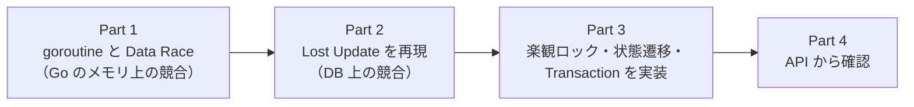
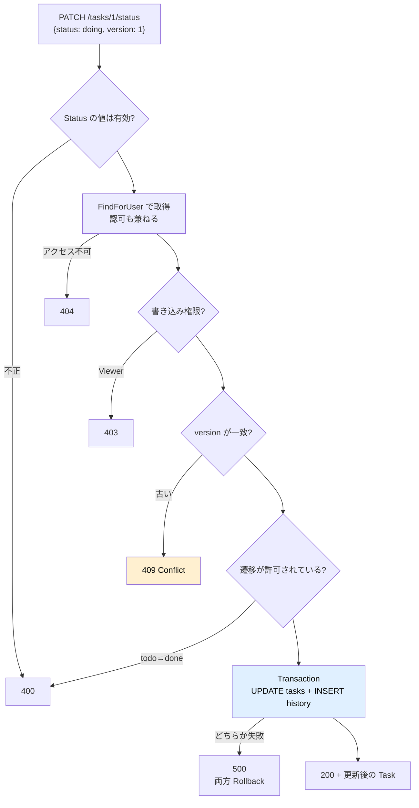
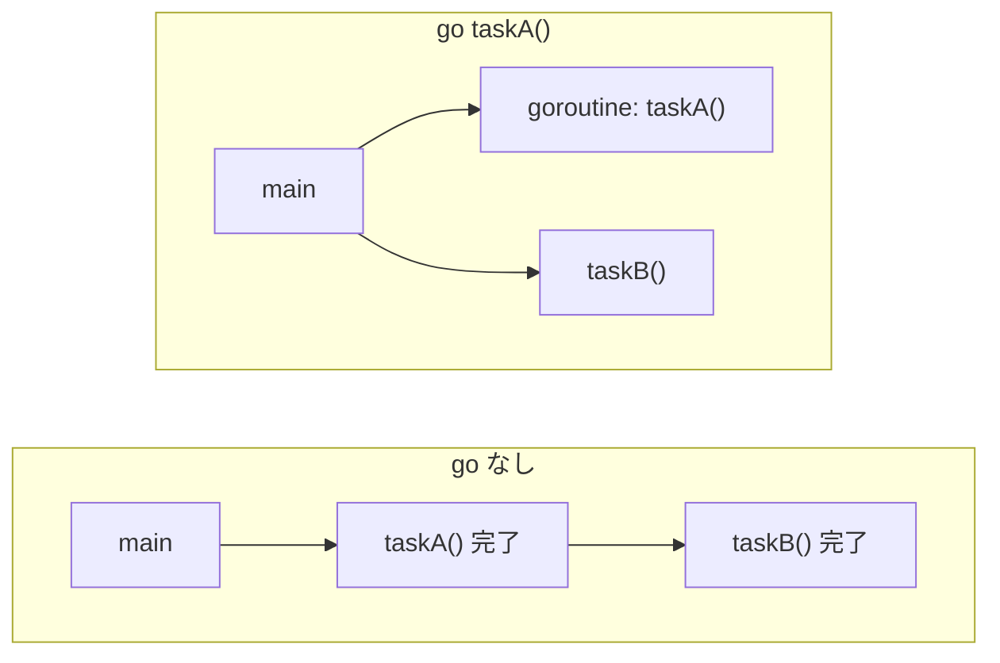
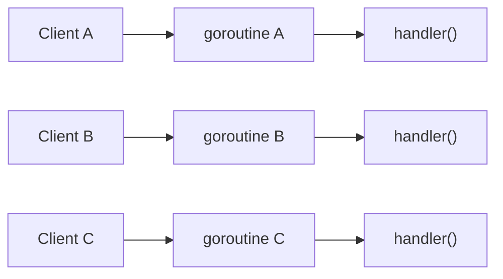
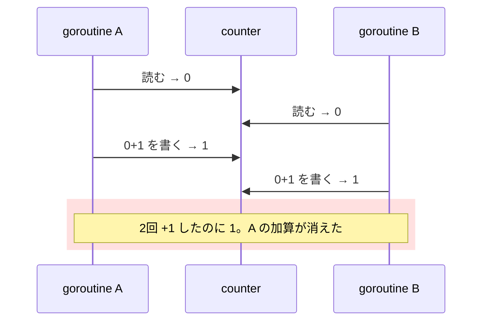
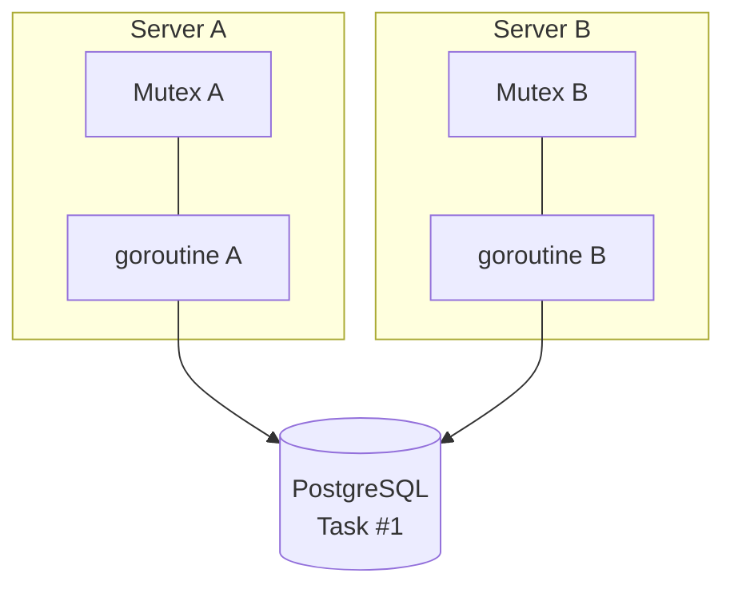
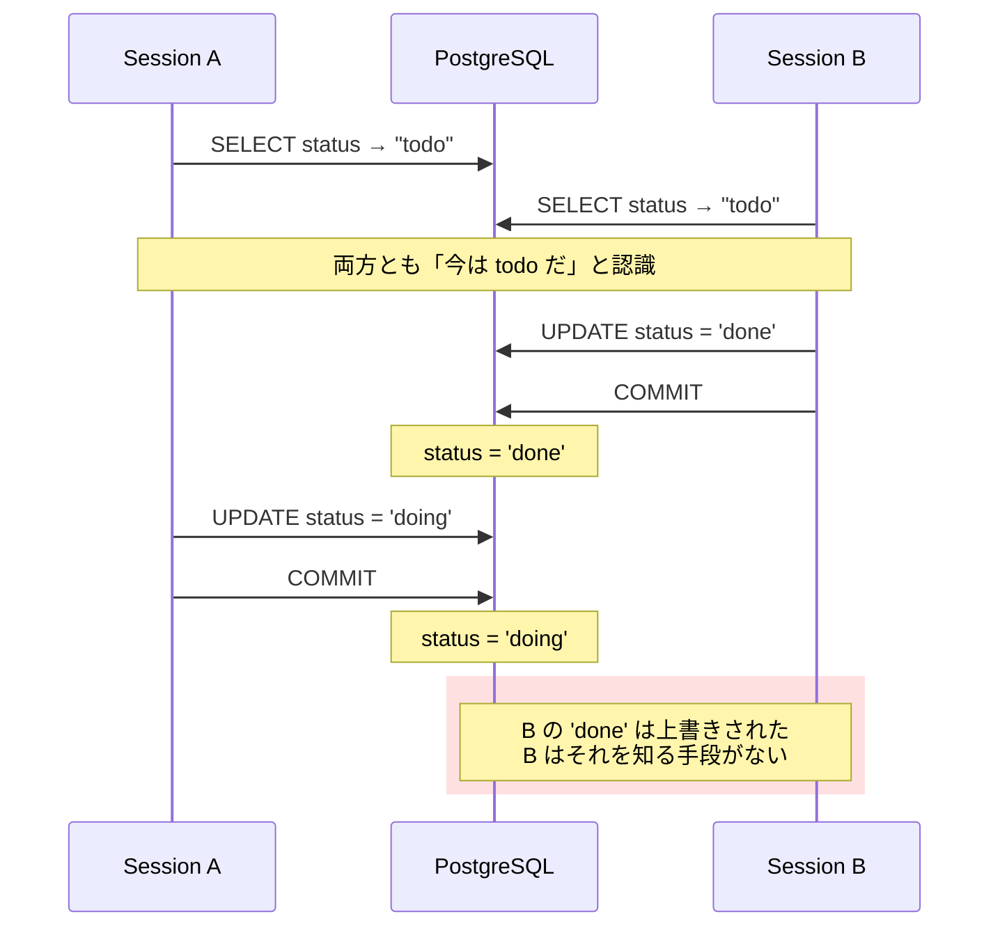
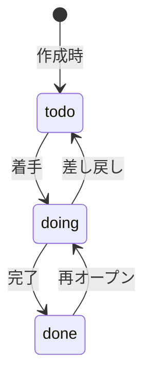

# Chapter 06: Transaction と同時更新

## この章の目的

「Task の Status を変更し、同時に変更履歴を残す」という機能を作る。単純に見えて、3つの問題が同時に現れる。

1. **Transaction** — 履歴の保存だけ失敗したら、Task の更新も残してはいけない
2. **Lost Update** — 2人が同時に更新すると、片方の変更が痕跡なく消える
3. **状態遷移** — `todo` からいきなり `done` へ飛ばしてよいのか

3つとも**実機で再現してから**対策する。

その前に Part 1 で、「同時に」とは Go の中で何が起きている状態なのかを確認する。`net/http` の Handler は複数の Request で並行して動く。goroutine と Data Race を先に理解しておくと、Lost Update との違いがはっきりする。

## 現在地

Webアプリ化(03-05) → **本番対応(06-08)** → Test(09)

## 完了条件

- [ ] `net/http` の Handler で毎回 `go` を書かなくてよい理由を説明できる
- [ ] **`go test -race` で Data Race を検出し**、`sync.Mutex` で直したあと警告が消えることを確認した
- [ ] Mutex では複数サーバ間の DB 競合を防げない理由を説明できる
- [ ] `PATCH /tasks/{id}/status` で Status を変更でき、履歴が残る
- [ ] **Lost Update を SQL レベルで再現した**（片方の更新が消えることを確認）
- [ ] 古い version での更新が 409 になる
- [ ] 8並列で同じ version を更新すると、成功が1件だけになる
- [ ] **履歴の保存を失敗させると、Task の更新も Rollback される**ことを確認した
- [ ] `todo` → `done` の直接遷移が 400 になる

## この章の構造



Part 3 で作る `PATCH /tasks/{id}/status` の判定順序。



---

## Part 1. goroutine と Race Condition

この Part はカンバンアプリのコードを変更しない。プロジェクトの外に実験用のディレクトリを作って試す。`go-kanban/` にいる状態から実行する。

```bash
mkdir ../goroutine-lab && cd ../goroutine-lab
go mod init goroutine-lab
mkdir demo waitgroup
```

最終的に次の構成になる。

```text
goroutine-lab/
├── go.mod
├── counter_test.go   Step 3, 4
├── demo/main.go      Step 1
└── waitgroup/main.go Step 2
```

> **NOTE**
> `go-kanban/` の中で試さない。Data Race を含むテストが残ると、Chapter 09 の `go test -race ./...` が失敗する。

### Step 1. goroutine を動かす

### やること

`go` を付けた関数呼び出しと、付けない呼び出しを並べて実行する。

### 実行

通常の関数呼び出しは、処理が終わるまで次へ進まない。`go` を付けると、その関数を **goroutine** として開始し、終了を待たずに次の行へ進む。



`demo/main.go`。

```go
package main

import (
	"fmt"
	"time"
)

func work(name string) {
	for i := 1; i <= 3; i++ {
		fmt.Println(name, i)
		time.Sleep(100 * time.Millisecond)
	}
}

func main() {
	go work("A") // goroutine として開始し、すぐ次の行へ進む
	work("B")    // main の goroutine で実行する
	time.Sleep(500 * time.Millisecond)
}
```

```bash
go run ./demo
```

### 期待結果

検証環境で3回実行したうちの2回分（1行にまとめて表示）。

```text
1回目: A 1  B 1  B 2  A 2  A 3  B 3
2回目: B 1  A 1  A 2  B 2  A 3  B 3
```

A と B が並行に進んでいる。同じコードでも、**実行するたびに出力順が変わった**。goroutine の実行順序を前提にしたコードは書かない。

> **NOTE**
> 最後の `time.Sleep` を消すと、`main` が先に終わった時点でプログラム全体が終了し、A の出力が途中で切れることがある。「たぶん終わっただろう」と Sleep で待つのは確実ではない。完了を待つ方法は Step 2 で扱う。

<details>
<summary>GO NOTE: goroutine と OS スレッド</summary>

goroutine は OS スレッドそのものではない。Go のランタイムが goroutine を OS スレッドへ割り当てて実行する。1つの goroutine が使うメモリは小さく、数千〜数万個を同時に動かせる。

最初は「**Go で複数の処理を並行して進めるための軽量な実行単位**」と理解しておけば十分。

</details>

### `net/http` は接続ごとに goroutine を使う

このハンズオンの Handler で、自分で `go` を書いた箇所はない。それでも Handler は並行に動いている。`net/http` が接続ごとに goroutine を起動し、その中で Handler を呼ぶからだ。別々の Client から届いた Request は、別々の goroutine で同時に処理される。



つまり Handler は、**同じ関数が同時に複数回実行される**前提で書く必要がある。

> **WARNING**
> Handler の中身を、さらに goroutine へ逃がさない。
>
> ```go
> func healthHandler(w http.ResponseWriter, r *http.Request) {
>     go actualHandler(w, r) // NG
> }
> ```
>
> Handler が return した時点で `net/http` は Response を完了させる。検証環境で、Handler 内の goroutine から 100ms 後に `w.Write([]byte("hello"))` させたところ、次のようになった。
>
> - Client が受け取ったのは `status=200 body=""`（空の Body）
> - 遅れた `Write` は `http: wrote more than the declared Content-Length` で失敗
> - `go run -race` では `DATA RACE` が報告された

---

### Step 2. `sync.WaitGroup` で完了を待つ

### やること

Sleep で待つ代わりに、`sync.WaitGroup` で goroutine の終了を待つ。

### 実行

`waitgroup/main.go`。

```go
package main

import (
	"fmt"
	"sync"
)

func main() {
	var wg sync.WaitGroup
	wg.Add(1) // 未完了の数を +1

	go func() {
		defer wg.Done() // 終わったら -1
		fmt.Println("background work")
	}()

	wg.Wait() // 未完了が 0 になるまで待つ
	fmt.Println("main: done")
}
```

```bash
go run ./waitgroup
```

### 期待結果

検証環境での実際の出力（3回とも同じ）。

```text
background work
main: done
```

`time.Sleep` を使っていないのに、goroutine の出力が必ず先に出る。`wg.Wait()` が goroutine の `Done()` まで待っているためだ。

### 仕組み

```text
Add(1)   → 未完了 = 1
  ↓
goroutine 開始
  ↓
Done()   → 未完了 = 0
  ↓
Wait() を通過
```

> **POINT**
> `WaitGroup` は「完了を待つ」仕組みであり、データを安全に共有する仕組みではない。この違いが Step 3 で問題になる。

---

### Step 3. Data Race を再現する

### やること

1000個の goroutine から、同じ変数を同期なしで `++` する。

### 実行

`counter++` は1行だが、中身は「読む → +1 → 書く」の3手順になっている。2つの goroutine が同時に実行すると、次の競合が起こり得る。



複数の処理が同じデータへ同時にアクセスし、実行順序によって結果が変わる状態を **Race Condition** と呼ぶ。その中でも、同じメモリへ同期なしにアクセスし、少なくとも一方が書き込みであるものを **Data Race** と呼ぶ。

`counter_test.go`。

```go
package lab

import (
	"sync"
	"testing"
)

func TestCounterRace(t *testing.T) {
	counter := 0
	var wg sync.WaitGroup

	for i := 0; i < 1000; i++ {
		wg.Add(1)
		go func() {
			defer wg.Done()
			counter++ // 同期なしで共有変数を書き換える
		}()
	}

	wg.Wait()
	t.Logf("counter=%d", counter)
}
```

まず `-race` なしで3回実行し、次に Race Detector を有効にして実行する。

```bash
go test -run TestCounterRace -v -count=3 .
go test -race -run TestCounterRace -v .
```

> **NOTE**
> Race Detector は cgo を使う。Windows では cgo が有効（`CGO_ENABLED=1`）で、gcc などの C コンパイラが入っている必要がある。`go env CGO_ENABLED` と `gcc --version` で確認する。

### 期待結果

検証環境での実際の出力。

**`-race` なし。** テストは PASS するが、値が 1000 にならない。

```text
=== RUN   TestCounterRace
    counter_test.go:21: counter=998
--- PASS: TestCounterRace (0.00s)
=== RUN   TestCounterRace
    counter_test.go:21: counter=980
--- PASS: TestCounterRace (0.00s)
=== RUN   TestCounterRace
    counter_test.go:21: counter=993
--- PASS: TestCounterRace (0.00s)
PASS
ok      goroutine-lab   0.199s
```

**`-race` あり。** Race Detector が Data Race を報告し、テストが FAIL する（パスは省略）。

```text
=== RUN   TestCounterRace
==================
WARNING: DATA RACE
Read at 0x00c00000c3a8 by goroutine 11:
  goroutine-lab.TestCounterRace.func1()
      .../goroutine-lab/counter_test.go:16 +0x7b

Previous write at 0x00c00000c3a8 by goroutine 9:
  goroutine-lab.TestCounterRace.func1()
      .../goroutine-lab/counter_test.go:16 +0x8d
...
==================
    counter_test.go:21: counter=959
    testing.go:1865: race detected during execution of test
--- FAIL: TestCounterRace (0.01s)
FAIL
```

`counter_test.go:16`（`counter++` の行）で、読み込みと書き込みが衝突したと指摘している。

> **CHECK**
> `-race` なしのテストは **PASS した**。`t.Logf` で値を出していなければ、1000 にならないことにも気づかない。さらに `counter=1000` になる回があっても、安全とは判断できない。並行処理のバグは毎回同じ形では再現しない。
> 並行処理を含むコードは `go test -race` で確認する。

---

### Step 4. `sync.Mutex` で共有メモリを守る

### やること

`counter++` を `sync.Mutex` で囲み、同時に1つの goroutine だけが実行するようにする。

### 実行

`counter_test.go` を書き換える。

```go
func TestCounterRace(t *testing.T) {
	counter := 0
	var wg sync.WaitGroup
	var mu sync.Mutex

	for i := 0; i < 1000; i++ {
		wg.Add(1)
		go func() {
			defer wg.Done()
			mu.Lock() // 他の goroutine はここで待つ
			counter++
			mu.Unlock()
		}()
	}

	wg.Wait()
	t.Logf("counter=%d", counter)
}
```

```text
goroutine A → Lock → counter++ → Unlock
                                   ↓
goroutine B ──────── 待機 ──────→ Lock → counter++ → Unlock
```

```bash
go test -race -run TestCounterRace -v -count=3 .
go test -race ./...
```

### 期待結果

検証環境での実際の出力。

```text
=== RUN   TestCounterRace
    counter_test.go:24: counter=1000
--- PASS: TestCounterRace (0.00s)
=== RUN   TestCounterRace
    counter_test.go:24: counter=1000
--- PASS: TestCounterRace (0.00s)
=== RUN   TestCounterRace
    counter_test.go:24: counter=1000
--- PASS: TestCounterRace (0.00s)
PASS
ok      goroutine-lab   1.313s
```

`go test -race ./...`（全パッケージ）。

```text
ok      goroutine-lab   1.322s
?       goroutine-lab/demo      [no test files]
?       goroutine-lab/waitgroup [no test files]
```

Race の警告が消え、3回とも `counter=1000` になった。

### Mutex で DB の競合まで防げるか

防げない。Mutex が守るのは**1つの Go プロセスの中のメモリ**だけになる。



Server A の Mutex は、Server B の処理を止められない。API サーバを複数台に増やした時点で、Mutex による排他は意味を失う。1台構成でも、psql や別のバッチから DB を直接更新されれば同じことが起きる。

### Data Race と Lost Update は別の問題

| | Data Race | Lost Update |
|---|---|---|
| 競合する場所 | Go プロセス内の共有メモリ（変数、map、slice） | DB 上の同じ行 |
| 起こす主体 | 同じプロセス内の goroutine | 別々の Request、別々のサーバ、別々の DB セッション |
| 検出方法 | `go test -race` | 並行リクエストで再現し、DB の最終状態を確認する |
| 対策 | `sync.Mutex`、channel、`sync/atomic` | Transaction、行ロック、**楽観ロック** |

カンバン API では、同時に届いた Request はそれぞれ別の goroutine で処理される。Handler の中で宣言した変数は goroutine ごとに独立しているので、Data Race は起きない（グローバル変数や、複数の Request で共有する map を書き換えれば起きる）。問題になるのは、**同じ Task の行を2つの Request が同時に更新する**ときだ。

```text
User A → Request → goroutine A → Service → Repository ─┐
                                                       ├→ Task #1
User B → Request → goroutine B → Service → Repository ─┘
```

これを Part 2 で再現する。実験用ディレクトリから `go-kanban/` へ戻っておく。

```bash
cd ../go-kanban
```

---

## Part 2. Lost Update を再現する

対策を書く前に、**何が起きるのかを実際に見る**。

Part 1 の Data Race はメモリ上の競合だった。ここで扱うのは DB 上の競合で、Mutex では防げない。Go のコードを介さず、2つの psql セッションから直接再現する。

### Step 5. 楽観ロックなしで同時更新する

### やること

2つの DB セッションから、version を見ない UPDATE を同時に実行する。

### 実行

```bash
# 対象の Task を todo に戻す
docker compose exec -T db psql -U kanban -d kanban -c \
  "UPDATE tasks SET status='todo', version=1 WHERE id=2;"

# セッション A: 読んでから2秒考えて 'doing' を書く（バックグラウンド）
docker compose exec -T db psql -U kanban -d kanban -c "
BEGIN;
SELECT status AS a_read FROM tasks WHERE id=2;
SELECT pg_sleep(2);
UPDATE tasks SET status='doing' WHERE id=2;
COMMIT;" &

sleep 1

# セッション B: 同じ値を読んで、すぐ 'done' を書く
docker compose exec -T db psql -U kanban -d kanban -c "
BEGIN;
SELECT status AS b_read FROM tasks WHERE id=2;
UPDATE tasks SET status='done' WHERE id=2;
COMMIT;"

sleep 3

docker compose exec -T db psql -U kanban -d kanban -c \
  "SELECT id, status, version FROM tasks WHERE id=2;"
```

### 期待結果

検証環境での実際の出力。

```text
初期状態: todo

--- Session B (先に COMMIT) ---
 b_read
--------
 todo

--- Session A (後から COMMIT) ---
 a_read
--------
 todo

### 最終状態 ###
 id | status | version
----+--------+---------
  2 | doing  |       1
```

> **観測された問題**
> A も B も `todo` を読んだ。B は `done` に変更して**正常に COMMIT した**。
> しかし最終状態は `doing`。**B の更新は、エラーも警告もなく消えた。**

### 時系列



この現象を **Lost Update** と呼ぶ。

### なぜ厄介なのか

| | |
|---|---|
| エラーが出ない | 両方の UPDATE が「1行更新しました」と正常終了する |
| ログに残らない | 異常ではないので記録されない |
| 再現が難しい | タイミング依存。テストで偶然通ってしまう |
| 発覚が遅い | 「入力したはずの内容が消えている」という問い合わせで初めて分かる |

カンバンで「担当者を変えたのに戻っている」「ステータスが勝手に巻き戻る」という不具合報告の多くは、これが原因になる。

---

## Part 3. Optimistic Lock で検出する

### Step 6. version を使った UPDATE を書く

### やること

UPDATE の `WHERE` に version を含め、「読んだときから変わっていない」ことを更新と同時に確認する。

### 実行

`internal/repository/task.go`。

```go
// UpdateStatus は Optimistic Lock による更新。
// WHERE に version を含めることで「読んだときから変わっていない」ことを
// UPDATE と同時に確認する。別Requestが先に更新していれば 0 件になる。
func (r *PgTaskRepository) UpdateStatus(
	ctx context.Context,
	taskID int64,
	status string,
	version int,
) (model.Task, error) {
	row := r.pool.QueryRow(
		ctx,
		`UPDATE tasks
		 SET status = $1, version = version + 1, updated_at = NOW()
		 WHERE id = $2 AND version = $3
		 RETURNING `+taskColumns,
		status, taskID, version,
	)

	task, err := scanTask(row)

	// 0件 = 「Taskが無い」か「versionが古い」。
	// 直前に存在確認を通っているので、ここでは競合として扱う。
	if errors.Is(err, pgx.ErrNoRows) {
		return model.Task{}, model.Public(model.ErrConflict,
			"task was updated by another request; reload and retry")
	}

	if err != nil {
		return model.Task{}, fmt.Errorf("update task status: %w", err)
	}

	return task, nil
}
```

### 仕組み

```text
初期状態: version = 1

A: 読む（version=1）      B: 読む（version=1）

A: UPDATE ... WHERE id=1 AND version=1
   → 1行更新。version は 2 になる

B: UPDATE ... WHERE id=1 AND version=1
   → version は既に 2 なので、条件に一致しない
   → 更新件数 0
   → 409 Conflict
```

`SET version = version + 1` と `WHERE version = $3` が**同じ1文**である点が重要になる。SELECT で確認してから UPDATE すると、その隙間で他のトランザクションが割り込める。単一の UPDATE 文なら、行ロックにより原子的に処理される。

<details>
<summary>楽観ロックと悲観ロックの使い分け</summary>

| | 楽観ロック（採用） | 悲観ロック（`SELECT FOR UPDATE`） |
|---|---|---|
| 考え方 | 競合はめったに起きない前提。起きたら検出する | 先にロックを取り、他を待たせる |
| ロック時間 | なし | 読んでから COMMIT までロックし続ける |
| Web API との相性 | 良い。画面を開いたまま放置されてもロックが残らない | 悪い。HTTP はステートレスで、ユーザーがいつ戻るか分からない |
| 競合時 | 409 を返し、利用者に再読み込みを促す | 待たされる（あるいはタイムアウト） |
| 競合が多い場合 | リトライが増えて効率が落ちる | 順番に処理できる |

Web API では楽観ロックが基本になる。「編集画面を開く」から「保存ボタンを押す」までの間、DB の行をロックし続けるわけにはいかない。

在庫の引き当てなど、競合が頻発し確実に順序処理したい場面では悲観ロックを検討する。

</details>

---

### Step 7. 状態遷移をルール化する

### やること

Status を「単なる文字列の更新」ではなく、業務ルールとして扱う。

### 実行

`internal/model/task.go`。

```go
// Status
const (
	StatusTodo  = "todo"
	StatusDoing = "doing"
	StatusDone  = "done"
)

// allowedTransitions は Status の遷移規則。
// 「どの状態からどの状態へ行けるか」をデータとして持つと、
// Test でも表として書け、分岐の書き漏らしに気づきやすい。
var allowedTransitions = map[string][]string{
	StatusTodo:  {StatusDoing},
	StatusDoing: {StatusTodo, StatusDone},
	StatusDone:  {StatusDoing},
}

// CanTransition は Status 遷移が業務上許可されるかを判断する。
func CanTransition(from, to string) bool {
	if from == to {
		return false
	}

	for _, allowed := range allowedTransitions[from] {
		if allowed == to {
			return true
		}
	}

	return false
}

func IsValidStatus(status string) bool {
	_, ok := allowedTransitions[status]
	return ok
}
```

### 許可する遷移



許可しない遷移。

| 遷移 | 理由 |
|---|---|
| `todo` → `done` | 着手していないものが完了するのはおかしい。作業実態の記録が飛ぶ |
| `done` → `todo` | 完了したものを未着手に戻すのは、通常は `doing` を経由する |
| 同じ Status へ | 変更がないのに version を上げ、履歴を汚す |

> **WHY**
> このルールを Handler に書くと、CLI・バッチ・別 API から同じ操作をしたときにルールが抜ける。
> **`model` に置く**ことで、どの入口から呼んでもルールが適用される。さらに `model` は DB にも HTTP にも依存しないので、Chapter 09 で高速な Unit Test を書ける。

---

### Step 8. Transaction で原子化する

### やること

Task の更新と履歴の追加を、1つの Transaction にまとめる。

### 実行

まず履歴テーブルを作る。`migrations/003_history.sql`。

```sql
CREATE TABLE task_history (
    id BIGSERIAL PRIMARY KEY,
    task_id BIGINT NOT NULL REFERENCES tasks(id) ON DELETE CASCADE,
    user_id BIGINT REFERENCES users(id) ON DELETE SET NULL,
    action TEXT NOT NULL,
    old_value TEXT NOT NULL DEFAULT '',
    new_value TEXT NOT NULL DEFAULT '',
    created_at TIMESTAMPTZ NOT NULL DEFAULT NOW()
);

CREATE INDEX idx_task_history_task_id ON task_history(task_id);
```

```bash
docker compose exec -T db \
  psql -U kanban -d kanban -v ON_ERROR_STOP=1 < migrations/003_history.sql
```

`internal/repository/task.go`。

```go
// UpdateStatusWithHistory は Task 更新と履歴追加を1つの Transaction で行う。
// 履歴だけ失敗した場合、Task の更新も残さない。
func (r *PgTaskRepository) UpdateStatusWithHistory(
	ctx context.Context,
	taskID, userID int64,
	oldStatus, newStatus string,
	version int,
) (model.Task, error) {
	tx, err := r.pool.Begin(ctx)
	if err != nil {
		return model.Task{}, fmt.Errorf("begin tx: %w", err)
	}

	// Commit 済みなら Rollback は何もしない。
	// 途中 return でも必ず Rollback されるための保険。
	defer tx.Rollback(ctx)

	row := tx.QueryRow(
		ctx,
		`UPDATE tasks
		 SET status = $1, version = version + 1, updated_at = NOW()
		 WHERE id = $2 AND version = $3
		 RETURNING `+taskColumns,
		newStatus, taskID, version,
	)

	task, err := scanTask(row)

	if errors.Is(err, pgx.ErrNoRows) {
		return model.Task{}, model.Public(model.ErrConflict,
			"task was updated by another request; reload and retry")
	}

	if err != nil {
		return model.Task{}, fmt.Errorf("update task status: %w", err)
	}

	_, err = tx.Exec(
		ctx,
		`INSERT INTO task_history (task_id, user_id, action, old_value, new_value)
		 VALUES ($1, $2, 'status_changed', $3, $4)`,
		taskID, userID, oldStatus, newStatus,
	)
	if err != nil {
		return model.Task{}, fmt.Errorf("insert task history: %w", err)
	}

	if err := tx.Commit(ctx); err != nil {
		return model.Task{}, fmt.Errorf("commit: %w", err)
	}

	return task, nil
}
```

### Transaction の流れ

```text
BEGIN
  ↓
UPDATE tasks      ← 成功
  ↓
INSERT history    ← 失敗！
  ↓
ROLLBACK          ← UPDATE もなかったことになる
  ↓
Task の status も version も変わらない
```

<details>
<summary>GO NOTE: <code>defer tx.Rollback(ctx)</code> の慣用句</summary>

```go
tx, err := r.pool.Begin(ctx)
if err != nil {
    return err
}
defer tx.Rollback(ctx)   // ← ここ

// ... 途中で return する箇所が何か所もある ...

if err := tx.Commit(ctx); err != nil {
    return err
}
```

- **Commit 前に return した場合** — `defer` が Rollback を実行する
- **Commit 後に `defer` が走る場合** — Transaction はすでに終了しているため、Rollback は何もせずエラーも返さない

つまり「どの経路で関数を抜けても、Commit していなければ Rollback される」ことが保証される。`if err != nil { tx.Rollback(); return err }` を全箇所に書く必要がなくなる。

</details>

---

### Step 9. Service で順序を決める

### やること

判定の順序を決める。**この順序が Status の返り値を左右する。**

### 実行

`internal/service/task.go`。

```go
// ChangeStatus は Status 変更の業務ルールをまとめて適用する。
//
// Handler ではなく Service に置く理由:
// CLI・Batch・別APIから同じ操作を行っても、同じルールが適用されるようにするため。
func (s *TaskService) ChangeStatus(
	ctx context.Context,
	userID, taskID int64,
	newStatus string,
	version int,
) (model.Task, error) {
	if !model.IsValidStatus(newStatus) {
		return model.Task{}, model.Invalid("status must be one of: todo, doing, done")
	}

	// 認可: アクセスできないTaskは 404 として扱われる。
	current, role, err := s.tasks.FindForUser(ctx, taskID, userID)
	if err != nil {
		return model.Task{}, err
	}

	if !model.CanWriteTask(role) {
		return model.Task{}, model.ErrForbidden
	}

	// 競合検出は業務ルール判定より先に行う。
	//
	// 逆順にすると、他Requestが先に doing へ変えた直後の Request は
	// 「doing から doing へは遷移できない」という 400 になる。
	// 利用者にとっての事実は「手元の情報が古い」なので 409 を返し、
	// 再読み込みを促す。
	if current.Version != version {
		return model.Task{}, model.Public(model.ErrConflict,
			"task was updated by another request; reload and retry")
	}

	// 業務ルール: 許可された遷移かどうか。
	if !model.CanTransition(current.Status, newStatus) {
		return model.Task{}, model.Invalid(
			"cannot change status from " + current.Status + " to " + newStatus)
	}

	// 同時更新検出: 読んだ version のまま更新できるか。
	updated, err := s.tasks.UpdateStatusWithHistory(
		ctx, taskID, userID, current.Status, newStatus, version)
	if err != nil {
		return model.Task{}, err
	}

	return updated, nil
}
```

### この順序はテストで発見した

最初は「状態遷移チェック → version チェック」の順で実装していた。8並列で同じ version の更新を投げたところ、こうなった。

```text
1件: 200 OK
4件: 400 Bad Request   ← 409 を期待していた
```

**原因。** 勝者が COMMIT した後に敗者が `FindForUser` で読み直すため、`current.Status` が既に `doing` になっている。そこへ `doing` への変更を要求するので「`doing` から `doing` へは遷移できない」という 400 になっていた。

**利用者視点で何が起きたのか。** 送ったリクエストが不正だったわけではなく、**手元の情報が古かった**。正しい案内は「再読み込みして、やり直してください」であり、それは 409 になる。

version チェックを先に持ってくると、返り値が確定する。

> **POINT**
> 「どの検証を先にやるか」は、単なる実装順の問題ではなく、**利用者に返すメッセージが何になるか**を決める設計判断になる。
> そして、この種の問題は**並行実行して初めて見つかる**。直列のテストでは永遠に気づけない。

さらに DB 側の `WHERE version = $3` も残す。Service のチェックと UPDATE の間にも隙間があるため、**最後の砦として DB 側でも検証する**（Chapter 03 で見た「Application Validation と DB Constraint の両方が必要」と同じ構図）。

---

## Part 4. 動かして確認する

### Step 10. 順番に叩く

### 実行

```bash
# 準備
curl -b alice.txt -X POST localhost:8080/projects/1/tasks \
  -H 'Content-Type: application/json' -d '{"title":"write docs","priority":"high"}'

# 不正な遷移
curl -b alice.txt -X PATCH localhost:8080/tasks/1/status \
  -H 'Content-Type: application/json' -d '{"status":"done","version":1}'

# 正常な遷移
curl -b alice.txt -X PATCH localhost:8080/tasks/1/status \
  -H 'Content-Type: application/json' -d '{"status":"doing","version":1}'

# 古い version で再実行
curl -b alice.txt -X PATCH localhost:8080/tasks/1/status \
  -H 'Content-Type: application/json' -d '{"status":"done","version":1}'

# 正しい version で実行
curl -b alice.txt -X PATCH localhost:8080/tasks/1/status \
  -H 'Content-Type: application/json' -d '{"status":"done","version":2}'
```

### 期待結果

検証環境での実際の出力。

| 操作 | Status | Response |
|---|---|---|
| `todo` → `done`（不正な遷移） | **400** | `{"error":{"code":"invalid_request","message":"cannot change status from todo to done"}}` |
| `todo` → `doing`（正常） | **200** | `{"id":1,...,"status":"doing","version":2,...}` |
| 古い `version:1` で更新 | **409** | `{"error":{"code":"conflict","message":"task was updated by another request; reload and retry"}}` |
| 正しい `version:2` で更新 | **200** | `{"id":1,...,"status":"done","version":3,...}` |

version が 1 → 2 → 3 と増えていることを確認する。

### 履歴を確認する

```bash
docker compose exec -T db psql -U kanban -d kanban -c \
  'SELECT task_id, user_id, action, old_value, new_value FROM task_history ORDER BY id;'
```

実際の出力。

```text
 task_id | user_id |     action     | old_value | new_value
---------+---------+----------------+-----------+-----------
       1 |       1 | status_changed | todo      | doing
       1 |       1 | status_changed | doing     | done
(2 rows)
```

**400 と 409 になった操作の履歴は残っていない。** 拒否された操作は DB に到達していない。

---

### Step 11. 並列で更新する

### やること

同じ version で 8 並列の更新を投げ、成功が1件だけになることを確認する。8 つの Request は、Part 1 で見たとおり別々の goroutine で同時に処理される。

### 実行

```bash
for i in 1 2 3 4 5 6 7 8; do
  ( curl -s -o /dev/null -w "%{http_code}\n" -b alice.txt \
      -X PATCH localhost:8080/tasks/2/status \
      -H 'Content-Type: application/json' \
      -d '{"status":"doing","version":1}' > "code_$i.txt" ) &
done
sleep 4
cat code_*.txt | sort | uniq -c
```

### 期待結果

検証環境での実際の出力。

```text
   1 200
   7 409
```

```text
 id | status | version
----+--------+---------
  2 | doing  |       2

history rows: 1
```

| 確認項目 | 結果 |
|---|---|
| 成功したリクエスト | **1件のみ** |
| 競合として拒否 | 7件（409） |
| version | 1 → 2（1回だけ増えた） |
| 履歴 | **1行のみ**（8行にならない） |

Part 2 で観測した「更新が痕跡なく消える」状態から、「**競合したことを利用者に伝える**」状態になった。

---

### Step 12. Transaction の Rollback を再現する

### やること

履歴の INSERT だけを意図的に失敗させ、Task の更新も取り消されることを確認する。

### 実行

`NOT VALID` 付きの CHECK 制約を使う。既存行は検証せず、**新規 INSERT だけ失敗させられる**。

```bash
# 対象の Task を doing / version=1 にする
docker compose exec -T db psql -U kanban -d kanban -c \
  "UPDATE tasks SET status='doing', version=1 WHERE id=206;"

# 履歴の INSERT を必ず失敗させる制約を追加
docker compose exec -T db psql -U kanban -d kanban -c \
  "ALTER TABLE task_history ADD CONSTRAINT reject_done
   CHECK (new_value <> 'done') NOT VALID;"

# doing -> done を実行（Task の UPDATE は成功、history の INSERT が失敗する）
curl -i -b alice.txt -X PATCH localhost:8080/tasks/206/status \
  -H 'Content-Type: application/json' -d '{"status":"done","version":1}'

# DB の状態を確認
docker compose exec -T db psql -U kanban -d kanban -c \
  "SELECT id, status, version FROM tasks WHERE id=206;"
docker compose exec -T db psql -U kanban -d kanban -c \
  "SELECT count(*) FROM task_history WHERE task_id=206;"

# 後片付け
docker compose exec -T db psql -U kanban -d kanban -c \
  "ALTER TABLE task_history DROP CONSTRAINT reject_done;"
```

> **NOTE**
> `NOT VALID` を付けないと、既に `new_value = 'done'` の行が存在する場合に制約の追加自体が失敗する。実際に検証中にこれで一度つまずいた。

### 期待結果

検証環境での実際の出力。

**実行前。**

```text
 id  | status | version
-----+--------+---------
 206 | doing  |       1

history rows before: 2
```

**レスポンス。**

```http
HTTP/1.1 500 Internal Server Error
```

```json
{"error":{"code":"internal_error","message":"internal server error"}}
```

**実行後の DB。**

```text
 id  | status | version
-----+--------+---------
 206 | doing  |       1        ← 変わっていない

history rows after: 2          ← 増えていない
```

**サーバログ。**

```json
{"time":"2026-09-25T00:16:48.65Z","level":"ERROR","msg":"unexpected error",
 "error":"insert task history: ERROR: new row for relation \"task_history\" violates check constraint \"reject_done\" (SQLSTATE 23514)"}
```

**制約を外して再実行。**

```text
status=200
{"id":206,...,"status":"done","version":2,...}
```

> **観測されたこと**
> - Task の UPDATE は一度成功していたが、履歴の INSERT が失敗したため**両方とも取り消された**
> - Client には一般的な 500 メッセージだけが返った
> - **テーブル名・制約名・SQLSTATE はサーバログにだけ残った**（Chapter 03 の設計が効いている）

Transaction がなければ、`status='done'` かつ履歴なし、という不整合なデータが残っていた。

---

## Transaction が必要な条件

すべての処理を Transaction で囲む必要はない。

| 条件 | 例 | Transaction |
|---|---|---|
| 複数テーブルを更新し、一方だけ成功すると矛盾する | Task 更新 + 履歴追加 | **必要** |
| 複数行を更新し、途中で止まると矛盾する | Project 作成 + Owner 登録 | **必要** |
| 単一行の UPDATE / INSERT | Task の title だけ変更 | 不要（単文は原子的） |
| 読み取りのみ | Task 一覧の取得 | 不要 |
| 読み取りの一貫性が必要な複数 SELECT | 集計レポート | 場合により必要 |

> **WARNING**
> Transaction の中で外部 API を呼ばない。相手の応答が遅れると、その間ずっと DB のロックとコネクションを占有する。
> 通知の送信は Commit 後に行う（Chapter 07 で扱う）。

---

## この章のまとめ

| 導入したもの | 防いだ問題 |
|---|---|
| `sync.Mutex`（Part 1 の実験） | Go プロセス内の共有メモリへの同時書き込み（Data Race） |
| Transaction（`BEGIN` / `COMMIT` / `defer Rollback`） | 片方だけ成功した不整合データ |
| `WHERE version = $3` による楽観ロック | Lost Update（更新が痕跡なく消える） |
| Service での version 事前チェック | 競合時に 400 が返り、利用者が原因を誤解する |
| `allowedTransitions` による遷移ルール | 実態と合わない状態変更 |
| `task_history` への記録 | 誰がいつ何を変えたか追えない（Chapter 08 で深掘り） |

| 得られた検証データ | 値 |
|---|---|
| 1000 goroutine で同期なしに `counter++` | 980〜998（1000 にならない）。`-race` で `DATA RACE` を検出 |
| Mutex で保護した場合 | 3回とも `counter=1000`。`-race` の警告なし |
| 楽観ロックなしの同時更新 | 片方の更新が消失（エラーなし） |
| 8並列・同一 version の更新 | 成功 1 / 409 が 7 |
| 履歴 INSERT 失敗時 | Task の更新も Rollback。履歴 0 行 |

次は [Chapter 07: Timeout・Retry・冪等性](./chapter07_resilience.md)。DB や外部 API が遅い・落ちる・応答が届かない状況に対処する。
