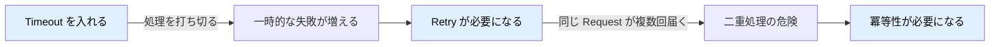
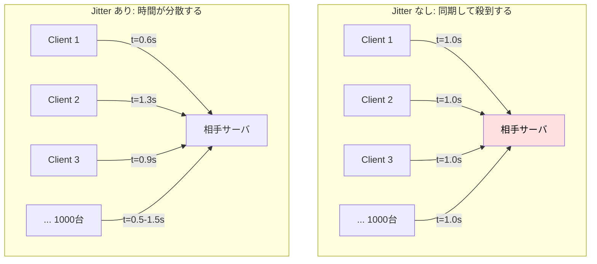
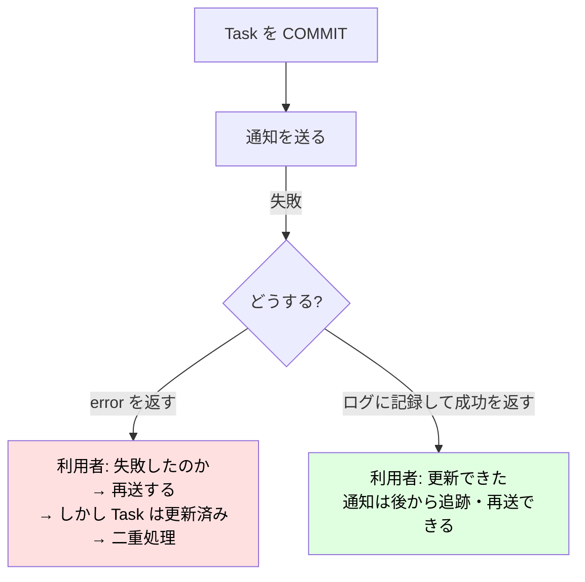
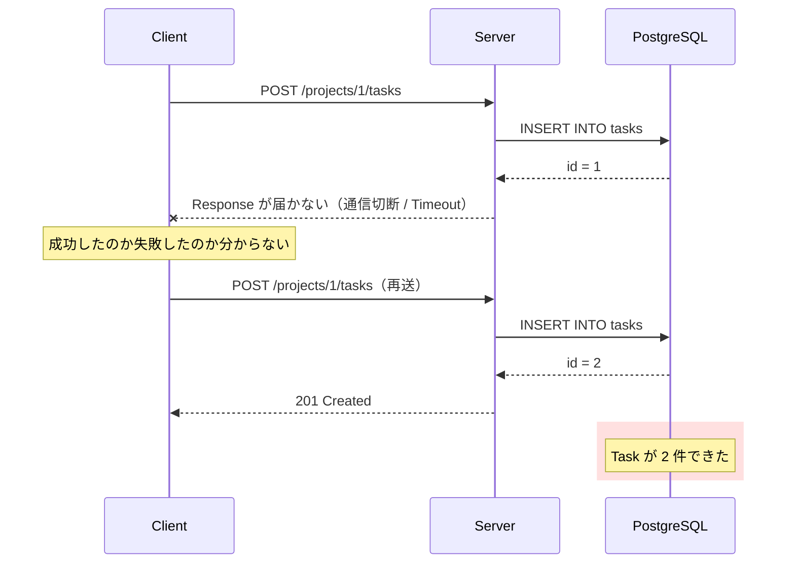
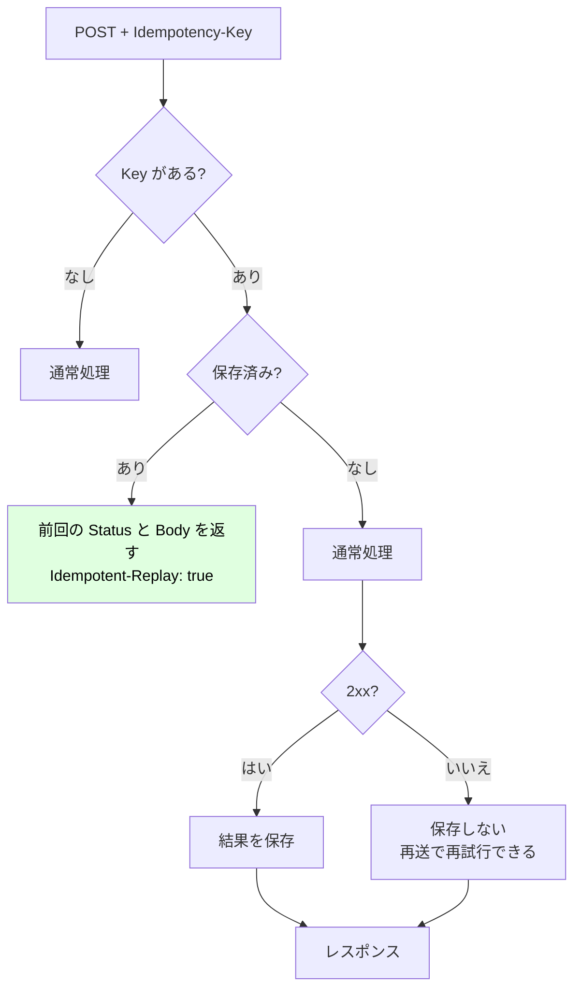

# Chapter 07: Timeout・Retry・冪等性

## この章の目的

ここまでは「DB も外部 API も正常に応答する」前提で作ってきた。実際には次のことが起きる。

- DB が遅い。Client はもう待っていないのに処理だけ残る
- 外部 API が 500 を返す、あるいは応答しない
- Response が届かず、Client が同じリクエストを再送する

この3つは**セットで考える必要がある**。Timeout を入れると Retry が必要になり、Retry を入れると冪等性が必要になる。片方だけ導入すると、別の障害を生む。

## 現在地

Webアプリ化(03-05) → **本番対応(06-08)** → Test(09)

## 完了条件

- [ ] Request 全体に Timeout が設定され、超過すると 503 が返る
- [ ] Timeout が DB のクエリまで伝わることを確認した
- [ ] 外部 API の 500 / 429 / Timeout は Retry され、400 は Retry されないことを確認した
- [ ] 通知の失敗で Task 更新が失敗しないことを確認した
- [ ] 同じ `Idempotency-Key` での再送が二重作成にならないことを確認した

## 3つの関係



---

## Part 1. Timeout

### Step 1. Request 全体に上限を設ける

#### やること

Middleware で Request の Context に期限を設定する。

#### 実行

`internal/middleware/observability.go`。

```go
// Timeout は Request 全体の上限時間を設定する。
// Client が待っていない処理をServer側で続けないための仕組み。
func Timeout(d time.Duration, next http.Handler) http.Handler {
	return http.HandlerFunc(func(w http.ResponseWriter, r *http.Request) {
		ctx, cancel := context.WithTimeout(r.Context(), d)
		defer cancel()

		next.ServeHTTP(w, r.WithContext(ctx))
	})
}
```

`internal/httpx/httpx.go` の `RespondError` に、Timeout の分類を追加する。

```go
	case errors.Is(err, context.DeadlineExceeded):
		// 処理は打ち切ったが、利用者から見れば「今は使えない」状態。
		writeErrorBody(w, http.StatusServiceUnavailable, "timeout", "request timed out")
```

`internal/app/app.go` で適用する。

```go
	// Middleware は外側から順に適用される。
	//
	//   RequestID -> AccessLog -> Timeout -> mux
	//
	// RequestID を最外にするのは、ログにも Timeout 時の記録にも
	// 同じ ID を載せるため。
	var h http.Handler = mux
	h = middleware.Timeout(cfg.RequestTimeout, h)   // 既定 2 秒
	h = middleware.AccessLog(logger, h)
	h = middleware.RequestID(h)
```

#### Context の伝播

```text
Client
  │ 接続を切る / Timeout に達する
  X
  ↓ ctx がキャンセルされる
Middleware (Timeout)
  ↓ ctx
Handler
  ↓ ctx
Service
  ↓ ctx
Repository
  ↓ ctx
pgx  ──→  PostgreSQL へキャンセルを送る
```

Context を引き回すのは、この連鎖を成立させるため。どこか1か所で `context.Background()` に差し替えると、**そこから先はキャンセルが伝わらない**。

> **WARNING**
> Request 処理の中で `context.Background()` を作らない。Client が切断しても DB のクエリだけが走り続け、接続プールを食い潰す。
> ただし**Commit 後の後処理**（ログの永続化など、途中でやめると困る処理）は例外で、あえて独立した Context を使うことがある。その場合も理由をコメントに残す。

---

### Step 2. Timeout を実際に発生させる

#### やること

DB 側で意図的に遅い処理を実行し、Timeout の挙動を確認する。

#### 実行

検証用のエンドポイントを用意する。`internal/handler/debug.go`。

```go
// SlowQuery は Timeout を再現するための検証用Endpoint。
// pg_sleep により、指定秒数だけDB側で待つ。
func SlowQuery(pool *pgxpool.Pool) http.HandlerFunc {
	return func(w http.ResponseWriter, r *http.Request) {
		seconds := r.URL.Query().Get("seconds")
		if seconds == "" {
			seconds = "3"
		}

		start := time.Now()

		var result int

		// Context は Handler から Repository、さらに DB Driver まで伝播する。
		// Timeout すると pgx が Query をキャンセルする。
		err := pool.QueryRow(r.Context(), "SELECT pg_sleep($1::float8), 1", seconds).
			Scan(nil, &result)
		if err != nil {
			httpx.RespondError(w, r, err)
			return
		}

		httpx.WriteJSON(w, http.StatusOK, map[string]any{
			"result":      result,
			"elapsed_ms":  time.Since(start).Milliseconds(),
			"slept_for_s": seconds,
		})
	}
}
```

```bash
# Server の上限は 2秒。DB を 3秒 待たせる
curl -s -o /dev/null -w 'status=%{http_code} time=%{time_total}s\n' \
  -b alice.txt 'localhost:8080/debug/slow?seconds=3'

# 上限内（1秒）なら成功する
curl -s -o /dev/null -w 'status=%{http_code} time=%{time_total}s\n' \
  -b alice.txt 'localhost:8080/debug/slow?seconds=1'
```

#### 期待結果

検証環境での実際の出力。

```text
=== TIMEOUT (server limit 2s, DB sleeps 3s) ===
status=503 time=2.002815s
{"error":{"code":"timeout","message":"request timed out"}}

=== within timeout (1s) ===
status=200 time=1.026585s
{"elapsed_ms":1001,"result":1,"slept_for_s":"1"}
```

| 確認項目 | 結果 |
| --- | --- |
| 打ち切りのタイミング | **2.00 秒**（3秒待たずに終了） |
| Status | 503 Service Unavailable |
| 上限内のリクエスト | 1.03 秒で 200 |

**DB のクエリまでキャンセルが届いている。** アプリが応答を返しただけで DB が 3 秒走り続けているわけではない。

<details>
<summary>Timeout 値をどう決めるか</summary>

| 対象 | 目安 | 根拠 |
| --- | --- | --- |
| Request 全体 | 2〜30 秒 | Client（ブラウザ、ロードバランサ）の Timeout より**短く**する |
| DB クエリ | Request 全体より短く | 遅いクエリを特定しやすくする |
| 外部 API（1回の試行） | 0.5〜3 秒 | Retry の回数 × Timeout が Request 全体を超えないようにする |

> **WARNING**
> Request 全体の Timeout が、ロードバランサの Timeout より長いと意味がない。LB が先に切断し、アプリ側は処理を続ける。**外側から内側へ向かって短くなる**ように設計する。

本ハンズオンでは既定 2 秒にしている。実際のアプリでは、エンドポイントごとに変えることが多い（一覧取得は短く、レポート生成は長く）。

</details>

---

## Part 2. Retry

### Step 3. 外部 API 呼び出しを作る

#### やること

Task の Status 変更時に、外部の通知 API へ POST する。

#### 外部 API から返ってくるもの

```text
Task 更新
  ↓
Notification API
  ├─ 200 OK           成功
  ├─ 400 Bad Request  こちらの Request が不正
  ├─ 429 Too Many     レート制限
  ├─ 500 / 503        相手側の障害
  ├─ Timeout          応答がない
  └─ 接続エラー        相手が落ちている
```

**これらを同じ扱いにしてはいけない。**

| 応答 | Retry すべきか | 理由 |
| --- | --- | --- |
| 2xx | 不要 | 成功 |
| 400 / 404 / 422 | **しない** | Request 自体が不正。何度送っても同じ結果になる |
| 401 / 403 | **しない** | 認証・権限の問題。時間では解決しない |
| 429 | する | レート制限。時間を置けば通る。`Retry-After` があれば従う |
| 5xx | する | 相手側の一時障害の可能性がある |
| Timeout | する | 一時的な遅延の可能性がある |
| 接続エラー | する | 相手が再起動中などの可能性がある |

#### 実行

`internal/notify/notifier.go`。

```go
// Config は Retry の挙動を決める。
type Config struct {
	BaseURL     string
	Timeout     time.Duration // 1回の試行の上限
	MaxAttempts int           // 初回を含む試行回数
	BaseDelay   time.Duration // 1回目の待機時間
}

func DefaultConfig(baseURL string) Config {
	return Config{
		BaseURL:     baseURL,
		Timeout:     500 * time.Millisecond,
		MaxAttempts: 3,
		BaseDelay:   100 * time.Millisecond,
	}
}

type HTTPNotifier struct {
	cfg    Config
	client *http.Client
	logger *slog.Logger
}

func NewHTTPNotifier(cfg Config, logger *slog.Logger) *HTTPNotifier {
	return &HTTPNotifier{
		cfg: cfg,
		// Timeout の無い http.Client を本番で使わない。
		// 相手が応答しない場合、Goroutine と Connection が滞留し続ける。
		client: &http.Client{Timeout: cfg.Timeout},
		logger: logger,
	}
}

// ErrRetryable は「もう一度試す価値がある」失敗。
var ErrRetryable = errors.New("retryable")
```

応答の分類。

```go
func (n *HTTPNotifier) post(ctx context.Context, url string, body []byte) error {
	req, err := http.NewRequestWithContext(ctx, http.MethodPost, url, bytes.NewReader(body))
	if err != nil {
		return fmt.Errorf("build request: %w", err)
	}

	req.Header.Set("Content-Type", "application/json")

	resp, err := n.client.Do(req)
	if err != nil {
		// 接続失敗・Timeout は一時障害の可能性がある。
		return fmt.Errorf("%w: %v", ErrRetryable, err)
	}
	defer resp.Body.Close()

	switch {
	case resp.StatusCode < 300:
		return nil
	case resp.StatusCode == http.StatusTooManyRequests,
		resp.StatusCode >= 500:
		return fmt.Errorf("%w: notification returned %d", ErrRetryable, resp.StatusCode)
	default:
		return fmt.Errorf("notification returned %d", resp.StatusCode)
	}
}
```

Retry ループ。

```go
func (n *HTTPNotifier) postWithRetry(ctx context.Context, url string, body []byte) error {
	var lastErr error

	for attempt := 1; attempt <= n.cfg.MaxAttempts; attempt++ {
		err := n.post(ctx, url, body)
		if err == nil {
			return nil
		}

		lastErr = err

		// Retryしても結果が変わらない失敗は、その場で諦める。
		// 例: 400 は Request 自体が不正なので、何度送っても 400 のまま。
		if !errors.Is(err, ErrRetryable) {
			return err
		}

		if attempt == n.cfg.MaxAttempts {
			break
		}

		delay := n.backoff(attempt)

		n.logger.WarnContext(ctx, "notification retry",
			slog.Int("attempt", attempt),
			slog.Int64("delay_ms", delay.Milliseconds()),
			slog.String("error", err.Error()),
		)

		// 待機中も Context のキャンセルには従う。
		select {
		case <-ctx.Done():
			return ctx.Err()
		case <-time.After(delay):
		}
	}

	return fmt.Errorf("notification failed after %d attempts: %w", n.cfg.MaxAttempts, lastErr)
}
```

### Step 4. Backoff と Jitter

#### 実装

```go
// backoff は指数バックオフ + Jitter。
//
// Jitter が無いと、同時に失敗した全Clientが同じタイミングで再送し、
// 復旧しかけた相手を再び落とす（Thundering Herd / Retry Storm）。
func (n *HTTPNotifier) backoff(attempt int) time.Duration {
	base := n.cfg.BaseDelay * time.Duration(1<<(attempt-1))
	jitter := time.Duration(rand.Int64N(int64(base)))

	return base/2 + jitter
}
```

#### なぜ間隔を広げるのか

```text
固定間隔（1秒ごと）で Retry

相手が過負荷 → 全 Client が1秒ごとに再送 → さらに過負荷 → 永久に復旧しない


指数バックオフ

1回目失敗 →  0.1秒待つ
2回目失敗 →  0.2秒待つ
3回目失敗 →  0.4秒待つ
            └─ 相手に回復する時間を与える
```

#### なぜ Jitter が必要なのか



障害は多くの場合**同時に**起きる。全 Client が同じタイミングで失敗すれば、Retry のタイミングも揃う。復旧しかけた相手に 1000 件が同時に届けば、また落ちる。これを **Retry Storm** または **Thundering Herd** と呼ぶ。

`base/2 + rand(base)` により、待機時間が `base/2` から `base*1.5` の範囲にばらける。

---

### Step 5. 通知の失敗で本処理を失敗させない

#### やること

通知が失敗しても、Task の更新は成功として扱う。

#### 実行

`internal/service/task.go`。

```go
	// 同時更新検出: 読んだ version のまま更新できるか。
	updated, err := s.tasks.UpdateStatusWithHistory(
		ctx, taskID, userID, current.Status, newStatus, version)
	if err != nil {
		return model.Task{}, err
	}

	// 通知の失敗で Task 更新を失敗にしない。
	// DBは既に Commit 済みで、ここで error を返すと利用者は
	// 「失敗した」と判断して再送し、二重処理の原因になる。
	if s.notifier != nil {
		if err := s.notifier.TaskStatusChanged(ctx, updated, current.Status); err != nil {
			s.logger.WarnContext(ctx, "notification failed",
				slog.Int64("task_id", updated.ID),
				slog.String("error", err.Error()),
			)
		}
	}

	return updated, nil
}
```

#### なぜこうするのか



**DB の Commit は既に終わっている。** この時点で error を返すと、利用者から見れば「失敗した」としか見えず、再送してくる。しかし Task は更新済みなので、再送は別の問題（version 不一致で 409、あるいは二重処理）を引き起こす。

通知は「送れなかったこと」をログに残し、別の仕組み（再送キュー、定期バッチ）で回収する。

> **POINT**
> 「主処理」と「副作用」を区別する。**主処理が成功したかどうかを、副作用の成否で上書きしない。**
> どちらが主でどちらが副かは要件次第で、例えば決済の通知は主処理に含めるべきかもしれない。その判断自体を意識的に行う。

---

### Step 6. Retry の挙動をテストで確認する

#### やること

外部 API を `httptest.Server` で再現し、Retry の挙動を検証する。

#### 実行

`internal/notify/notifier_test.go`（抜粋）。

```go
// 外部APIの挙動は httptest.Server で再現する。
// 実際の外部サービスへ接続しないため、Testが速く、相手の状態にも依存しない。
func TestRetryBehavior(t *testing.T) {
	t.Parallel()

	tests := []struct {
		name         string
		status       int
		wantAttempts int32
		wantErr      bool
	}{
		{"success on first attempt", http.StatusOK, 1, false},
		{"400 is not retried", http.StatusBadRequest, 1, true},
		{"404 is not retried", http.StatusNotFound, 1, true},
		{"429 is retried", http.StatusTooManyRequests, 3, true},
		{"500 is retried", http.StatusInternalServerError, 3, true},
		{"503 is retried", http.StatusServiceUnavailable, 3, true},
	}

	for _, tt := range tests {
		t.Run(tt.name, func(t *testing.T) {
			t.Parallel()

			var attempts int32

			server := httptest.NewServer(http.HandlerFunc(func(w http.ResponseWriter, r *http.Request) {
				atomic.AddInt32(&attempts, 1)
				w.WriteHeader(tt.status)
			}))
			defer server.Close()

			notifier := notify.NewHTTPNotifier(testConfig(server.URL), discardLogger())

			err := notifier.TaskStatusChanged(context.Background(), model.Task{ID: 1}, "todo")

			if tt.wantErr && err == nil {
				t.Fatal("expected error, got nil")
			}

			if !tt.wantErr && err != nil {
				t.Fatalf("expected success, got %v", err)
			}

			if got := atomic.LoadInt32(&attempts); got != tt.wantAttempts {
				t.Fatalf("attempts = %d, want %d", got, tt.wantAttempts)
			}
		})
	}
}
```

Client 側 Timeout の検証。

```go
// 相手が応答しない場合、Client側のTimeoutで打ち切れることを確認する。
func TestTimeoutIsRetryable(t *testing.T) {
	t.Parallel()

	var attempts int32

	server := httptest.NewServer(http.HandlerFunc(func(w http.ResponseWriter, r *http.Request) {
		atomic.AddInt32(&attempts, 1)
		time.Sleep(500 * time.Millisecond) // Client Timeout(200ms) より長い
	}))
	defer server.Close()

	notifier := notify.NewHTTPNotifier(testConfig(server.URL), discardLogger())

	start := time.Now()
	err := notifier.TaskStatusChanged(context.Background(), model.Task{ID: 1}, "todo")
	elapsed := time.Since(start)

	if err == nil {
		t.Fatal("expected timeout error")
	}

	if got := atomic.LoadInt32(&attempts); got != 3 {
		t.Fatalf("attempts = %d, want 3 (timeout should be retried)", got)
	}

	// 3回 x 200ms程度で終わる。相手のsleep(500ms x 3)を待っていない。
	if elapsed > 1200*time.Millisecond {
		t.Fatalf("took %v; client timeout does not seem to work", elapsed)
	}
}
```

Context キャンセルの検証。

```go
// Context がキャンセルされたら、待機中でも即座に諦めることを確認する。
func TestRetryStopsOnContextCancel(t *testing.T) {
	t.Parallel()

	server := httptest.NewServer(http.HandlerFunc(func(w http.ResponseWriter, r *http.Request) {
		w.WriteHeader(http.StatusServiceUnavailable)
	}))
	defer server.Close()

	cfg := testConfig(server.URL)
	cfg.BaseDelay = 2 * time.Second // 待機中にキャンセルされる状況を作る

	notifier := notify.NewHTTPNotifier(cfg, discardLogger())

	ctx, cancel := context.WithTimeout(context.Background(), 100*time.Millisecond)
	defer cancel()

	start := time.Now()
	err := notifier.TaskStatusChanged(ctx, model.Task{ID: 1}, "todo")

	if err == nil {
		t.Fatal("expected error")
	}

	if elapsed := time.Since(start); elapsed > time.Second {
		t.Fatalf("took %v; retry ignored context cancellation", elapsed)
	}
}
```

```bash
go test ./internal/notify/ -v
```

#### 期待結果

検証環境での実際の出力。

```text
=== RUN   TestRetryBehavior
=== RUN   TestRetryBehavior/success_on_first_attempt
=== RUN   TestRetryBehavior/400_is_not_retried
=== RUN   TestRetryBehavior/404_is_not_retried
=== RUN   TestRetryBehavior/429_is_retried
=== RUN   TestRetryBehavior/500_is_retried
=== RUN   TestRetryBehavior/503_is_retried
--- PASS: TestRetryBehavior (0.00s)
--- PASS: TestRetrySucceedsAfterTransientFailure (0.04s)
--- PASS: TestRetryStopsOnContextCancel (0.10s)
--- PASS: TestTimeoutIsRetryable (0.91s)
PASS
ok  	example.com/go-kanban/internal/notify	1.501s
```

| 検証した挙動 | 結果 |
| --- | --- |
| 200 → 試行 1 回 | ○ |
| 400 / 404 → 試行 1 回で諦める | ○ |
| 429 / 500 / 503 → 試行 3 回 | ○ |
| 3回目で復旧 → 成功して終了 | ○ |
| 相手が 500ms 応答しない → 200ms で打ち切り、3回試行、合計 0.91 秒 | ○ |
| Context キャンセル → 2秒待たずに即終了 | ○ |

`TestTimeoutIsRetryable` が示すのは、**相手の応答を待たずに自分から打ち切れている**こと。相手の sleep が 500ms × 3 = 1.5 秒でも、こちらは 0.91 秒で終わっている。

---

## Part 3. 冪等性（Idempotency）

### 問題の構造



**Client には区別がつかない。** 「Response が届かなかった」は、「処理されなかった」を意味しない。

### HTTP メソッドと冪等性

| メソッド | 仕様上の冪等性 | 補足 |
| --- | --- | --- |
| GET | あり | 何度読んでも状態は変わらない |
| PUT | あり | 同じ値で上書きするだけ |
| DELETE | あり | 2回目は「すでに無い」だけ |
| **POST** | **なし** | 呼ぶたびに新しい資源が作られる |
| PATCH | 実装次第 | 今回は version で保護しているため、2回目は 409 になる |

**POST だけ対策が必要**になる。

> **NOTE**
> 今回の `PATCH /tasks/{id}/status` は、Chapter 06 の楽観ロックによって既に保護されている。再送しても version が合わず 409 になるため、二重適用されない。**楽観ロックは冪等性の一形態としても機能する。**

---

### Step 7. Idempotency-Key を実装する

#### やること

Client が発行した一意なキーで、処理済みのリクエストを識別する。

#### 実行

`migrations/004_idempotency.sql` を作る。

```sql
CREATE TABLE idempotency_keys (
    key TEXT NOT NULL,
    user_id BIGINT NOT NULL REFERENCES users(id) ON DELETE CASCADE,
    endpoint TEXT NOT NULL,
    status_code INTEGER NOT NULL,
    response_body TEXT NOT NULL,
    created_at TIMESTAMPTZ NOT NULL DEFAULT NOW(),
    PRIMARY KEY (key, user_id, endpoint)
);
```

```bash
docker compose exec -T db \
  psql -U kanban -d kanban -v ON_ERROR_STOP=1 < migrations/004_idempotency.sql
```

主キーが `(key, user_id, endpoint)` の3つである点が重要になる。

| 含める理由 | |
| --- | --- |
| `user_id` | キーを利用者ごとに分離する。共有すると、他人のキーを指定して**他人のレスポンスを読める** |
| `endpoint` | 同じキーで別の API を叩いたとき、前の結果が返るのを防ぐ |

`internal/middleware/idempotency.go`。

```go
const IdempotencyKeyHeader = "Idempotency-Key"

// captureWriter は Response を記録しつつ Client へも書き込む。
type captureWriter struct {
	http.ResponseWriter
	status int
	body   bytes.Buffer
}

func (w *captureWriter) WriteHeader(status int) {
	w.status = status
	w.ResponseWriter.WriteHeader(status)
}

func (w *captureWriter) Write(b []byte) (int, error) {
	w.body.Write(b)
	return w.ResponseWriter.Write(b)
}

// Idempotency は同じ Idempotency-Key の再送に対して、
// 処理をやり直さず前回の結果を返す。
func Idempotency(
	repo *repository.IdempotencyRepository,
	logger *slog.Logger,
	next http.Handler,
) http.Handler {
	return http.HandlerFunc(func(w http.ResponseWriter, r *http.Request) {
		key := r.Header.Get(IdempotencyKeyHeader)
		if key == "" {
			next.ServeHTTP(w, r)
			return
		}

		user, ok := httpx.CurrentUser(r.Context())
		if !ok {
			httpx.RespondError(w, r, model.ErrUnauthorized)
			return
		}

		// Key は利用者ごとに分離する。
		// 共有すると、他人のKeyを指定して他人のResponseを読めてしまう。
		endpoint := r.Method + " " + r.URL.Path

		stored, err := repo.Find(r.Context(), key, user.ID, endpoint)

		switch {
		case err == nil:
			w.Header().Set("Content-Type", "application/json")
			w.Header().Set("Idempotent-Replay", "true")
			w.WriteHeader(stored.StatusCode)

			if _, err := w.Write([]byte(stored.Body)); err != nil {
				logger.ErrorContext(r.Context(), "write replayed response",
					slog.String("error", err.Error()))
			}

			return
		case !errors.Is(err, repository.ErrNoStoredResponse):
			httpx.RespondError(w, r, err)
			return
		}

		capture := &captureWriter{ResponseWriter: w, status: http.StatusOK}
		next.ServeHTTP(capture, r)

		// 成功した結果だけ保存する。
		// 失敗まで保存すると、一時障害による失敗が永続化される。
		if capture.status >= 200 && capture.status < 300 {
			if err := repo.Save(r.Context(), key, user.ID, endpoint, repository.StoredResponse{
				StatusCode: capture.status,
				Body:       capture.body.String(),
			}); err != nil {
				logger.ErrorContext(r.Context(), "save idempotency key",
					slog.String("error", err.Error()))
			}
		}
	})
}
```

保存側は `ON CONFLICT DO NOTHING` を使う。

```go
// Save は結果を保存する。
// ON CONFLICT DO NOTHING により、同時に2つのRequestが完了しても
// 先に保存された結果が正となる。
func (r *IdempotencyRepository) Save(...) error {
	_, err := r.pool.Exec(
		ctx,
		`INSERT INTO idempotency_keys (key, user_id, endpoint, status_code, response_body)
		 VALUES ($1, $2, $3, $4, $5)
		 ON CONFLICT (key, user_id, endpoint) DO NOTHING`,
		key, userID, endpoint, stored.StatusCode, stored.Body,
	)
	// ...
}
```

作成系の API にだけ適用する。`internal/app/app.go`。

```go
	// 再送されうる作成系のみ Idempotency を有効にする。
	idempotent := func(h http.HandlerFunc) http.Handler {
		return middleware.RequireAuth(authService,
			middleware.Idempotency(idempotencyRepo, logger, h))
	}

	mux.Handle("POST /projects/{id}/tasks", idempotent(taskHandler.Create))
```

#### 判断の流れ



> **POINT**
> **失敗した結果を保存しない。** 保存すると、一時的な DB 障害による 500 が「このキーは永久に 500」として固定される。
> 利用者は同じキーで再送でき、次は成功できる状態を保つ。

---

### Step 8. 動かして確認する

#### 実行

```bash
# Key なしで同じリクエストを2回
curl -b alice.txt -X POST localhost:8080/projects/1/tasks \
  -H 'Content-Type: application/json' -d '{"title":"duplicate me","priority":"low"}'
curl -b alice.txt -X POST localhost:8080/projects/1/tasks \
  -H 'Content-Type: application/json' -d '{"title":"duplicate me","priority":"low"}'

# Key ありで同じリクエストを2回
KEY=$(openssl rand -hex 16)
curl -i -b alice.txt -X POST localhost:8080/projects/1/tasks \
  -H 'Content-Type: application/json' -H "Idempotency-Key: $KEY" \
  -d '{"title":"idempotent task","priority":"low"}'
curl -i -b alice.txt -X POST localhost:8080/projects/1/tasks \
  -H 'Content-Type: application/json' -H "Idempotency-Key: $KEY" \
  -d '{"title":"idempotent task","priority":"low"}'
```

#### 期待結果

検証環境での実際の出力。

**Key なし。**

```text
1st: 201
2nd: 201
rows created: 2      ← Task が2件できた
```

**Key あり。**

```http
HTTP/1.1 201 Created

{"id":205,"project_id":1,"title":"idempotent task",...}
```

再送。

```http
HTTP/1.1 201 Created
Idempotent-Replay: true

{"id":205,"project_id":1,"title":"idempotent task",...}
```

```text
rows created: 1      ← Task は1件だけ
```

| 確認項目 | Key なし | Key あり |
| --- | --- | --- |
| 作成された Task | **2 件** | **1 件** |
| 2回目の id | 別の id | **同じ id（205）** |
| `Idempotent-Replay` ヘッダ | なし | **true** |

異なるキーを使えば、別の処理として扱われる（検証済み。`key-456` で 2 件目が作成される）。

<details>
<summary>本番運用で追加で考えること</summary>

| 項目 | 検討事項 |
| --- | --- |
| キーの有効期限 | 無期限に保存するとテーブルが肥大する。24時間〜7日程度で削除するバッチが必要 |
| 処理中の再送 | 1回目がまだ処理中に再送が来ると、両方が処理を開始しうる。厳密には「処理中」レコードを先に INSERT して排他する |
| リクエスト本文の検証 | 同じキーで**異なる本文**が来たら 422 を返すべき。今回は未実装 |
| Body のサイズ | 大きなレスポンスをそのまま保存すると DB を圧迫する |
| キーの生成 | Client 側で UUID などを生成する。サーバが生成すると、それを受け取るための往復が必要になり意味がない |

</details>

---

## この章のまとめ

| 導入したもの | 防いだ問題 |
| --- | --- |
| Request 全体の Timeout | Client が待っていない処理の滞留 |
| Context の伝播 | DB クエリがキャンセルされず接続を占有する |
| `http.Client{Timeout: ...}` | 応答しない相手への接続が残り続ける |
| Retry の可否判定 | 400 を延々と再送する無駄 |
| 指数バックオフ | 固定間隔の Retry が相手を殺し続ける |
| Jitter | Retry Storm（同時再送による二次障害） |
| Context を見る待機（`select`） | キャンセル済みなのに待ち続ける |
| 通知失敗を主処理から切り離す | 副作用の失敗が主処理の失敗になり、再送で二重処理を招く |
| Idempotency-Key | Response 紛失による再送での二重作成 |
| `(key, user_id, endpoint)` の複合主キー | 他人のレスポンスの読み取り |
| 成功時のみ保存 | 一時障害による失敗の永続化 |

| 得られた検証データ | 値 |
| --- | --- |
| Timeout（上限 2 秒、DB 3 秒） | 2.00 秒で 503 |
| Retry（400 / 404） | 試行 1 回で終了 |
| Retry（429 / 500 / 503） | 試行 3 回 |
| Client Timeout（相手 500ms 無応答） | 3 回試行して合計 0.91 秒 |
| Idempotency-Key ありの再送 | Task 1 件、同じ id、`Idempotent-Replay: true` |

次は [Chapter 08: Logging と Audit Log](./chapter08_observability.md)。ここまでで作った仕組みが障害時に追跡できるよう、ログを整える。
