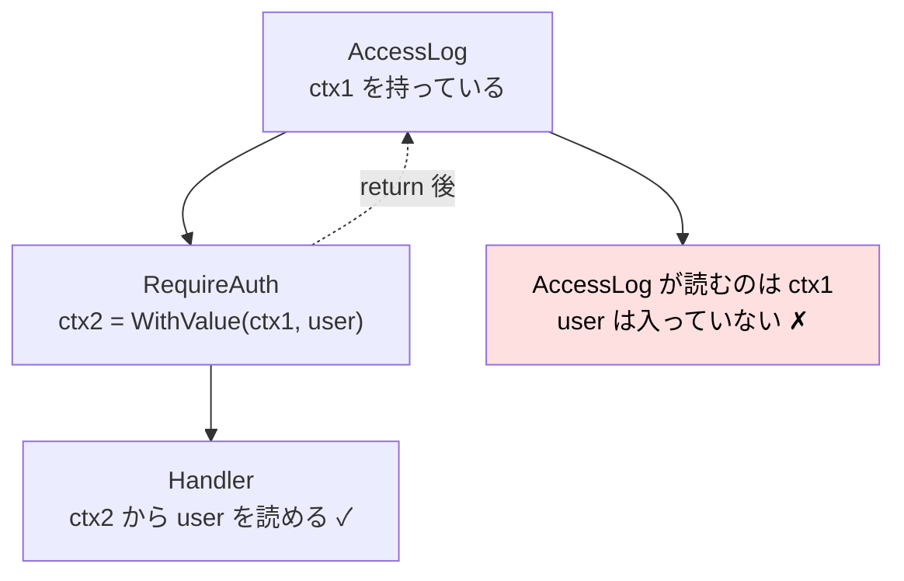
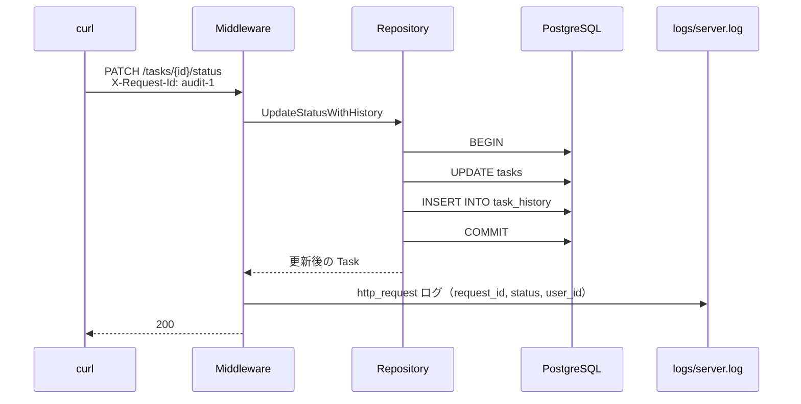
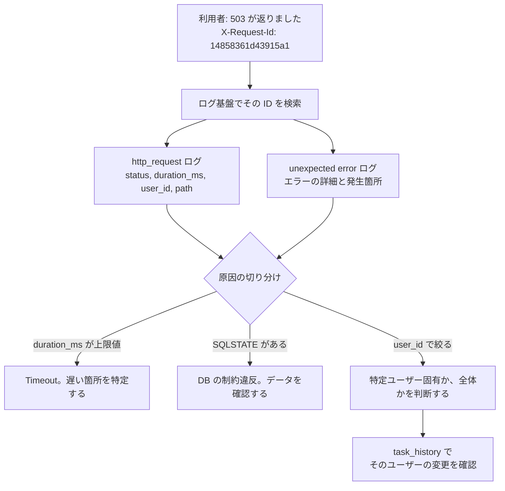

# Chapter 08: Logging と Audit Log

## この章の目的

ここまで作った仕組みは、障害が起きたときに追跡できる状態になっていない。「500 が返った」という報告を受けても、どの Request が、誰の操作で、どこで失敗したのかを特定できない。

この章で2種類のログを整える。

| | 通常ログ | 監査ログ（Audit Log） |
| --- | --- | --- |
| 記録するもの | システムで何が起きたか | 誰が、いつ、何を変更したか |
| 主な用途 | 障害調査、性能分析 | 変更履歴の追跡、責任の所在 |
| 保存先 | 標準出力 → ログ基盤 | DB（`task_history`） |
| 保存期間 | 数日〜数か月 | 業務要件による（数年のことも） |

あわせて、ログに出してはいけないものも決めておく。

## 現在地

Webアプリ化(03-05) → **本番対応(06-08)** → Test(09)

## 完了条件

- [ ] 1 Request につき 1 行の構造化ログ（JSON）が出る
- [ ] `request_id` で Request を追跡できる
- [ ] ログに `user_id` が含まれる
- [ ] 500 が ERROR レベルで記録される
- [ ] Cookie / パスワード / Session ID がログに出ていないことを確認した
- [ ] `task_history` から「誰がいつ何を変えたか」を追える

---

## Part 1. 構造化ログ

### Step 1. なぜ構造化するのか

#### 非構造化ログ（よくある形）

```text
2026/09/25 00:16:04 PATCH /tasks/1/status returned 200 in 13ms for user 1
```

人間には読めるが、次のことができない。

- 「500 になった Request だけ」を抽出する
- 「応答時間が 1 秒を超えたもの」を集計する
- 「user_id=1 の操作」を追う

フォーマットが少しでも変わると、正規表現が壊れる。

#### 構造化ログ（JSON）

```json
{"time":"2026-09-25T00:16:04.5955146+09:00","level":"INFO","msg":"http_request","request_id":"ca6440b20c408753","method":"GET","path":"/tasks/1","status":200,"duration_ms":3,"bytes":127,"user_id":1}
```

キーと値が分かれているため、ログ基盤側でそのまま検索・集計・アラート設定ができる。

```text
status >= 500                     → エラー率のアラート
duration_ms > 1000                → 遅い Request の抽出
request_id = "ca6440b2..."        → 1 Request の全ログを収集
user_id = 1 AND status = 403      → 特定ユーザーの権限エラー
```

---

### Step 2. slog を設定する

#### やること

Go 標準の `log/slog` で JSON ログを出す。

#### 実行

`cmd/api/main.go` の `main` で logger を作り、デフォルトに設定する。

```go
func main() {
	// 構造化ログ。JSONで出すと、検索・集計・アラート設定がしやすい。
	logger := slog.New(slog.NewJSONHandler(os.Stdout, &slog.HandlerOptions{
		Level: slog.LevelInfo,
	}))
	slog.SetDefault(logger)

	if err := run(logger); err != nil {
		logger.Error("server stopped with error", slog.String("error", err.Error()))
		os.Exit(1)
	}
}
```

出力先は標準出力にする。ファイルへのローテーションや転送は、コンテナ基盤やログ収集エージェントに任せる。アプリがファイル管理まで抱えると、コンテナ環境で扱いづらくなる。

---

### Step 3. Request ID を付与する

#### やること

1 Request を追跡するための ID を発行し、Response ヘッダにも返す。

#### 実行

まず、Request ID を Context に出し入れする関数を `internal/httpx/httpx.go` の `CurrentUser` の下に追加する。middleware が書き込み、Step 4 のアクセスログが読み出す。

```go
const requestIDContextKey contextKey = "request_id"

func WithRequestID(ctx context.Context, id string) context.Context {
	return context.WithValue(ctx, requestIDContextKey, id)
}

// RequestIDFrom は RequestID middleware が載せた ID を取り出す。
// middleware を通っていない場合は空文字を返す。
func RequestIDFrom(ctx context.Context) string {
	id, _ := ctx.Value(requestIDContextKey).(string)
	return id
}
```

次に、`internal/middleware/observability.go` の import を次のように変える。

```go
import (
	"context"
	"crypto/rand"
	"encoding/hex"
	"net/http"
	"time"

	"example.com/go-kanban/internal/httpx"
)
```

同じファイルの末尾（`Timeout` の後ろ）に middleware を追加する。

```go
const RequestIDHeader = "X-Request-Id"

// RequestID は1Requestを追跡するためのIDを付与する。
// 障害調査で「このRequestに関係するログだけ」を絞り込むために使う。
func RequestID(next http.Handler) http.Handler {
	return http.HandlerFunc(func(w http.ResponseWriter, r *http.Request) {
		id := r.Header.Get(RequestIDHeader)
		if id == "" {
			id = newRequestID()
		}

		w.Header().Set(RequestIDHeader, id)

		next.ServeHTTP(w, r.WithContext(httpx.WithRequestID(r.Context(), id)))
	})
}

func newRequestID() string {
	buf := make([]byte, 8)

	if _, err := rand.Read(buf); err != nil {
		return "unknown"
	}

	return hex.EncodeToString(buf)
}
```

#### 設計上の判断

| 判断 | 理由 |
| --- | --- |
| Request ヘッダに既にあればそれを使う | ロードバランサや呼び出し元サービスが発行した ID を引き継ぐ。マイクロサービス間で同じ ID を辿れる |
| Response ヘッダに返す | 利用者から「500 になった」と問い合わせがあったとき、ID を添えてもらえる。ログ基盤でその ID を検索すれば、その Request で起きたことだけを取り出せる |
| Session ID とは別物 | Session ID は秘密情報。ログにも Response ヘッダにも出せない |

---

### Step 4. アクセスログを出す

#### やること

1 Request につき 1 行のログを出す。

#### 実行

まず、書き込まれた Status を記録するラッパーを用意する。`internal/middleware/observability.go` の末尾（Step 3 で追加した `newRequestID` の後ろ）に追加する。

```go
// statusRecorder は書き込まれたStatusを記録する。
// http.ResponseWriter からは、書いたStatusを後から読めないため必要。
type statusRecorder struct {
	http.ResponseWriter
	status int
	bytes  int
}

func (w *statusRecorder) WriteHeader(status int) {
	w.status = status
	w.ResponseWriter.WriteHeader(status)
}

func (w *statusRecorder) Write(b []byte) (int, error) {
	n, err := w.ResponseWriter.Write(b)
	w.bytes += n

	return n, err
}
```

このラッパーを使って、Handler の処理が終わった後に 1 行のログを出す。同じ `observability.go` の末尾（`statusRecorder` の後ろ）に追加し、import に `"log/slog"` を足す。

```go
// AccessLog は1Requestにつき1行の構造化ログを出す。
//
// Cookie や Authorization Header は意図的に出力しない。
// ログは長期間保存され、閲覧範囲も広いため、機密情報を書くと漏洩範囲が広がる。
func AccessLog(logger *slog.Logger, next http.Handler) http.Handler {
	return http.HandlerFunc(func(w http.ResponseWriter, r *http.Request) {
		start := time.Now()
		recorder := &statusRecorder{ResponseWriter: w, status: http.StatusOK}

		next.ServeHTTP(recorder, r)

		attrs := []slog.Attr{
			slog.String("request_id", httpx.RequestIDFrom(r.Context())),
			slog.String("method", r.Method),
			slog.String("path", r.URL.Path),
			slog.Int("status", recorder.status),
			slog.Int64("duration_ms", time.Since(start).Milliseconds()),
			slog.Int("bytes", recorder.bytes),
		}

		if user, ok := httpx.CurrentUser(r.Context()); ok {
			attrs = append(attrs, slog.Int64("user_id", user.ID))
		}

		level := slog.LevelInfo
		if recorder.status >= http.StatusInternalServerError {
			level = slog.LevelError
		}

		logger.LogAttrs(r.Context(), level, "http_request", attrs...)
	})
}
```

最後に、`internal/app/app.go` の `New` の末尾で middleware を組み込む。`// Chapter 08 で、...` のコメントがある箇所を次のように書き換える。

```go
	// Middleware は外側から順に適用される。
	// RequestID → AccessLog → Timeout → mux の順に通る。
	var h http.Handler = mux
	h = middleware.Timeout(cfg.RequestTimeout, h)
	h = middleware.AccessLog(logger, h)
	h = middleware.RequestID(h)

	return h
```

後から包んだものほど外側になる。並び順には次の理由がある。

| 順序 | 理由 |
| --- | --- |
| `RequestID` を `AccessLog` より外側に置く | `AccessLog` が Context から Request ID を読むため、先に載せておく必要がある |
| `AccessLog` を `Timeout` より外側に置く | Timeout で打ち切られた Request も含めて、所要時間と Status を記録するため |

<details>
<summary>GO NOTE: なぜ <code>statusRecorder</code> が必要なのか</summary>

`http.ResponseWriter` は書き込み専用のインターフェースで、「さっき書いた Status は何番だったか」を読み出すメソッドがない。

```go
type ResponseWriter interface {
	Header() Header
	Write([]byte) (int, error)
	WriteHeader(statusCode int)
}
```

そこで元の `ResponseWriter` を埋め込んだ構造体を作り、`WriteHeader` を横取りして値を控える。埋め込みにより、`Header()` など他のメソッドはそのまま使える。

なお `WriteHeader` を明示的に呼ばずに `Write` した場合、Go は自動的に 200 を送る。そのため `status: http.StatusOK` で初期化しておく必要がある。

</details>

---

### Step 5. Context の不変性でつまずく

正直に書くと、Step 4 の実装は `user_id` の部分がうまく動かなかった。ハマった過程をそのまま載せる。

#### 最初の実装

Step 4 の `AccessLog` のうち、次の部分が問題になる。

```go
// 期待どおりに動かなかった実装
if user, ok := httpx.CurrentUser(r.Context()); ok {
    attrs = append(attrs, slog.Int64("user_id", user.ID))
}
```

#### 観測された結果

認証は成功していて、Handler 側の `CurrentUser` も正しく User を返している。それでも `user_id` がログに一切出なかった。

```json
{"level":"INFO","msg":"http_request","request_id":"d8819f43341464bd","method":"POST","path":"/projects/1/tasks","status":201,"duration_ms":3,"bytes":130}
```

#### 原因

`context.WithValue` は新しい Context を作る。元の Context は変更されない。



`AccessLog` は `RequireAuth` より外側にある。内側で作られた新しい Context は、外側には届かない。

#### 解決

外側で書き換え可能な入れ物を用意し、内側がその中身を書き換える。

入れ物は `internal/httpx/httpx.go` の `RequestIDFrom` の下に定義する。

```go
// LogFields は1Requestの間だけ共有される、書き換え可能なログ情報。
//
// context.WithValue は「新しいContext」を作る。内側のmiddlewareが
// 値を足しても、外側が持っているContextは変わらない。
// AccessLog(外側) が RequireAuth(内側) の決めた user_id を出すには、
// 外側で入れ物を作り、内側がその中身を書き換える必要がある。
type LogFields struct {
	UserID int64
}

const logFieldsContextKey contextKey = "log_fields"

func WithLogFields(ctx context.Context) (context.Context, *LogFields) {
	fields := &LogFields{}
	return context.WithValue(ctx, logFieldsContextKey, fields), fields
}

func LogFieldsFrom(ctx context.Context) (*LogFields, bool) {
	fields, ok := ctx.Value(logFieldsContextKey).(*LogFields)
	return fields, ok
}
```

入れ物を用意するのは `AccessLog`。`internal/middleware/observability.go` の `AccessLog` を次のように書き換える。変更点は、`next` を呼ぶ前に入れ物を作ることと、`user_id` を入れ物から読むことの 2 つ。

```go
func AccessLog(logger *slog.Logger, next http.Handler) http.Handler {
	return http.HandlerFunc(func(w http.ResponseWriter, r *http.Request) {
		start := time.Now()
		recorder := &statusRecorder{ResponseWriter: w, status: http.StatusOK}

		// 内側のmiddlewareが user_id を書き込めるよう、先に入れ物を用意する。
		ctx, fields := httpx.WithLogFields(r.Context())

		next.ServeHTTP(recorder, r.WithContext(ctx))

		attrs := []slog.Attr{
			slog.String("request_id", httpx.RequestIDFrom(ctx)),
			slog.String("method", r.Method),
			slog.String("path", r.URL.Path),
			slog.Int("status", recorder.status),
			slog.Int64("duration_ms", time.Since(start).Milliseconds()),
			slog.Int("bytes", recorder.bytes),
		}

		if fields.UserID != 0 {
			attrs = append(attrs, slog.Int64("user_id", fields.UserID))
		}

		level := slog.LevelInfo
		if recorder.status >= http.StatusInternalServerError {
			level = slog.LevelError
		}

		logger.LogAttrs(ctx, level, "http_request", attrs...)
	})
}
```

書き込むのは `internal/middleware/auth.go` の `RequireAuth`。末尾の `next.ServeHTTP` の直前に、入れ物へ `user_id` を書く処理を追加する。

```go
		// アクセスログへ user_id を載せる。
		if fields, ok := httpx.LogFieldsFrom(r.Context()); ok {
			fields.UserID = user.ID
		}

		next.ServeHTTP(w, r.WithContext(httpx.WithUser(r.Context(), user)))
```

今回 Context に入れたのは `LogFields` の値ではなくポインタなので、内側と外側が同じ実体を見ている。だから内側の書き換えが外側から見える。

> **POINT**
> 値を「渡す」だけなら `context.WithValue` でよい。外側へ情報を返したいときは、ポインタを渡して中身を書き換える。
> ただしこの方法は、複数の goroutine から同時に書くと data race になる（[Chapter 06 Part 1](./chapter06_transaction.md#part-1-goroutine-と-data-race) で再現したもの）。1 Request が 1 goroutine で処理される前提でのみ成立する。

---

### Step 6. 動かして確認する

#### 実行

`go-kanban/` でサーバーを起動する。`/debug/slow` を使うので `DEBUG_ROUTES=1` を付ける。

```bash
DEBUG_ROUTES=1 go run ./cmd/api
```

別のターミナルで、同じく `go-kanban/` から Request を送る。Session Cookie は有効期限が 24 時間なので、先にログインし直して `./cookie/alice.txt` を上書きしておく。

```bash
# Session を取り直す（Chapter 04 と同じディレクトリで実行する）
mkdir -p cookie
curl -s -w '\n%{http_code}\n' -c ./cookie/alice.txt -X POST localhost:8080/login -H 'Content-Type: application/json' \
  -d '{"email":"alice@example.com","password":"alice-password-1"}'    # → 204
```

読み取り対象の Task を alice の Project に作り、その ID を控える。Task の ID はそれまでに作ったデータの量で変わるので、`/tasks/1` のように決め打ちすると、他人の Task や存在しない Task を指して 404 になる。

```bash
PROJECT_ID=$(curl -s -b ./cookie/alice.txt -X POST localhost:8080/projects \
  -H 'Content-Type: application/json' -d '{"name":"Chapter08 Board"}' \
  | sed -E 's/^\{"id":([0-9]+).*/\1/')
echo "PROJECT_ID=$PROJECT_ID"

TASK_ID=$(curl -s -b ./cookie/alice.txt -X POST localhost:8080/projects/$PROJECT_ID/tasks \
  -H 'Content-Type: application/json' -d '{"title":"observe me","priority":"low"}' \
  | sed -E 's/^\{"id":([0-9]+).*/\1/')
echo "TASK_ID=$TASK_ID"
```

どちらも `=` の後ろに数字だけが表示されれば成功。JSON が表示された場合は Session が切れているので、ログインからやり直す。

ログを確認するための Request を送る。`/debug/slow` は Timeout まで 2 秒かかるので、`&` でバックグラウンド実行し、その間に次の Request を送る。

```bash
curl -b ./cookie/alice.txt localhost:8080/tasks/$TASK_ID
curl localhost:8080/health
curl -b ./cookie/alice.txt 'localhost:8080/debug/slow?seconds=3' &
curl -H 'X-Request-Id: my-trace-123' -b ./cookie/alice.txt localhost:8080/tasks/$TASK_ID
```

4 つの Request は、それぞれ別のことを確認するために送る。ERROR ログ（503）を出すのは `/debug/slow` だけで、ほかの 3 つは 200 になる。

| Request | 確認すること | 期待するログ |
| --- | --- | --- |
| `GET /tasks/$TASK_ID` | `request_id` が自動生成される | INFO / 200 / `user_id` あり |
| `GET /health` | 認証なしの Request には `user_id` が付かない | INFO / 200 / `user_id` なし |
| `GET /debug/slow?seconds=3` | Timeout した Request が ERROR になる | ERROR / 503 / 約 2000 ms |
| `GET /tasks/$TASK_ID`（`X-Request-Id` 付き） | ヘッダで渡した ID がそのまま使われる | INFO / 200 / `request_id` が `my-trace-123` |

> **NOTE**
> `/debug/slow` が 404 を返す場合は、サーバーを `DEBUG_ROUTES=1` なしで起動している。このルートは `DEBUG_ROUTES=1` のときだけ登録される。
>
> 3 秒待って 200 が返る場合は、Timeout が効いていない。[Chapter 07](./chapter07_resilience.md) の `Timeout` middleware と `RequestTimeout`（2 秒）の設定を確認する。
>
> ログに `status=401` が出て `user_id` が無い場合は、Cookie が送られていない。`-b` に存在しないファイルを渡しても curl はエラーを出さず、Cookie を付けずに送信する。カレントディレクトリが `go-kanban/` か、ログインし直したかを確認する。
>
> ログが `time=... level=INFO msg=http_request ...` のようなテキスト形式で出る場合は、`main.go` が `slog.NewTextHandler` のままになっている。[Step 2](#step-2-slog-を設定する) の `slog.NewJSONHandler` に置き換えてから起動し直す。
>
> 認証済みの Request なのに `user_id` が出ない場合は、[Step 5](#step-5-context-の不変性でつまずく) で `RequireAuth` に追加する `fields.UserID = user.ID` が抜けている。

#### 期待結果

検証環境では、次のログが出た。ログは Request の完了順に並ぶため、`/debug/slow` が最後になる。ログイン・Project 作成・Task 作成の行は省略している。`/tasks/` の後ろの ID と `user_id` は環境によって変わる。

```json
{"time":"2026-09-25T00:16:04.5955146+09:00","level":"INFO","msg":"http_request","request_id":"ca6440b20c408753","method":"GET","path":"/tasks/1","status":200,"duration_ms":3,"bytes":127,"user_id":1}
{"time":"2026-09-25T00:16:04.6265839+09:00","level":"INFO","msg":"http_request","request_id":"e0997692cdb945c4","method":"GET","path":"/health","status":200,"duration_ms":0,"bytes":16}
{"time":"2026-09-25T00:16:04.7048213+09:00","level":"INFO","msg":"http_request","request_id":"my-trace-123","method":"GET","path":"/tasks/1","status":200,"duration_ms":13,"bytes":127,"user_id":1}
{"time":"2026-09-25T00:16:06.658012+09:00","level":"ERROR","msg":"http_request","request_id":"14858361d43915a1","method":"GET","path":"/debug/slow","status":503,"duration_ms":2000,"bytes":59,"user_id":1}
```

このログから、次のことが確認できる。

| 項目 | 結果 |
| --- | --- |
| `user_id` | 認証済み Request にのみ付く（`/health` には無い） |
| `request_id` | 自動生成される |
| ヘッダ由来の ID | `my-trace-123` がそのまま使われている |
| 503 のレベル | ERROR（`status >= 500` のため） |
| `duration_ms` | Timeout のケースで 2000 ms |

> **NOTE**
> 503（Timeout）が ERROR レベルになっている。これは「500 以上は ERROR」というルールの結果で、意図した挙動になる。
> ただし Timeout は相手側の遅延が原因のこともあり、アラートを ERROR 全件に設定すると通知が多すぎる可能性がある。運用時にレベル設計を見直す判断項目として扱う。

---

## Part 2. ログに出してはいけないもの

### Step 7. 漏洩していないか確認する

#### やること

ログに機密情報が含まれていないか、実際に検索して確認する。

#### 実行

検索するには、ログがファイルに残っている必要がある。Step 6 でサーバーを標準出力のまま起動していた場合は、`go-kanban` ディレクトリでログをファイルに書き出す形で起動し直し、Step 6 の curl をもう一度実行する。

```bash
mkdir -p logs
DEBUG_ROUTES=1 go run ./cmd/api > logs/server.log 2>&1
```

ログが溜まったら、機密情報に関係する文字列を数える。

```bash
grep -icE 'kanban_session|password|set-cookie' logs/server.log
```

#### 期待結果

一致した行数が表示される。0 なら漏洩していない。

```text
0
```

> **NOTE**
> 一致が 0 件のとき、`grep` は終了コード 1 を返す。スクリプトに組み込む場合は、失敗扱いにならないよう注意する。

#### 出してはいけないもの

| 種別 | 具体例 | 理由 |
| --- | --- | --- |
| 認証情報 | パスワード、パスワードハッシュ | そのまま悪用できる |
| セッション | Session ID、Cookie ヘッダ | ログを読める人が他人になりすませる |
| トークン | API Key、Authorization ヘッダ、JWT | 同上 |
| 個人情報 | 不要なメールアドレス、氏名、住所 | 法規制の対象になりうる |
| 決済情報 | カード番号、CVV | 保存自体が規制対象 |
| Request 本文 | POST body 全体 | 上記のいずれかが含まれうる |

#### なぜ厳しく扱うのか

```text
ログの特徴

  保存期間が長い      数か月分が残る
  閲覧範囲が広い      開発者、運用者、外部のログ基盤ベンダー
  複製されやすい      転送、バックアップ、分析基盤への連携
  消しにくい          「あのログだけ削除」が難しい
```

アプリのメモリ上にしかない情報と違い、**ログに書いた時点で漏洩範囲が一段広がる**。

#### 実装上の対策

```go
// NG: ヘッダをまるごと出す
slog.Any("headers", r.Header)        // Cookie も Authorization も含まれる

// NG: Request 本文をそのまま出す
slog.String("body", string(bodyBytes))  // password が含まれうる

// OK: 必要な項目だけを明示的に選ぶ
slog.String("method", r.Method)
slog.String("path", r.URL.Path)
slog.Int64("user_id", fields.UserID)
```

**「何を出すか」を明示的に列挙する。** 「何を隠すか」を除外リストで管理すると、新しい項目が増えたときに漏れる。

> **WARNING**
> `r.URL.String()` はクエリ文字列を含む。`?token=xxx` のような設計だとログに残る。
> 本ハンズオンでは `r.URL.Path` だけを出している。

---

## Part 3. Audit Log

Part 1 の通常ログは「Request がどうなったか」を記録する。Part 3 では、Chapter 06 で作った `task_history` を監査ログとして使い、「誰が何を変えたか」を追えることを確かめる。

```text
通常ログ
  「システムで何が起きたか」
  {"msg":"http_request","path":"/tasks/1/status","status":200,"user_id":1}
    → 200 で成功したことは分かるが、何を何に変えたかは分からない

監査ログ
  「誰が、いつ、何を、何から何へ変更したか」
  user_id=1, task_id=1, action=status_changed, old=todo, new=doing
```

1 回の Status 変更で、2 つのログが別々の場所に残る。



監査ログ（`task_history`）は Transaction の中で書き、通常ログ（`http_request`）は Response を返す直前に middleware が書く。Part 3 はこの 2 つを順に確認し、最後に突き合わせる。

---

### Step 8. task_history の構造を確認する

#### やること

監査ログの保存先になる `task_history` が DB にあることと、その列を確認する。

#### 実行

`go-kanban/` で実行する。

```bash
docker compose exec -T db psql -U kanban -d kanban -c '\d task_history'
```

#### 期待結果

検証環境では、次の結果になった。

```text
                                       Table "public.task_history"
   Column   |           Type           | Collation | Nullable |                 Default
------------+--------------------------+-----------+----------+------------------------------------------
 id         | bigint                   |           | not null | nextval('task_history_id_seq'::regclass)
 task_id    | bigint                   |           | not null |
 user_id    | bigint                   |           |          |
 action     | text                     |           | not null |
 old_value  | text                     |           | not null | ''::text
 new_value  | text                     |           | not null | ''::text
 created_at | timestamp with time zone |           | not null | now()
Indexes:
    "task_history_pkey" PRIMARY KEY, btree (id)
    "idx_task_history_task_id" btree (task_id)
Foreign-key constraints:
    "task_history_task_id_fkey" FOREIGN KEY (task_id) REFERENCES tasks(id) ON DELETE CASCADE
    "task_history_user_id_fkey" FOREIGN KEY (user_id) REFERENCES users(id) ON DELETE SET NULL
```

`Check constraints:` に `reject_done` が表示された場合は、[Chapter 06](./chapter06_transaction.md) の Rollback 確認で追加した制約が残っている。このままでは `done` への変更が 500 になるので、先に外しておく。

```bash
docker compose exec -T db psql -U kanban -d kanban -c \
  'ALTER TABLE task_history DROP CONSTRAINT reject_done;'
```

> **NOTE**
> `Did not find any relation named "task_history".` と表示された場合は、`migrations/003_history.sql` が適用されていない。[Chapter 06](./chapter06_transaction.md) の Migration 手順を実行してから進む。

#### 各列の意味

| 列 | 監査ログとしての意味 |
| --- | --- |
| `user_id` | 誰が（ユーザー削除後も履歴を残すため `ON DELETE SET NULL`） |
| `created_at` | いつ（DB サーバーの時刻。`TIMESTAMPTZ` なので UTC で保存される） |
| `task_id` | 何を |
| `action` | どんな操作（現状は `status_changed` のみ） |
| `old_value` / `new_value` | 何から何へ |

履歴は `internal/repository/task.go` の `UpdateStatusWithHistory` が、Task の UPDATE と同じ Transaction で INSERT する。実装は [Chapter 06](./chapter06_transaction.md) で作ったものをそのまま使い、この章では変更しない。

---

### Step 9. Status を変更して監査ログを残す

#### やること

Status を 3 回変更し、成功した変更だけが履歴に残ることを確かめる。2 回目はわざと古い `version` を送り、409 Conflict にする。

#### 実行

サーバーは Step 7 と同じく、`go-kanban/` でログをファイルに書き出す形で起動しておく。Step 11 で `logs/server.log` を検索する。

```bash
mkdir -p logs
DEBUG_ROUTES=1 go run ./cmd/api > logs/server.log 2>&1
```

別のターミナルで、同じく `go-kanban/` から実行する。Step 6 の `TASK_ID` は使わず、履歴が空の Task を新しく作る。既存の Task だと、過去の章で残した履歴が混ざって結果を読みにくくなる。

```bash
# Session が切れていたら取り直す
curl -s -w '\n%{http_code}\n' -c ./cookie/alice.txt -X POST localhost:8080/login -H 'Content-Type: application/json' \
  -d '{"email":"alice@example.com","password":"alice-password-1"}'    # → 204

PROJECT_ID=$(curl -s -b ./cookie/alice.txt -X POST localhost:8080/projects \
  -H 'Content-Type: application/json' -d '{"name":"Chapter08 Audit"}' \
  | sed -E 's/^\{"id":([0-9]+).*/\1/')
AUDIT_TASK_ID=$(curl -s -b ./cookie/alice.txt -X POST localhost:8080/projects/$PROJECT_ID/tasks \
  -H 'Content-Type: application/json' -d '{"title":"audit me","priority":"low"}' \
  | sed -E 's/^\{"id":([0-9]+).*/\1/')
echo "AUDIT_TASK_ID=$AUDIT_TASK_ID"
```

`AUDIT_TASK_ID=` の後ろに数字だけが表示されれば成功。

続けて Status を変更する。Step 11 でログと突き合わせるため、`X-Request-Id` に分かりやすい ID を付けて送る。

```bash
# 1. todo → doing（version 1 は作成直後の値）
curl -s -w '\n%{http_code}\n' -b ./cookie/alice.txt -X PATCH localhost:8080/tasks/$AUDIT_TASK_ID/status \
  -H 'Content-Type: application/json' -H 'X-Request-Id: audit-1' \
  -d '{"status":"doing","version":1}'

# 2. 古い version のまま doing → done（競合させる）
curl -s -w '\n%{http_code}\n' -b ./cookie/alice.txt -X PATCH localhost:8080/tasks/$AUDIT_TASK_ID/status \
  -H 'Content-Type: application/json' -H 'X-Request-Id: audit-2' \
  -d '{"status":"done","version":1}'

# 3. 正しい version で doing → done
curl -s -w '\n%{http_code}\n' -b ./cookie/alice.txt -X PATCH localhost:8080/tasks/$AUDIT_TASK_ID/status \
  -H 'Content-Type: application/json' -H 'X-Request-Id: audit-3' \
  -d '{"status":"done","version":2}'
```

#### 期待結果

| # | 送った内容 | Status | Body |
| --- | --- | --- | --- |
| 1 | `doing`, `version:1` | 200 | `{"id":260,...,"status":"doing","version":2,...}` |
| 2 | `done`, `version:1` | 409 | `{"error":{"code":"conflict","message":"task was updated by another request; reload and retry"}}` |
| 3 | `done`, `version:2` | 200 | `{"id":260,...,"status":"done","version":3,...}` |

`id` の値は環境によって変わる。

> **NOTE**
> 1 回目から 409 になる場合は、`AUDIT_TASK_ID` が空か、作成済みの別の Task を指している。`echo $AUDIT_TASK_ID` で値を確認し、Task の作成からやり直す。
>
> 3 回目が 500 になる場合は、`reject_done` 制約が残っている。[Step 8](#step-8-task_history-の構造を確認する) の手順で外す。

---

### Step 10. 監査ログを検索する

#### やること

`task_history` を 2 つの切り口で検索する。「この Task に何が起きたか」と「このユーザーが何をしたか」。

#### 実行

以降の SQL は、Step 9 で設定したシェル変数 `AUDIT_TASK_ID` を使う。シェル変数はターミナルごとに別なので、まず値が入っているかを確認する。

```bash
echo "AUDIT_TASK_ID=$AUDIT_TASK_ID"
```

`=` の後ろが空の場合は、Step 9 と別のターミナルで実行しているか、ターミナルを開き直している。`go-kanban/` で、Step 9 で作った Task の ID を DB から取り直す。

```bash
AUDIT_TASK_ID=$(docker compose exec -T db psql -U kanban -d kanban -tAc \
  "SELECT max(id) FROM tasks WHERE title = 'audit me';")
echo "AUDIT_TASK_ID=$AUDIT_TASK_ID"
```

`-tAc` は、見出しや罫線を付けずに値だけを出力するオプション。Step 9 を複数回やり直した場合は、最後に作った Task の ID が入る。

Task 単位で見る。`created_at` は UTC で保存されているので、通常ログ（`+09:00`）と比べやすいよう日本時間に変換して表示する。

```bash
docker compose exec -T db psql -U kanban -d kanban -c \
  "SELECT h.id, h.task_id, u.email, h.old_value, h.new_value,
          to_char(h.created_at AT TIME ZONE 'Asia/Tokyo', 'YYYY-MM-DD HH24:MI:SS.MS') AS changed_at_jst
   FROM task_history h LEFT JOIN users u ON u.id = h.user_id
   WHERE h.task_id = $AUDIT_TASK_ID ORDER BY h.id;"
```

ユーザー単位で見る。alice（`user_id=1`）の直近 5 件を新しい順に出す。

```bash
docker compose exec -T db psql -U kanban -d kanban -c \
  "SELECT h.created_at, u.email, h.task_id, h.old_value, h.new_value
   FROM task_history h LEFT JOIN users u ON u.id = h.user_id
   WHERE h.user_id = 1 ORDER BY h.id DESC LIMIT 5;"
```

#### 期待結果

検証環境では、Task 単位の検索が次の結果になった。

```text
 id | task_id |       email       | old_value | new_value |     changed_at_jst
----+---------+-------------------+-----------+-----------+-------------------------
  9 |     260 | alice@example.com | todo      | doing     | 2026-09-30 19:38:23.806
 10 |     260 | alice@example.com | doing     | done      | 2026-09-30 19:38:23.885
(2 rows)
```

Step 9 で送った 3 回のうち、履歴は 2 行だけになる。409 になった 2 回目は UPDATE が 0 件で終わり、INSERT まで進まずに Rollback されるため、履歴に残らない。

ユーザー単位の検索では、先頭 2 行に上と同じ変更が並び、その後に過去の章で行った変更が続く。

```text
          created_at           |       email       | task_id | old_value | new_value
-------------------------------+-------------------+---------+-----------+-----------
 2026-09-30 10:38:23.885697+00 | alice@example.com |     260 | doing     | done
 2026-09-30 10:38:23.80655+00  | alice@example.com |     260 | todo      | doing
 2026-09-29 13:25:07.863663+00 | alice@example.com |      14 | todo      | doing
 ...
```

こちらは `created_at` を変換していないので、UTC（`+00`）で表示される。3 行目以降の内容は、それまでに行った操作によって変わる。

> **NOTE**
> `ERROR:  syntax error at or near "ORDER"` と表示され、`WHERE h.task_id =  ORDER BY` のように `=` の後ろが空になっている場合は、`AUDIT_TASK_ID` が空のまま実行している。この Step 冒頭の手順で ID を取り直す。

#### 失敗した操作をどう扱うか

| 操作 | 通常ログ | 監査ログ（`task_history`） |
| --- | --- | --- |
| 変更に成功（200） | 残る | 残る |
| 競合で失敗（409） | 残る | 残らない |
| 権限不足（403 / 404） | 残る | 残らない |

本実装の監査ログは「実際に起きた変更」だけを記録する。「誰かが変更しようとして拒否された」ことを追うときは、通常ログの `status` と `user_id` で探す。拒否された操作も監査対象にする要件がある場合は、Transaction の外で別テーブルに記録する設計が必要になる。

---

### Step 11. 通常ログと突き合わせる

#### やること

Step 10 で見つけた変更について、それを行った Request の通常ログを探す。

#### 実行

`go-kanban/` で、Step 9 の Request のログを抜き出す。

```bash
grep '"method":"PATCH"' logs/server.log | grep "/tasks/$AUDIT_TASK_ID/status"
```

#### 期待結果

検証環境では、次のログが出た。

```json
{"time":"2026-09-30T19:38:23.8106922+09:00","level":"INFO","msg":"http_request","request_id":"audit-1","method":"PATCH","path":"/tasks/260/status","status":200,"duration_ms":7,"bytes":128,"user_id":1}
{"time":"2026-09-30T19:38:23.8479508+09:00","level":"INFO","msg":"http_request","request_id":"audit-2","method":"PATCH","path":"/tasks/260/status","status":409,"duration_ms":0,"bytes":96,"user_id":1}
{"time":"2026-09-30T19:38:23.8879445+09:00","level":"INFO","msg":"http_request","request_id":"audit-3","method":"PATCH","path":"/tasks/260/status","status":200,"duration_ms":4,"bytes":127,"user_id":1}
```

Step 10 の結果と並べると、次のように対応する。

| 監査ログ | 通常ログ | 対応の根拠 |
| --- | --- | --- |
| `todo → doing`（19:38:23.806） | `audit-1`（19:38:23.810, 200） | 同じ Task、同じ `user_id`、直後の時刻 |
| なし | `audit-2`（19:38:23.847, 409） | 失敗したので監査ログには無い |
| `doing → done`（19:38:23.885） | `audit-3`（19:38:23.887, 200） | 同じ Task、同じ `user_id`、直後の時刻 |

通常ログの `time` が監査ログの `created_at` より数 ms 遅いのは、通常ログが Response を返す直前に書かれるため。

> **NOTE**
> `grep` で何も表示されない場合は、サーバーを標準出力のまま起動している。Step 9 の冒頭の `> logs/server.log 2>&1` 付きで起動し直し、Step 9 からやり直す。
>
> 時刻が 9 時間ずれて見える場合は、`AT TIME ZONE 'Asia/Tokyo'` を付けずに `created_at` を表示している。`2026-09-30 10:38:23+00` と `2026-09-30T19:38:23+09:00` は同じ時刻を指す。

#### いまの設計の限界

今回は Task ID・`user_id`・時刻の 3 つで対応を推測した。同じユーザーが同じ Task を短い間隔で何度も更新すると、どの Request がどの変更かを時刻だけで決めるのは難しくなる。

`task_history` に `request_id` 列を持たせると、この突き合わせが 1 回の検索で確定する。本ハンズオンでは実装しないが、次の「監査ログに記録する項目」で未実装の項目として挙げている。

---

### 監査ログを DB に保存する理由

| | 通常ログ（標準出力） | 監査ログ（DB） |
| --- | --- | --- |
| 保存の確実性 | ログ基盤が落ちれば欠落しうる | Transaction に含められる |
| 検索 | ログ基盤の機能に依存 | SQL で自由に検索できる |
| 整合性 | Task の更新と別々に記録される | Task の更新と同じ Transaction |
| 保存期間 | 数日〜数か月 | 業務要件に従って保持できる |

Chapter 06 で確認したとおり、履歴の INSERT が失敗すれば Task の更新も Rollback される。アプリ経由で更新する限り、「更新されたのに履歴がない」状態は起きない。

### 監査ログに記録する項目

| 項目 | 本実装 | 一般的な要件 |
| --- | --- | --- |
| 誰が | `user_id` | ○ |
| いつ | `created_at` | ○ |
| 何を | `task_id` | ○ |
| どんな操作 | `action` | ○ |
| 変更前 | `old_value` | ○ |
| 変更後 | `new_value` | ○ |
| どこから | 未実装 | IP アドレス、User-Agent が求められることがある |
| どの Request で | 未実装 | `request_id` を入れると、Step 11 の突き合わせが推測なしで済む |

通常ログと監査ログが同じ ID で繋がるようにしておくと、調査が一気に楽になる。

---

## 障害調査の流れ

ここまでの仕組みが揃うと、次のように追える。



Chapter 03 で決めた「利用者には一般的な文言、ログには詳細」という方針が、ここで効いてくる。利用者には「internal error」としか返していなくても、ログには次のように原因が残っている。

```json
{"level":"ERROR","msg":"unexpected error","error":"insert task history: ERROR: new row for relation \"task_history\" violates check constraint \"reject_done\" (SQLSTATE 23514)"}
```

---

## この章のまとめ

| 導入したもの | 解決した問題 |
| --- | --- |
| `slog` による JSON ログ | 検索・集計・アラート設定ができない |
| `request_id` の発行と伝播 | 1 Request のログを絞り込めない |
| ヘッダからの `request_id` 継承 | サービスをまたいだ追跡ができない |
| Response ヘッダへの `request_id` | 問い合わせ時に該当 Request を特定できない |
| `statusRecorder` | 書いた Status を後から読めない |
| `LogFields`（ポインタ経由の書き戻し） | 内側 middleware の情報が外側に届かない |
| Status に応じたログレベル | エラーが INFO に埋もれる |
| 出力項目の明示的な列挙 | Cookie やパスワードの漏洩 |
| `task_history` の Transaction 内記録 | 更新されたのに履歴がない状態 |

次は [Chapter 09: Test と Refactoring](./chapter09_test.md)。ここまでの挙動をテストで固定し、責務の整理を仕上げる。
