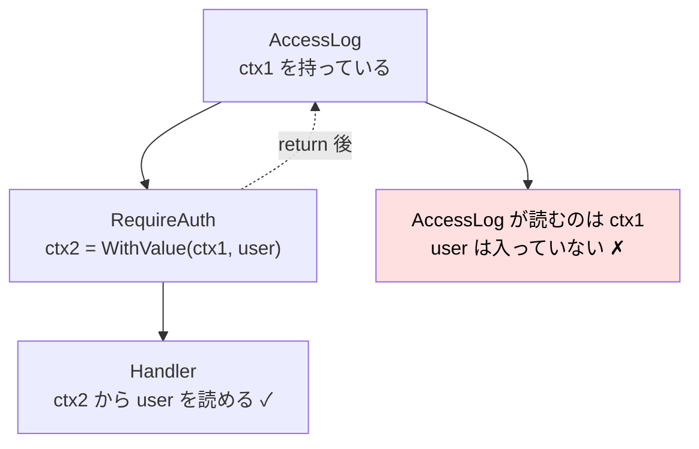

# Chapter 08: Logging と Audit Log

## この章の目的

ここまで作った仕組みは、障害が起きたときに**追跡できる状態になっていない**。「500 が返った」という報告を受けても、どのリクエストが、誰の操作で、どこで失敗したのかを特定できない。

この章で2種類のログを整える。

| | 通常ログ | 監査ログ（Audit Log） |
|---|---|---|
| 記録するもの | システムで何が起きたか | **誰が、いつ、何を変更したか** |
| 主な用途 | 障害調査、性能分析 | 変更履歴の追跡、責任の所在 |
| 保存先 | 標準出力 → ログ基盤 | DB（`task_history`） |
| 保存期間 | 数日〜数か月 | 業務要件による（数年のことも） |

そして、**ログに出してはいけないもの**を明確にする。

## 現在地

Webアプリ化(03-05) → **本番対応(06-08)** → Test(09)

## 完了条件

- [ ] 1 Request につき 1 行の構造化ログ（JSON）が出る
- [ ] `request_id` でリクエストを追跡できる
- [ ] ログに `user_id` が含まれる
- [ ] 500 が ERROR レベルで記録される
- [ ] **Cookie / パスワード / Session ID がログに出ていない**ことを確認した
- [ ] `task_history` から「誰がいつ何を変えたか」を追える

---

## Part 1. 構造化ログ

### Step 1. なぜ構造化するのか

### 非構造化ログ（よくある形）

```text
2026/09/25 00:16:04 PATCH /tasks/1/status returned 200 in 13ms for user 1
```

人間には読めるが、次のことができない。

- 「500 になったリクエストだけ」を抽出する
- 「応答時間が 1 秒を超えたもの」を集計する
- 「user_id=1 の操作」を追う

フォーマットが少しでも変わると、正規表現が壊れる。

### 構造化ログ（JSON）

```json
{"time":"2026-09-25T00:16:04.59Z","level":"INFO","msg":"http_request","request_id":"ca6440b20c408753","method":"GET","path":"/tasks/1","status":200,"duration_ms":3,"bytes":127,"user_id":1}
```

キーと値が分かれているため、ログ基盤側でそのまま検索・集計・アラート設定ができる。

```text
status >= 500                     → エラー率のアラート
duration_ms > 1000                → 遅いリクエストの抽出
request_id = "ca6440b2..."        → 1リクエストの全ログを収集
user_id = 1 AND status = 403      → 特定ユーザーの権限エラー
```

---

### Step 2. slog を設定する

### やること

Go 標準の `log/slog` で JSON ログを出す。

### 実行

`cmd/api/main.go`。

```go
func main() {
	// 構造化ログ。JSONで出すと、検索・集計・アラート設定がしやすい。
	logger := slog.New(slog.NewJSONHandler(os.Stdout, &slog.HandlerOptions{
		Level: slog.LevelInfo,
	}))
	slog.SetDefault(logger)

	if err := run(logger); err != nil {
		logger.Error("server stopped with error", slog.String("error", err.Error()))
		os.Exit(1)
	}
}
```

標準出力へ書く。ファイルへのローテーションや転送は、コンテナ基盤やログ収集エージェントの仕事にする。アプリがファイル管理まで抱えると、コンテナ環境で扱いづらくなる。

---

### Step 3. Request ID を付与する

### やること

1 Request を追跡するための ID を発行し、Response ヘッダにも返す。

### 実行

`internal/middleware/observability.go`。

```go
const RequestIDHeader = "X-Request-Id"

// RequestID は1Requestを追跡するためのIDを付与する。
// 障害調査で「このRequestに関係するログだけ」を絞り込むために使う。
func RequestID(next http.Handler) http.Handler {
	return http.HandlerFunc(func(w http.ResponseWriter, r *http.Request) {
		id := r.Header.Get(RequestIDHeader)
		if id == "" {
			id = newRequestID()
		}

		w.Header().Set(RequestIDHeader, id)

		next.ServeHTTP(w, r.WithContext(httpx.WithRequestID(r.Context(), id)))
	})
}

func newRequestID() string {
	buf := make([]byte, 8)

	if _, err := rand.Read(buf); err != nil {
		return "unknown"
	}

	return hex.EncodeToString(buf)
}
```

### 設計上の判断

| 判断 | 理由 |
|---|---|
| Request ヘッダに既にあれば**それを使う** | ロードバランサや呼び出し元サービスが発行した ID を引き継ぐ。マイクロサービス間で同じ ID を辿れる |
| Response ヘッダに**返す** | 利用者からの問い合わせ時に「この ID で調べてください」と言える |
| Session ID とは**別物** | Session ID は秘密情報。ログにも Response ヘッダにも出せない |

> **POINT**
> Request ID を Response に返すと、「500 になりました」という報告に ID が添えられる。
> ログ基盤でその ID を検索すれば、**そのリクエストで起きたことだけ**が取り出せる。

---

### Step 4. アクセスログを出す

### やること

1 Request につき 1 行のログを出す。

### 実行

Status を記録するためのラッパーが必要になる。

```go
// statusRecorder は書き込まれたStatusを記録する。
// http.ResponseWriter からは、書いたStatusを後から読めないため必要。
type statusRecorder struct {
	http.ResponseWriter
	status int
	bytes  int
}

func (w *statusRecorder) WriteHeader(status int) {
	w.status = status
	w.ResponseWriter.WriteHeader(status)
}

func (w *statusRecorder) Write(b []byte) (int, error) {
	n, err := w.ResponseWriter.Write(b)
	w.bytes += n

	return n, err
}
```

ログ出力。

```go
// AccessLog は1Requestにつき1行の構造化ログを出す。
//
// Cookie や Authorization Header は意図的に出力しない。
// ログは長期間保存され、閲覧範囲も広いため、機密情報を書くと漏洩範囲が広がる。
func AccessLog(logger *slog.Logger, next http.Handler) http.Handler {
	return http.HandlerFunc(func(w http.ResponseWriter, r *http.Request) {
		start := time.Now()
		recorder := &statusRecorder{ResponseWriter: w, status: http.StatusOK}

		// 内側のmiddlewareが user_id を書き込めるよう、先に入れ物を用意する。
		ctx, fields := httpx.WithLogFields(r.Context())

		next.ServeHTTP(recorder, r.WithContext(ctx))

		attrs := []slog.Attr{
			slog.String("request_id", httpx.RequestIDFrom(ctx)),
			slog.String("method", r.Method),
			slog.String("path", r.URL.Path),
			slog.Int("status", recorder.status),
			slog.Int64("duration_ms", time.Since(start).Milliseconds()),
			slog.Int("bytes", recorder.bytes),
		}

		if fields.UserID != 0 {
			attrs = append(attrs, slog.Int64("user_id", fields.UserID))
		}

		level := slog.LevelInfo
		if recorder.status >= http.StatusInternalServerError {
			level = slog.LevelError
		}

		logger.LogAttrs(ctx, level, "http_request", attrs...)
	})
}
```

<details>
<summary>GO NOTE: なぜ <code>statusRecorder</code> が必要なのか</summary>

`http.ResponseWriter` は**書き込み専用**のインターフェースで、「さっき書いた Status は何番だったか」を読み出すメソッドがない。

```go
type ResponseWriter interface {
	Header() Header
	Write([]byte) (int, error)
	WriteHeader(statusCode int)
}
```

そこで元の `ResponseWriter` を埋め込んだ構造体を作り、`WriteHeader` を横取りして値を控える。埋め込みにより、`Header()` など他のメソッドはそのまま使える。

なお `WriteHeader` を明示的に呼ばずに `Write` した場合、Go は自動的に 200 を送る。そのため `status: http.StatusOK` で初期化しておく必要がある。

</details>

---

### Step 5. Context の不変性でつまずく

この実装には**最初うまくいかなかった箇所**がある。そのまま共有する。

### 最初の実装

```go
// 期待どおりに動かなかった実装
if user, ok := httpx.CurrentUser(r.Context()); ok {
    attrs = append(attrs, slog.Int64("user_id", user.ID))
}
```

### 観測された結果

`user_id` がログに一切出なかった。認証は成功しており、Handler 側では `CurrentUser` が正しく User を返しているにもかかわらず。

```json
{"level":"INFO","msg":"http_request","request_id":"d8819f43341464bd","method":"POST","path":"/projects/1/tasks","status":201,"duration_ms":3,"bytes":130}
```

### 原因

`context.WithValue` は**新しい Context を作る**。元の Context は変更されない。



`AccessLog` は `RequireAuth` より**外側**にある。内側で作られた新しい Context は、外側には届かない。

### 解決

外側で**書き換え可能な入れ物**を用意し、内側がその中身を書き換える。

`internal/httpx/httpx.go`。

```go
// LogFields は1Requestの間だけ共有される、書き換え可能なログ情報。
//
// context.WithValue は「新しいContext」を作る。内側のmiddlewareが
// 値を足しても、外側が持っているContextは変わらない。
// AccessLog(外側) が RequireAuth(内側) の決めた user_id を出すには、
// 外側で入れ物を作り、内側がその中身を書き換える必要がある。
type LogFields struct {
	UserID int64
}

const logFieldsContextKey contextKey = "log_fields"

func WithLogFields(ctx context.Context) (context.Context, *LogFields) {
	fields := &LogFields{}
	return context.WithValue(ctx, logFieldsContextKey, fields), fields
}

func LogFieldsFrom(ctx context.Context) (*LogFields, bool) {
	fields, ok := ctx.Value(logFieldsContextKey).(*LogFields)
	return fields, ok
}
```

`internal/middleware/auth.go` で書き込む。

```go
		// アクセスログへ user_id を載せる。
		if fields, ok := httpx.LogFieldsFrom(r.Context()); ok {
			fields.UserID = user.ID
		}

		next.ServeHTTP(w, r.WithContext(httpx.WithUser(r.Context(), user)))
```

**入れ子の Context は値のコピーではなくポインタを運ぶ。** ポインタが指す先は共有されているため、内側の書き換えが外側から見える。

> **POINT**
> 値を「渡す」だけなら `context.WithValue` でよい。**外側へ情報を返したい**ときは、ポインタを渡して中身を書き換える。
> ただしこの方法は、複数の goroutine から同時に書くと data race になる（[Chapter 06 Part 1](./chapter06_transaction.md#part-1-goroutine-と-race-condition) で再現したもの）。1 Request が 1 goroutine で処理される前提でのみ成立する。

---

### Step 6. 動かして確認する

### 実行

```bash
curl -b alice.txt localhost:8080/tasks/1
curl localhost:8080/health
curl -b alice.txt 'localhost:8080/debug/slow?seconds=3'
curl -H 'X-Request-Id: my-trace-123' -b alice.txt localhost:8080/tasks/1
```

### 期待結果

検証環境での実際の出力。

```json
{"time":"2026-09-25T00:16:04.5955146+09:00","level":"INFO","msg":"http_request","request_id":"ca6440b20c408753","method":"GET","path":"/tasks/1","status":200,"duration_ms":3,"bytes":127,"user_id":1}
{"time":"2026-09-25T00:16:04.6265839+09:00","level":"INFO","msg":"http_request","request_id":"e0997692cdb945c4","method":"GET","path":"/health","status":200,"duration_ms":0,"bytes":16}
{"time":"2026-09-25T00:16:06.658012+09:00","level":"ERROR","msg":"http_request","request_id":"14858361d43915a1","method":"GET","path":"/debug/slow","status":503,"duration_ms":2000,"bytes":59,"user_id":1}
{"time":"2026-09-25T00:16:04.7048213+09:00","level":"INFO","msg":"http_request","request_id":"my-trace-123","method":"GET","path":"/tasks/1","status":200,"duration_ms":13,"bytes":127,"user_id":1}
```

確認できたこと。

| 項目 | 結果 |
|---|---|
| `user_id` | 認証済みリクエストにのみ付く（`/health` には無い） |
| `request_id` | 自動生成される |
| ヘッダ由来の ID | `my-trace-123` がそのまま使われている |
| 503 のレベル | **ERROR**（`status >= 500` のため） |
| `duration_ms` | Timeout のケースで 2000 ms |

> **NOTE**
> 503（Timeout）が ERROR レベルになっている。これは「500 以上は ERROR」というルールの結果で、意図した挙動になる。
> ただし Timeout は相手側の遅延が原因のこともあり、アラートを ERROR 全件に設定すると通知が多すぎる可能性がある。**運用時にレベル設計を見直す判断項目**として扱う。

---

## Part 2. ログに出してはいけないもの

### Step 7. 漏洩していないか確認する

### やること

ログに機密情報が含まれていないか、実際に検索して確認する。

### 実行

```bash
grep -icE 'kanban_session|password|set-cookie' server.log
```

### 期待結果

```text
matches: 0
```

### 出してはいけないもの

| 種別 | 具体例 | 理由 |
|---|---|---|
| 認証情報 | パスワード、パスワードハッシュ | そのまま悪用できる |
| セッション | Session ID、Cookie ヘッダ | ログを読める人が他人になりすませる |
| トークン | API Key、Authorization ヘッダ、JWT | 同上 |
| 個人情報 | 不要なメールアドレス、氏名、住所 | 法規制の対象になりうる |
| 決済情報 | カード番号、CVV | 保存自体が規制対象 |
| リクエスト本文 | POST body 全体 | 上記のいずれかが含まれうる |

### なぜ厳しく扱うのか

```text
ログの特徴

  保存期間が長い      数か月分が残る
  閲覧範囲が広い      開発者、運用者、外部のログ基盤ベンダー
  複製されやすい      転送、バックアップ、分析基盤への連携
  消しにくい          「あのログだけ削除」が難しい
```

アプリのメモリ上にしかない情報と違い、**ログに書いた時点で漏洩範囲が一段広がる**。

### 実装上の対策

```go
// NG: ヘッダをまるごと出す
slog.Any("headers", r.Header)        // Cookie も Authorization も含まれる

// NG: リクエスト本文をそのまま出す
slog.String("body", string(bodyBytes))  // password が含まれうる

// OK: 必要な項目だけを明示的に選ぶ
slog.String("method", r.Method)
slog.String("path", r.URL.Path)
slog.Int64("user_id", fields.UserID)
```

**「何を出すか」を明示的に列挙する。** 「何を隠すか」を除外リストで管理すると、新しい項目が増えたときに漏れる。

> **WARNING**
> `r.URL.String()` はクエリ文字列を含む。`?token=xxx` のような設計だとログに残る。
> 本ハンズオンでは `r.URL.Path` だけを出している。

---

## Part 3. Audit Log

### Step 8. 監査ログとして task_history を使う

### 通常ログとの違い

```text
通常ログ
  「システムで何が起きたか」
  {"msg":"http_request","path":"/tasks/1/status","status":200,"user_id":1}
    → 200 で成功したことは分かるが、何を何に変えたかは分からない

監査ログ
  「誰が、いつ、何を、何から何へ変更したか」
  user_id=1, task_id=1, action=status_changed, old=todo, new=doing
```

Chapter 06 で作った `task_history` が、そのまま監査ログになる。

```sql
CREATE TABLE task_history (
    id BIGSERIAL PRIMARY KEY,
    task_id BIGINT NOT NULL REFERENCES tasks(id) ON DELETE CASCADE,
    user_id BIGINT REFERENCES users(id) ON DELETE SET NULL,
    action TEXT NOT NULL,
    old_value TEXT NOT NULL DEFAULT '',
    new_value TEXT NOT NULL DEFAULT '',
    created_at TIMESTAMPTZ NOT NULL DEFAULT NOW()
);
```

### 実行

```bash
docker compose exec -T db psql -U kanban -d kanban -c \
  'SELECT task_id, user_id, action, old_value, new_value FROM task_history ORDER BY id;'
```

### 期待結果

検証環境での実際の出力。

```text
 task_id | user_id |     action     | old_value | new_value
---------+---------+----------------+-----------+-----------
       1 |       1 | status_changed | todo      | doing
       1 |       1 | status_changed | doing     | done
(2 rows)
```

### なぜ DB に保存するのか

| | 通常ログ（標準出力） | 監査ログ（DB） |
|---|---|---|
| 保存の確実性 | ログ基盤が落ちれば欠落しうる | **Transaction に含められる** |
| 検索 | ログ基盤の機能に依存 | SQL で自由に検索できる |
| 整合性 | Task の更新と別々に記録される | **Task の更新と同じ Transaction** |
| 保存期間 | 数日〜数か月 | 業務要件に従って保持できる |

Chapter 06 で確認したとおり、履歴の INSERT が失敗すれば Task の更新も Rollback される。**「更新されたのに履歴がない」状態が原理的に発生しない。**

### 監査ログに記録する項目

| 項目 | 本実装 | 一般的な要件 |
|---|---|---|
| 誰が | `user_id` | ○ |
| いつ | `created_at` | ○ |
| 何を | `task_id` | ○ |
| どんな操作 | `action` | ○ |
| 変更前 | `old_value` | ○ |
| 変更後 | `new_value` | ○ |
| どこから | 未実装 | IP アドレス、User-Agent が求められることがある |
| どのリクエストで | 未実装 | `request_id` を入れると通常ログと突き合わせられる |

> **POINT**
> 監査ログに `request_id` を入れると、「この変更を行ったリクエストの通常ログ」まで辿れる。
> 通常ログと監査ログが**同じ ID で繋がる**設計にしておくと、調査が一気に楽になる。

---

## 障害調査の流れ

ここまでの仕組みが揃うと、次のように追える。


Chapter 03 で設計した「**利用者には一般的な文言、ログには詳細**」が、ここで効いてくる。

```json
{"level":"ERROR","msg":"unexpected error","error":"insert task history: ERROR: new row for relation \"task_history\" violates check constraint \"reject_done\" (SQLSTATE 23514)"}
```

---

## この章のまとめ

| 導入したもの | 解決した問題 |
|---|---|
| `slog` による JSON ログ | 検索・集計・アラート設定ができない |
| `request_id` の発行と伝播 | 1リクエストのログを絞り込めない |
| ヘッダからの `request_id` 継承 | サービスをまたいだ追跡ができない |
| Response ヘッダへの `request_id` | 問い合わせ時に該当リクエストを特定できない |
| `statusRecorder` | 書いた Status を後から読めない |
| `LogFields`（ポインタ経由の書き戻し） | 内側 middleware の情報が外側に届かない |
| Status に応じたログレベル | エラーが INFO に埋もれる |
| 出力項目の明示的な列挙 | Cookie やパスワードの漏洩 |
| `task_history` の Transaction 内記録 | 更新されたのに履歴がない状態 |

| 得られた検証データ | 値 |
|---|---|
| アクセスログ | 1 Request = 1 行の JSON |
| `user_id` | 認証済みリクエストにのみ出力 |
| `request_id` の継承 | `my-trace-123` がそのまま使われた |
| 機密情報の検索結果 | `kanban_session` / `password` / `set-cookie` すべて **0 件** |

次は [Chapter 09: Test と Refactoring](./chapter09_test.md)。ここまでの挙動をテストで固定し、責務の整理を仕上げる。
